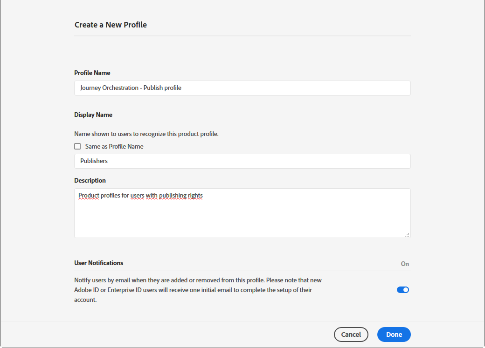
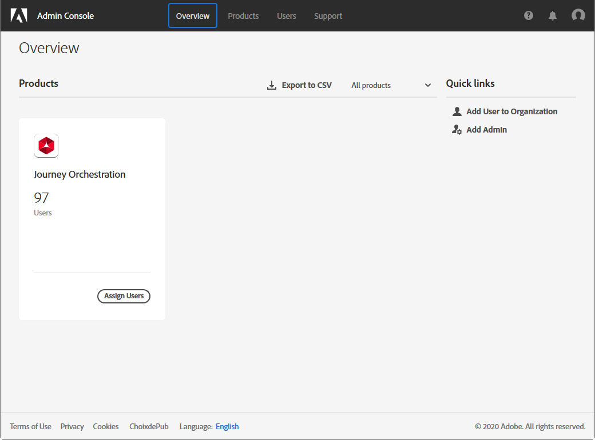

# Toegangsbeheer{#concept_rfj_wpt_52b}

## Informatie over toegangsbeheer {#about-access-management}

Met [!DNL Journey Orchestration] kunt u een reeks toestemmingen aan uw gebruikers toewijzen om te definiëren tot welk deel van de interface ze toegang hebben.

Ze kunnen worden beheerd door beheerders die toegang hebben tot de Admin Console. Voor meer informatie over Admin Console, verwijs naar de [ gids van de Onderneming en van teamadmin ](https://helpx.adobe.com/nl/enterprise/managing/user-guide.html).

Voor toegang tot [!DNL Journey Orchestration]moet een gebruiker:

* deel van een [!DNL Journey Orchestration]-**[!UICONTROL product profile]** zijn dat is gekoppeld aan [!DNL Journey Orchestration]-toestemmingen.
* deel van een [!DNL Adobe Experience Platform]-**[!UICONTROL product profile]** zijn. Er is geen verplichte toestemming. De gebruiker heeft de **[!UICONTROL profile management]**-toestemming nodig om platformsegmenten te maken en te bewerken vanuit de [!DNL Journey Orchestration]-interface. Raadpleeg [deze pagina](https://experienceleague.adobe.com/docs/experience-platform/access-control/home.html#adobe-admin-console) voor meer informatie.

In Admin Console kunt u een van de volgende out-of-the-box productprofielen aan uw gebruikers toewijzen:

* **[!UICONTROL Limited Access User]**: gebruiker met alleen-lezen toegang tot journey’s en rapporten. Dit productprofiel bevat de volgende toestemmingen:
   * Journey’s lezen
   * Rapporten lezen

* **[!UICONTROL Administrators]**: gebruiker met toegang tot de beheermenu’s met de mogelijkheid om journey’s, gebeurtenissen en rapporten te beheren. Dit productprofiel bevat de volgende toestemmingen:
   * Journey’s beheren
   * Journey’s publiceren
   * Gebeurtenissen, databronnen en acties beheren
   * Rapporten beheren

  >[!NOTE]
  >
  >Het **[!UICONTROL Administrators]** is het enige productprofiel waarmee transactionele berichten (of berichtsjablonen) in Adobe Campaign Standard kunnen worden gemaakt, bewerkt en gepubliceerd. Dit productprofiel is nodig als u Adobe Campaign Standard gebruikt om berichten tijdens uw reizen te verzenden. De naam mag niet worden gewijzigd in Admin Console.

* **[!UICONTROL Standard User]**: gebruiker met basistoegang zoals journeybeheer. Dit productprofiel bevat de volgende toestemmingen:
   * Journey’s beheren
   * Journey’s publiceren
   * Rapporten beheren
   * Gebeurtenissen, gegevensbronnen en handelingen lezen

U kunt ook zelf productprofielen maken als de meegeleverde profielen niet voldoende zijn om uw gebruikers te beheren.
Gebruikers moeten altijd aan een productprofiel zijn gekoppeld zodat u specifieke ingebouwde toestemmingen aan hen kunt toewijzen, zoals:

* **[!UICONTROL Read journeys]**
* **[!UICONTROL Read reports]**
* **[!UICONTROL Manage events, data sources and actions]**
* **[!UICONTROL Read events, data sources and actions]**
* **[!UICONTROL Manage journeys]**
* **[!UICONTROL Publish journeys]**
* **[!UICONTROL Manage reports]**

Hieronder ziet u de compatibiliteit tussen toestemmingen en de verschillende functies van [!DNL Journey Orchestration].

## Een productprofiel maken {#create-product-profile}

Met [!DNL Journey Orchestration] kunt u zelf productprofielen maken en een reeks toestemmingen en sandboxen aan uw gebruikers toewijzen. Met productprofielen kunt u toegang tot bepaalde functies of objecten in de interface toestaan of weigeren.

Raadpleeg de [Adobe Experience Platform-documentatie](https://experienceleague.adobe.com/docs/experience-platform/sandbox/ui/user-guide.html) voor informatie over het maken en beheren van sandboxen.

Een productprofiel maken en een reeks toestemmingen en sandboxen toewijzen:

1. Selecteer **[!UICONTROL Journey Orchestration]** in Admin Console. Klik op het tabblad **[!UICONTROL Product profile]** op **[!UICONTROL New Profile]**.

   

1. Voeg een **[!UICONTROL Profile Name]** en **[!UICONTROL Description]** toe voor uw nieuwe productprofiel. Als u voor uw profiel een andere **[!UICONTROL Display name]** wilt, schakelt u **[!UICONTROL Same as Profile Name]** uit en typt u uw **[!UICONTROL Display name]**.

1. Kies in de categorie **[!UICONTROL User Notifications]** of gebruikers via e-mail op de hoogte worden gesteld wanneer ze aan dit productprofiel worden toegevoegd of eruit worden verwijderd.

1. Klik op **[!UICONTROL Done]** als u klaar bent. Uw nieuwe productprofiel is nu gemaakt.

   

1. Selecteer het nieuwe productprofiel om toestemmingen te beheren. Voeg op het tabblad **[!UICONTROL Users]** gebruikers toe aan uw productprofiel. Raadpleeg [deze pagina](../about/access-management.md#assigning-product-profile) voor meer informatie.

1. Voer dezelfde stappen uit als hierboven beschreven om **[!UICONTROL Admin]** aan uw productprofiel toe te voegen.

1. Selecteer op het tabblad **[!UICONTROL Permissions]** een van de twee categorieën **[!UICONTROL Sandbox]** of **[!UICONTROL Authoring]** om de pagina **[!UICONTROL Edit Permissions]** te openen en toestemmingen voor uw productprofiel toe te voegen of te verwijderen.

   

1. Kies in de toestemmingencategorie **[!UICONTROL Sandboxes]** welke sandbox(en) aan uw productprofiel moeten worden toegewezen. Klik onder **[!UICONTROL Available Permissions Items]** op het pluspictogram (+) om sandboxen aan uw profiel toe te wijzen. Zie deze [sectie](../about/access-management.md#sandboxes) voor meer informatie over sandboxen.

   

1. Klik zo nodig onder **[!UICONTROL Included Permission Items]** op het X-pictogram om toestemmingen voor uw productprofiel te verwijderen.

   

1. Voer vanuit de toestemmingencategorie **[!UICONTROL Authoring]** dezelfde stappen uit als hierboven om toestemmingen toe te voegen aan uw productprofiel.
    Ga voor meer informatie over toestemmingen en compatibiliteit tussen toestemmingen en de verschillende functionaliteiten van [!DNL Journey Orchestration] naar deze [sectie](../about/access-management.md#about-access-management).

   

1. Klik op **[!UICONTROL Save]** als u klaar bent.

Uw productprofiel is nu gemaakt en geconfigureerd. Gebruikers die aan dit profiel zijn gekoppeld, kunnen nu verbinding maken met [!DNL Journey Orchestration].

## Een productprofiel toewijzen {#assigning-product-profile}

Productprofielen worden toegewezen aan een reeks gebruikers die dezelfde toestemmingen hebben binnen uw organisatie.
In deze sectie vindt u de lijst van alle meegeleverde productprofielen met toegewezen toestemmingen.

Een productprofiel toewijzen waarmee een gebruiker toegang heeft tot [!DNL Journey Orchestration]:

1. Selecteer **[!UICONTROL Journey Orchestration]** in de Admin Console.

   

1. Selecteer het productprofiel waaraan de nieuwe gebruiker wordt gekoppeld.

   

1. Klik op **[!UICONTROL Add user]**.

   U kunt de nieuwe gebruiker ook toevoegen aan een gebruikersgroep om de gedeelde reeks toestemmingen te verfijnen. Raadpleeg deze [pagina](https://helpx.adobe.com/nl/enterprise/using/user-groups.html) voor meer informatie.

   

1. Typ het e-mailadres van de nieuwe gebruiker en klik op **[!UICONTROL Save]**.

   

De gebruiker ontvangt vervolgens een e-mail met een doorverwijzing naar uw [!DNL Journey Orchestration]-instantie.

## Sandboxen gebruiken {#sandboxes}

In [!DNL Journey Orchestration] kunt u uw instantie partitioneren in afzonderlijke virtuele omgevingen, sandboxen genoemd.
Sandboxen worden toegewezen via productprofielen in Admin Console. Raadpleeg deze [sectie](../about/access-management.md#create-product-profile)voor meer informatie over het toewijzen van sandboxen.

[!DNL Journey Orchestration] weerspiegelt de Adobe Experience Platform-sandboxen die voor een bepaalde organisatie zijn gemaakt.
U kunt Adobe Experience Platform-sandboxen maken of herstellen vanuit uw Adobe Experience Platform-instantie. Raadpleeg de [gebruikershandleiding voor sandboxen](https://experienceleague.adobe.com/docs/experience-platform/sandbox/ui/user-guide.html) voor gedetailleerde informatie.

U vindt de schakelfunctie voor sandboxen linksboven in het scherm. Als u van sandbox wilt wisselen, klikt u op de momenteel actieve sandbox in de schakelfunctie en selecteert u een andere sandbox in de vervolgkeuzelijst.
