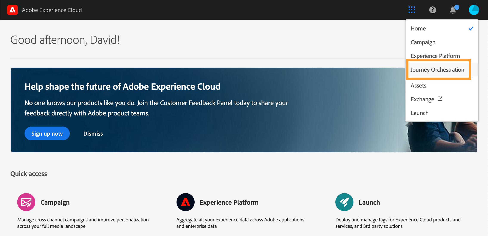
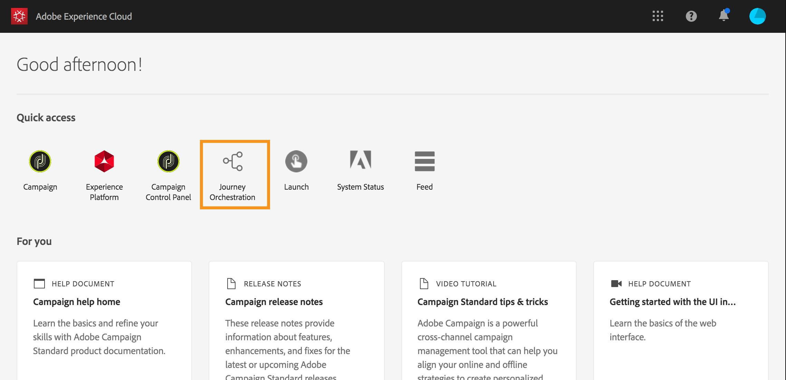
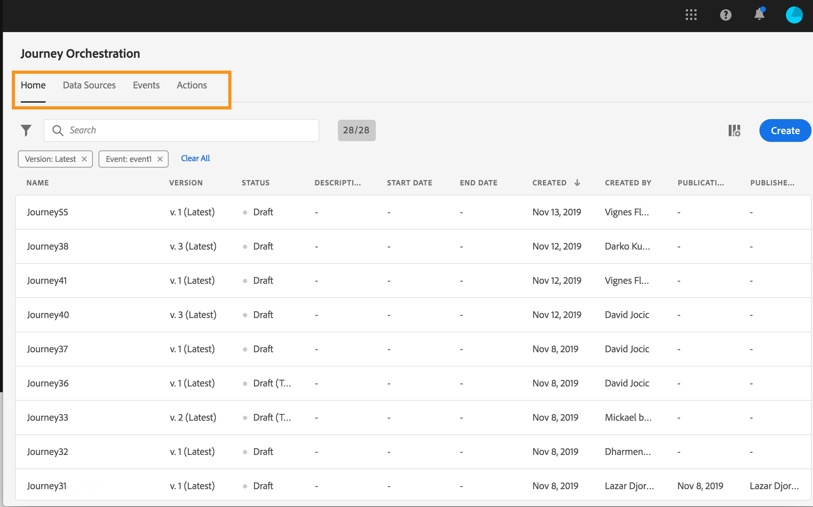
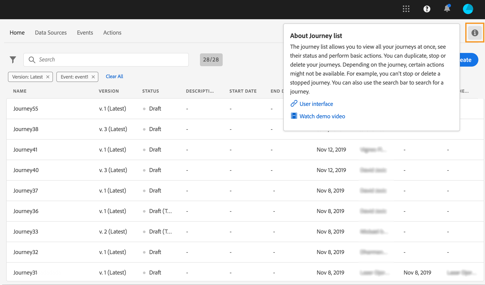
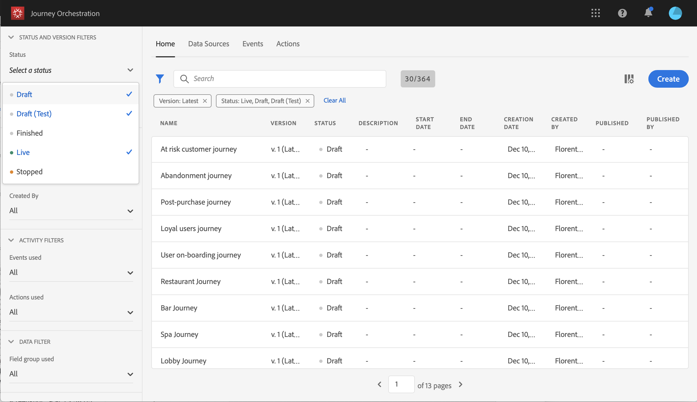
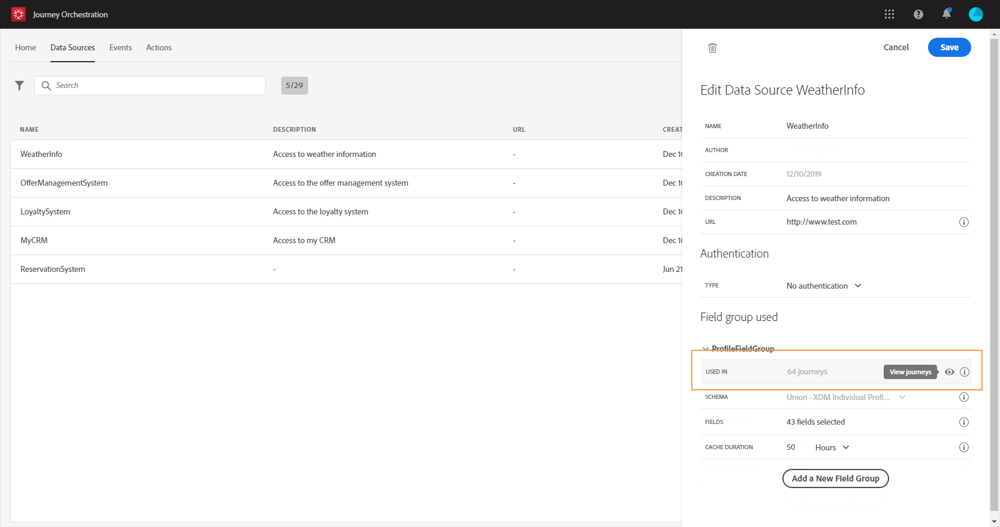
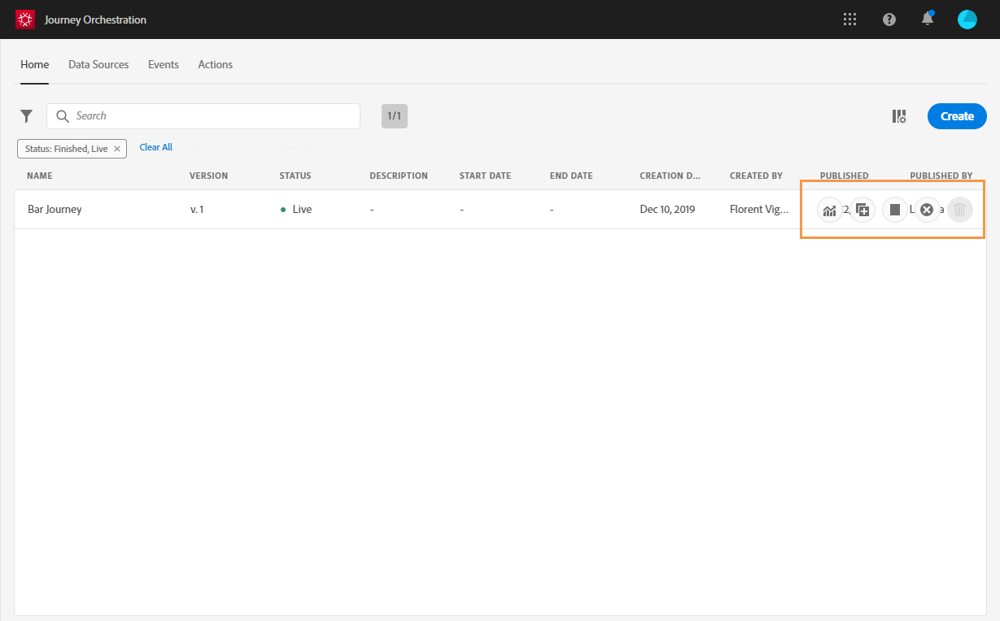
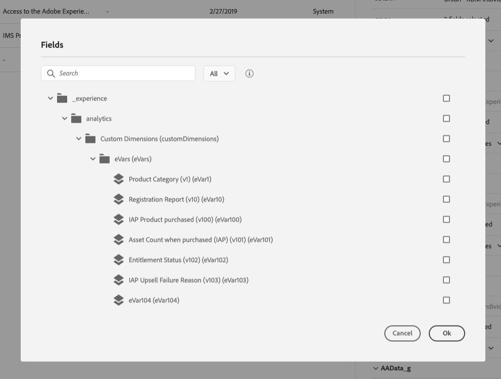

# Gebruikersinterface{#concept_rcq_lqt_52b}

>[!CAUTION]
>
>**zoekend Adobe Journey Optimizer**? Klik [&#x200B; hier &#x200B;](https://experienceleague.adobe.com/nl/docs/journey-optimizer/using/ajo-home){target="_blank"} voor de documentatie van Journey Optimizer.
>
>
>_Deze documentatie verwijst naar erfenismaterialen van Journey Orchestration die door Journey Optimizer zijn vervangen. Neem contact op met uw accountteam als u vragen hebt over uw toegang tot Journey Orchestration of Journey Optimizer._

## Toegang verkrijgen tot [!DNL Journey Orchestration]{#accessing_journey_orchestration}

Als u de interface van [!DNL Journey Orchestration] wilt openen, klikt u op het pictogram **[!UICONTROL App Selector]** rechtsboven en vervolgens op **[!UICONTROL Journey Orchestration]** .

U kunt [!DNL Journey Orchestration] ook openen vanaf de Experience Cloud-startpagina in de **[!UICONTROL Quick access]** -sectie.

## De interface detecteren{#section_jsq_zr1_ffb}

>[!CONTEXTUALHELP]
>id="jo_home"
>title="Info"
>abstract="Met de reislijst kunt u al uw reizen tegelijk bekijken, hun status bekijken en basishandelingen uitvoeren."
>additional-url="https://images-tv.adobe.com/mpcv3/38af62cb-9390-4bc0-a576-d336849adb97_1574809570.1920x1080at3000_h264.mp4" text="Video over demo bekijken"

Met de bovenste menu&#39;s kunt u door de verschillende functies van [!DNL Journey Orchestration] navigeren: **[!UICONTROL Home]** (de ritten), **[!UICONTROL Data Sources]**, **[!UICONTROL Events]**, **[!UICONTROL Actions]** .

Klik op het pictogram  in de rechterbovenhoek van het scherm om de contextuele Help weer te geven. Deze is beschikbaar in de verschillende lijstschermen van [!DNL Journey Orchestration] (reizen, gebeurtenissen, handelingen en gegevensbronnen). Op deze manier kunt u een korte beschrijving weergeven van de huidige functionaliteit en toegang krijgen tot verwante artikelen en video&#39;s.

## Zoeken en filteren{#section_lgm_hpz_pgb}

In de lijsten **[!UICONTROL Home]**, **[!UICONTROL Data Sources]**, **[!UICONTROL Events]** en **[!UICONTROL Actions]**, staat een onderzoeksbar u toe om naar een punt te zoeken.

U kunt de **[!UICONTROL Filters]** openen door op het filterpictogram linksboven in de lijst te klikken. Met het menu Filters kunt u de weergegeven elementen filteren op basis van verschillende criteria. U kunt ervoor kiezen alleen de elementen van een bepaald type of een bepaalde status weer te geven, de elementen die u hebt gemaakt of de elementen die in de afgelopen 30 dagen zijn gewijzigd.

In de lijsten **[!UICONTROL Data Sources]**, **[!UICONTROL Events]** en **[!UICONTROL Actions]** gebruikt u **[!UICONTROL Creation filters]** om te filteren op de aanmaakdatum en de gebruiker. U kunt bijvoorbeeld alleen de gebeurtenissen weergeven die u de afgelopen 30 dagen hebt gemaakt.

In de reislijst (onder **[!UICONTROL Home]**) kunt u, naast **[!UICONTROL Creation filters]**, ook de weergegeven reizen filteren op basis van hun status, type en versie (**[!UICONTROL Status and version filters]**). Het type kan zijn: **[!UICONTROL Unitary event]** of **[!UICONTROL Segment qualification]** . U kunt er ook voor kiezen om alleen de ritten weer te geven die een bepaalde gebeurtenis, veldgroep of handeling gebruiken (**[!UICONTROL Activity filters]** en **[!UICONTROL Data filters]** ). Met **[!UICONTROL Publication filters]** kunt u een publicatiedatum of gebruiker selecteren. U kunt er bijvoorbeeld voor kiezen om alleen de nieuwste versies van live reizen weer te geven die gisteren zijn gepubliceerd. Zie [&#x200B; deze pagina &#x200B;](../building-journeys/using-the-journey-designer.md).

>[!NOTE]
>
>Merk op dat de getoonde kolommen kunnen worden gepersonaliseerd gebruikend de configuratieknoop op het hoogste recht van de lijsten. Personalization wordt voor elke gebruiker opgeslagen.

Met de kolommen **[!UICONTROL Last update]** en **[!UICONTROL Last update by]** kunt u aangeven wanneer de laatste update van uw reizen is uitgevoerd en welke gebruiker deze heeft uitgevoerd.

In de gebeurtenis, gegevensbron en actieconfiguratievensters, toont het **[!UICONTROL Used in]** gebied het aantal reizen die die bepaalde gebeurtenis, gebiedsgroep of actie gebruiken. U kunt op de knop **[!UICONTROL View journeys]** klikken om de lijst met corresponderende reizen weer te geven.

In de verschillende lijsten kunt u basishandelingen op elk element uitvoeren. U kunt bijvoorbeeld een item dupliceren of verwijderen.

## Bladeren door Adobe Experience Platform-velden {#friendly-names-display}

Wanneer het bepalen van [&#x200B; gebeurtenislading &#x200B;](../event/defining-the-payload-fields.md), [&#x200B; lading van de gebiedsgroep &#x200B;](../datasource/field-groups.md) en het selecteren van gebieden in de [&#x200B; uitdrukkingsredacteur &#x200B;](../expression/expressionadvanced.md), wordt de vertoningsnaam getoond naast de gebiedsnaam. Deze informatie wordt teruggewonnen van de schemadefinitie in het Model van de Gegevens van de Ervaring.

Als de beschrijvers zoals &quot;xdm :alternateDisplayInfo&quot;terwijl vestiging schema&#39;s worden verstrekt, zullen de gebruikersvriendelijke namen vertoningsnamen vervangen. Dit is vooral handig wanneer u werkt met &quot;eVars&quot; en algemene velden.U kunt beschrijvers van vriendschappelijke namen via een API vraag vormen. Voor meer informatie, zie de [&#x200B; de ontwikkelaarsgids van de Registratie van het Schema &#x200B;](https://experienceleague.adobe.com/docs/experience-platform/xdm/api/getting-started.html?lang=nl-NL).

Als een vriendelijke naam beschikbaar is, wordt het veld weergegeven als `<friendly-name>(<name>)` . Als er geen vriendelijke naam beschikbaar is, wordt de weergavenaam weergegeven, bijvoorbeeld `<display-name>(<name>)` . Als er geen is gedefinieerd, wordt alleen de technische naam van het veld weergegeven `<name>` .

>[!NOTE]
>
>De vriendschappelijke namen worden niet teruggewonnen wanneer u gebieden van een vereniging van schema&#39;s selecteert.

## Toegankelijkheid{#accessibility}

De toegankelijkheidsfuncties in Adobe Journey Optimizer worden geleverd door Adobe Experience Platform:

* Toegankelijkheid toetsenbord
* Kleurcontrast
* Validatie van vereiste velden

[&#x200B; leer meer &#x200B;](https://experienceleague.adobe.com/docs/experience-platform/accessibility/features.html?lang=nl-NL){target="_blank"} in de documentatie van Adobe Experience Platform.

U kunt de volgende algemene sneltoetsen gebruiken in Adobe Journey Optimizer:

| Actie | Sneltoets |
| --- | --- |
| Tussen gebruikersinterface-elementen, -secties en -menugroepen verplaatsen | Tab |
| Ga achterwaarts tussen gebruikersinterface-elementen, -secties en -menuproepen | Shift + Tab |
| Binnen secties verplaatsen om focus in te stellen op afzonderlijke elementen | Pijl |
| Een element dat de focus heeft selecteren of wissen | Enter of Spatiebalk |
| Een selectie annuleren, een deelvenster samenvouwen of een dialoogvenster sluiten | Esc |

[&#x200B; leer meer &#x200B;](https://experienceleague.adobe.com/docs/experience-platform/accessibility/custom.html?lang=nl-NL){target="_blank"} in de documentatie van Adobe Experience Platform.

U kunt deze sneltoetsen gebruiken in specifieke delen van Journey Optimizer:

<table>
  <thead>
    <tr>
      <th>Interface-element</th>
      <th>Actie</th>
      <th>Sneltoets</th>
    </tr>
  </thead>
  <tr>
    <td>Lijst met reizen, handelingen, gegevensbronnen of gebeurtenissen</td>
    <td>Een reis, handeling, gegevensbron of gebeurtenis maken</td>
    <td>C</td>
  </tr>
  <tr>
    <td rowspan="3">Reis canvas in conceptstatus</td>
    <td>Voeg een activiteit van het linkerpalet bij de eerste beschikbare positie toe, van boven tot onder</td>
    <td>Dubbelklik op de activiteit</td>
  </tr>
  <tr>
    <td>Alle activiteiten selecteren</td>
    <td>CTRL + A (Vensters)   Bevel + A (Mac)</td>
  </tr>
  <tr>
    <td>Geselecteerde activiteiten verwijderen</td>
    <td>Verwijder of Backspace en ga vervolgens in om de verwijdering te bevestigen</td>
  </tr>
  <tr>
  <td rowspan="3">

Configuratievenster van deze elementen:

<ul>
  <li>Activiteit in een reis</li>
  <li>Gebeurtenis</li>
  <li>Gegevensbron</li>
  <li>Actie</li>
</ul>

</td>
    <td>Ga naar het volgende veld dat moet worden geconfigureerd</td>
    <td>Tab</td>
  </tr>
  <tr>
    <td>Wijzigingen opslaan en het configuratievenster sluiten</td>
    <td>Enter</td>
  </tr>
  <tr>
    <td>Wijzigingen negeren en het configuratievenster sluiten</td>
    <td>Esc</td>
  </tr>
  <tr>
    <td rowspan="4">Reizen in testmodus</td>
    <td>De testmodus in- of uitschakelen</td>
    <td>T</td>
  </tr>
  <tr>
    <td>Een gebeurtenis activeren tijdens een op een gebeurtenis gebaseerde reis</td>
    <td>E</td>
  </tr>
  <tr>
    <td>

Een gebeurtenis activeren in een op segmenten gebaseerde rit waarvoor de optie **[!UICONTROL Single profile at a time]** is ingeschakeld

</td>
    <td>P</td>
  </tr>
  <tr>
    <td>De testlogboeken weergeven</td>
    <td>L</td>
  </tr>
<!--
//Ajouter ce raccourci quand il marchera (actuellement, le raccourci Ctrl/Cmd+F du navigateur a priorité sur celui de AJO).//
  <tr>
    <td>Page with a search bar</td>
    <td>Select the search bar</td>
    <td>Ctrl/Command + F</td>
  </tr>
-->
  <tr>
    <td>Tekstveld</td>
    <td>Alle tekst in het geselecteerde veld selecteren</td>
    <td>CTRL + A (Vensters)   Bevel + A (Mac)</td>
  </tr>
  <tr>
    <td rowspan="2">Pop-upvenster</td>
    <td>Wijzigingen opslaan of de handeling bevestigen</td>
    <td>Enter</td>
  </tr>
  <tr>
    <td>Sluit het venster</td>
    <td>Esc</td>
  </tr>
  <tr>
    <td>Eenvoudige expressie-editor</td>
    <td>Een veld selecteren en toevoegen</td>
    <td>Dubbelklikken op een veld</td>
  </tr>
  <tr>
    <td>Bladeren door XDM-velden</td>
    <td>Alle velden van een knooppunt selecteren</td>
    <td>Het bovenliggende knooppunt selecteren</td>
  </tr>
  <tr>
    <td>Payloadvoorbeeld</td>
    <td>Selecteer de lading</td>
    <td>CTRL + A (Vensters)   Bevel + A (Mac)</td>
  </tr>
</table>
