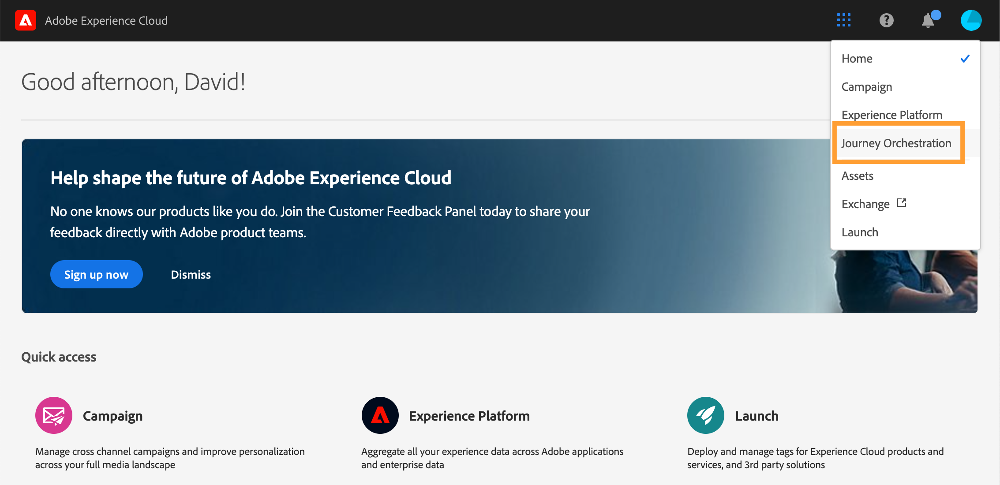

# Gebruikersinterface{#concept_rcq_lqt_52b}

>[!NOTE]
>
>We raden u aan Chrome als uw internetbrowser te gebruiken om het beste uit [!DNL Journey Orchestration]de lijst te halen. De interface wordt weergegeven in de taal die is gedefinieerd in IMS. Als uw taal IMS niet door wordt gesteund, wordt de interface getoond in het Engels. [!DNL Journey Orchestration]
>
>Deze documentatie wordt regelmatig bijgewerkt om recente wijzigingen in het product te weerspiegelen. Sommige schermafbeeldingen kunnen echter enigszins afwijken van de interface van het product.

## Toegang [!DNL Journey Orchestration]{#accessing_journey_orchestration}

Als u toegang wilt krijgen tot de interface van [!DNL Journey Orchestration]de toepassing, klikt u op het **[!UICONTROL App Selector]** pictogram rechtsboven. Klik **[!UICONTROL Journey Orchestration]** rechts onder Experience Platform.

U kunt ook toegang krijgen [!DNL Journey Orchestration] vanaf de startpagina van Experience Cloud in de **[!UICONTROL Quick access]** sectie.

## De interface detecteren{#section_jsq_zr1_ffb}

>[!CONTEXTUALHELP]
>id="jo_home"
>title="Info"
>abstract="Met de reislijst kunt u al uw reizen tegelijk bekijken, hun status bekijken en basishandelingen uitvoeren. U kunt uw reizen dupliceren, stoppen of verwijderen. Afhankelijk van de reis zijn bepaalde acties mogelijk niet beschikbaar. U kunt bijvoorbeeld een gesloten reis niet verwijderen of opnieuw starten. U kunt er een nieuwe versie van maken of deze dupliceren. U kunt de zoekbalk ook gebruiken om een reis te zoeken."
>additional-url="https://images-tv.adobe.com/mpcv3/38af62cb-9390-4bc0-a576-d336849adb97_1574809570.1920x1080at3000_h264.mp4" text="Video over demo bekijken"

Met de bovenste menu&#39;s kunt u door de verschillende functies van [!DNL Journey Orchestration]: **[!UICONTROL Home]**(de ritten),**[!UICONTROL Data Sources]**, **[!UICONTROL Events]**, **[!UICONTROL Actions]**.

Klik op het  pictogram in de rechterbovenhoek van het scherm om de contextafhankelijke Help weer te geven. Het is beschikbaar over de verschillende [!DNL Journey Orchestration] lijstschermen (reizen, gebeurtenissen, acties en gegevensbronnen). Op deze manier kunt u een korte beschrijving weergeven van de huidige functionaliteit en toegang krijgen tot verwante artikelen en video&#39;s.

## Zoeken en filteren{#section_lgm_hpz_pgb}

In de lijsten **[!UICONTROL Home]**,**[!UICONTROL Data Sources]****[!UICONTROL Events]** en **[!UICONTROL Actions]** lijsten kunt u zoeken naar een item.

U **[!UICONTROL Filters]** kunt het dialoogvenster openen door linksboven in de lijst op het filterpictogram te klikken. Met het menu Filters kunt u de weergegeven elementen filteren op basis van verschillende criteria. U kunt ervoor kiezen alleen de elementen van een bepaald type of een bepaalde status weer te geven, de elementen die u hebt gemaakt of de elementen die in de afgelopen 30 dagen zijn gewijzigd.

Gebruik in de lijst **[!UICONTROL Data Sources]**, **[!UICONTROL Events]** en **[!UICONTROL Actions]** lijsten de **aanmaakfilters** om te filteren op de aanmaakdatum en de gebruiker. U kunt bijvoorbeeld alleen de gebeurtenissen weergeven die u de afgelopen 30 dagen hebt gemaakt.

In de reislijst (onder **[!UICONTROL Home]**) kunt u, naast het **[!UICONTROL Creation filters]**, ook de weergegeven ritten filteren op basis van hun status en versie (**[!UICONTROL Status and version filters]**). U kunt er ook voor kiezen om alleen de ritten weer te geven die een bepaalde gebeurtenis, veldgroep of handeling (**[!UICONTROL Activity filters]** en **[!UICONTROL Data filters]**) gebruiken. **[!UICONTROL Publication filters]** Selecteer een publicatiedatum of -gebruiker. U kunt er bijvoorbeeld voor kiezen om alleen de nieuwste versies van live reizen weer te geven die gisteren zijn gepubliceerd. Zie .

>[!NOTE]
>
>Merk op dat de getoonde kolommen kunnen worden gepersonaliseerd gebruikend de configuratieknoop op het hoogste recht van de lijsten. Personalisatie wordt voor elke gebruiker opgeslagen.

Met de **[!UICONTROL Last update]** kolommen en de **[!UICONTROL Last update by]** kolommen kunt u zien wanneer de laatste update van uw reizen is uitgevoerd en welke gebruiker deze heeft uitgevoerd.

In de gebeurtenis, gegevensbron en actieconfiguratievensters, toont het **[!UICONTROL Used in]** gebied het aantal reizen die die bepaalde gebeurtenis, gebiedsgroep of actie gebruiken. U kunt op de **[!UICONTROL View journeys]** knop klikken om de lijst met bijbehorende reizen weer te geven.

In de verschillende lijsten kunt u basishandelingen op elk element uitvoeren. U kunt bijvoorbeeld een item dupliceren of verwijderen.

## Bladeren door gegevensplatformvelden {#friendly-names-display}

Bij het definiëren van een [gebeurtenislading](../event/defining-the-payload-fields.md), het laden [van een](../datasource/field-groups.md) veldgroep en het selecteren van velden in de [expressieeditor](../expression/expressionadvanced.md), wordt naast de veldnaam ook de weergavenaam weergegeven. Deze informatie wordt teruggewonnen van de schemadefinitie in het Model van de Gegevens van de Ervaring.

Als er beschrijvingen zoals &quot;xdm:alternateDisplayInfo&quot; worden opgegeven tijdens het instellen van schema&#39;s, worden de weergavenamen vervangen door de gebruikersvriendelijke namen. Dit is vooral handig wanneer u werkt met &quot;eVars&quot; en generieke velden. U kunt beschrijvingen van vriendschappelijke namen configureren via een API-aanroep. Voor meer informatie, zie de de ontwikkelaarsgids [van de Registratie van het](https://docs.adobe.com/content/help/en/experience-platform/xdm/api/getting-started.html)Schema.

Als een vriendelijke naam beschikbaar is, wordt het veld weergegeven als `<friendly-name>(<name>)`. Als er geen vriendelijke naam beschikbaar is, wordt de weergavenaam weergegeven, bijvoorbeeld `<display-name>(<name>)`. Als geen van deze waarden is gedefinieerd, wordt alleen de technische naam van het veld weergegeven `<name>`.

>[!NOTE]
>
>De vriendschappelijke namen worden niet teruggewonnen wanneer u gebieden van een vereniging van schema&#39;s selecteert.

## De verschillende sneltoetsen gebruiken{#section_ksq_zr1_ffb}

Hier volgen de verschillende sneltoetsen die beschikbaar zijn in de interface van [!DNL Journey Orchestration]de website.

_In de lijst van reizen, handelingen, gegevensbronnen of gebeurtenissen:_

* Druk op **c** om een nieuwe reis, handeling, gegevensbron of gebeurtenis te maken.

_Wanneer het vormen van een activiteit in een reis:_

Het canvas wordt automatisch opgeslagen. U kunt linksboven op het canvas de status van opslaan zien.

* Druk op **Escape** om het configuratievenster te sluiten en de aangebrachte wijzigingen te negeren. Dit is het equivalent van de **[!UICONTROL Cancel]** knop.
* Druk op **[!UICONTROL Enter]** of klik buiten het deelvenster om het configuratievenster te sluiten. Wijzigingen worden opgeslagen. Dit is het equivalent van de **[!UICONTROL Ok]** knop.
* Als u **[!UICONTROL Delete]** of **backspace** drukt, kunt u dan drukken **[!UICONTROL Enter]** om de schrapping te bevestigen.

_In pop-ups:_

* Druk op **Escape** om deze te sluiten (equivalent van de knop **Annuleren** ).
* Druk op **[!UICONTROL Enter]** om op te slaan of te bevestigen (equivalent van de **[!UICONTROL Ok]** knop of **[!UICONTROL Save]** knop).

_In de gebeurtenis, gegevensbron of actieconfiguratieruit:_

* Druk op **escape** om het configuratievenster te sluiten zonder het op te slaan.
* Druk op **[!UICONTROL Enter]** om wijzigingen op te slaan en het configuratievenster te sluiten.
* Druk op **het tabblad** om te schakelen tussen de verschillende velden.

_In de editor voor eenvoudige expressies_

* Dubbelklik op een veld aan de linkerkant om een query toe te voegen (equivalent aan slepen en neerzetten).

_Wanneer u door XDM-velden bladert:_

* Als u een &quot;knooppunt&quot; inschakelt, worden alle velden van het knooppunt geselecteerd.

_In alle tekstgebieden:_

* Selecteer de tekst met de toetsencombinatie **Ctrl/Command + A** . In de voorvertoning van de lading wordt de lading geselecteerd.

_In een scherm met een zoekbalk:_

* Selecteer de zoekbalk met de toetsencombinatie **Ctrl/Command + F** .

_Op het canvas van een reis:_

* Gebruik de toetsencombinatie **Ctrl/Command + A** om alle activiteiten te selecteren.
* Wanneer een of meerdere activiteiten zijn geselecteerd, drukt u op **[!UICONTROL Delete]** of **backspace** om deze te verwijderen. Vervolgens kunt u in het bevestigingspop-upvenster op deze bevestiging klikken **[!UICONTROL Enter]** om deze te bevestigen.
* Dubbelklik op een activiteit in het linkerpalet om deze toe te voegen op de eerste beschikbare positie (van boven naar beneden).
