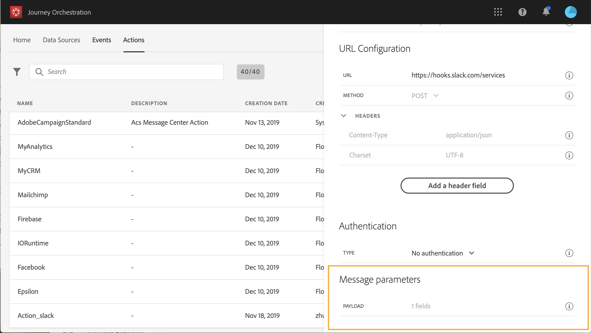

# Berichtparameters definiëren {#concept_wy4_bf1_2gb}

Plak in de sectie **[!UICONTROL Message parameters]** een voorbeeld van de JSON-payload die u naar de externe service wilt verzenden.

U kunt het parametertype definiëren (bijvoorbeeld: tekenreeks, geheel getal, enz.).

U kunt ook opgeven of een parameter een constante of een variabele is.

* Constante betekent dat de waarde van de parameter in de ruit van de actieconfiguratie door een technische persoon wordt bepaald. De waarde zal altijd het zelfde over reizen zijn. De kleur verandert niet en de markeerstift ziet deze niet wanneer u de aangepaste handeling voor de reis gebruikt. Het kan bijvoorbeeld een id zijn die het externe systeem verwacht. In dat geval is het veld rechts van de schakelconstante/variabele de doorgegeven waarde.
* Variabele betekent dat de waarde van de parameter varieert. De markering die deze aangepaste actie gebruikt, kan de gewenste waarde doorgeven of opgeven waar de waarde voor deze parameter moet worden opgehaald (bijvoorbeeld van het evenement, van de Adobe Experience Platform, enz.). In dat geval is het veld aan de rechterkant van de schakelconstante/variabele het label dat de markator in de reis ziet om deze parameter een naam te geven.

