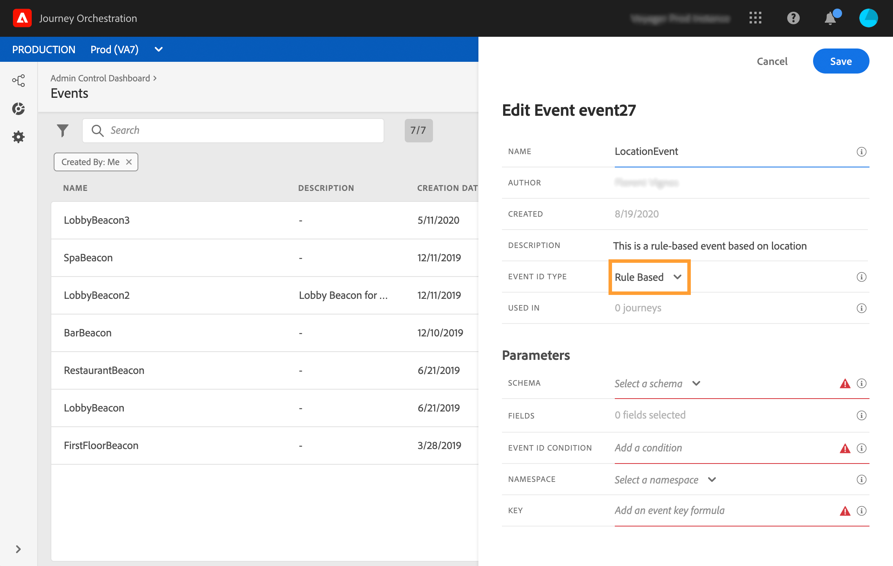

# Gebeurtenissen op basis van regels{#simplified-events}

We hebben de manier vereenvoudigd waarop u Experience Events instelt. We introduceren een nieuwe methode waarvoor geen eventID nodig is. Wanneer u een gebeurtenis instelt in Journey Orchestration, kunt u nu een op regels gebaseerde gebeurtenis definiëren.

Dit nieuwe type gebeurtenis genereert geen eventID. Gebruikend de eenvoudige uitdrukkingsredacteur, definieert u nu eenvoudig een regel die door het systeem zal worden gebruikt om de relevante gebeurtenissen te identificeren die uw reizen zullen teweegbrengen. Deze regel kan worden gebaseerd op elk veld dat beschikbaar is in de gebeurtenislading, bijvoorbeeld de locatie van het profiel of het aantal items dat is toegevoegd aan het winkelwagentje van het profiel.

Deze nieuwe methode is meestal transparant voor gebruikers. De enige wijziging is een nieuw veld in het scherm met gebeurtenisdefinities.

1. Klik in het linkermenu op het pictogram **Beheer** en klik vervolgens op **Gebeurtenissen**. De lijst met gebeurtenissen wordt weergegeven.

   

1. Klik op **Toevoegen** om een nieuwe gebeurtenis te maken. Het deelvenster voor gebeurtenisconfiguratie wordt aan de rechterkant van het scherm geopend.

   

1. Voer de naam van de gebeurtenis in. U kunt ook een beschrijving toevoegen.

   

1. Selecteer Op **regel gebaseerd** in het veld Type **nieuwe** Event-id.

   

   >[!NOTE]
   >
   >Het gegenereerde **type** systeem is de bestaande methode die een eventID vereist. Zie [deze sectie](../event/about-events.md).

1. Definieer het **schema** en de **payload velden**. Zie [deze sectie](../event/defining-the-payload-fields.md).

   

   >[!NOTE]
   >
   >Wanneer u het **Door het systeem gegenereerde type** selecteert, zijn alleen schema&#39;s beschikbaar die de gebeurtenisid-typemengsel hebben. Wanneer u het op **regel gebaseerde** type selecteert, zijn alle schema&#39;s van de Gebeurtenis van de Ervaring beschikbaar.

1. Klik in het veld Voorwaarde **-id van** gebeurtenis. Gebruikend de eenvoudige uitdrukkingsredacteur, bepaal de voorwaarde die door het systeem zal worden gebruikt om de gebeurtenissen te identificeren die uw reis zullen teweegbrengen.

   

   In ons voorbeeld schreven we een voorwaarde op basis van de stad van het profiel. Dit betekent dat wanneer het systeem een gebeurtenis ontvangt die aan deze voorwaarde (het gebied van de **Stad** en de waarde van **Parijs** ) aanpast, het het aan Journey Orchestration zal overgaan.

1. Definieer de **naamruimte** en **sleutel**. Zie [De naamruimte](../event/selecting-the-namespace.md) selecteren en de [gebeurtenissleutel](../event/defining-the-event-key.md)definiëren.

   

De andere stappen voor gebeurtenisconfiguratie en het creëren van de reis blijven onveranderd.

De gebeurtenis is nu geconfigureerd en klaar om op een reis te worden neergezet, net als elke andere gebeurtenis. Telkens wanneer een gebeurtenis die overeenkomt met de regel naar het systeem wordt verzonden, wordt het doorgegeven aan Journey Orchestration om uw reizen te starten.

