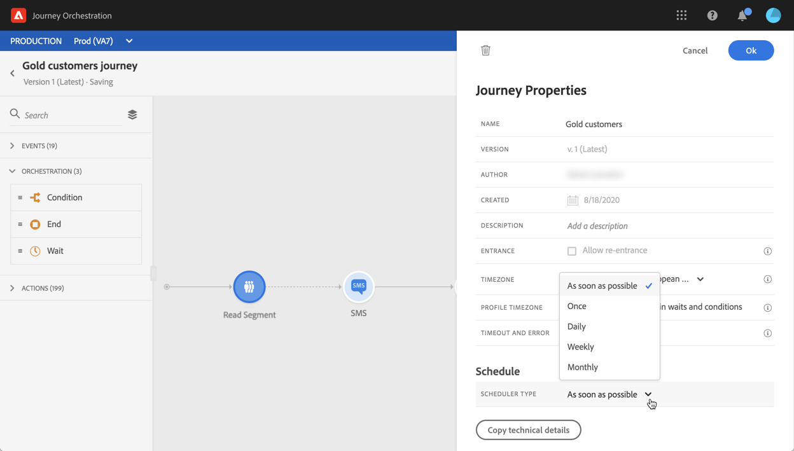

# Segmentactiviteit lezen {#segment-trigger-activity}

## Informatie over de activiteit Leessegment {#about-segment-trigger-actvitiy}

>[!NOTE]
>
>Als er op het canvas tijdens de publicatie of tijdens de activering van de testmodus een Adobe Campaign Standard-actie buiten de doos aanwezig is, wordt de rit vertraagd bij 13 ingangen per seconde. Anders zal de reis worden vertraagd bij 1000 gebeurtenissen per seconde.

Met de activiteit Leessegment kunt u alle personen die tot een Adobe Experience Platform-segment behoren een reis laten maken. Het starten van een journey kan één keer, of op regelmatige basis plaatsvinden.

Laten we zeggen dat je een Gold-klantensegment hebt op Adobe Experience Platform. Met de activiteit van het Leessegment, kunt u alle individuen van het Gouden klantensegment een reis maken en hen tot geïndividualiseerde reizen maken die alle reisfunctionaliteit gebruiken: voorwaarden, timers, gebeurtenissen, handelingen.

>[!NOTE]
>
>U kunt geen sprong en een **Gelezen segmentactiviteit** in de zelfde reis hebben. U kunt niet naar een reis springen die met een gebeurtenis van het **Gelezen segment** begint.

## De activiteit configureren {#configuring-segment-trigger-activity}

>[!NOTE]
>
>Vanwege de vertraging bij de segmentuitvoer is het niet mogelijk om een op segmenten gebaseerde reis binnen een kortere periode dan 1 uur te activeren.

1. Ontvouw de **[!UICONTROL Orchestration]** categorie en laat een **[!UICONTROL Read Segment]** activiteit op uw canvas vallen.

   De activiteit moet als eerste stap van een reis worden geplaatst.

1. Voeg een **[!UICONTROL Label]** aan de activiteit (facultatief) toe.

1. Kies in het **[!UICONTROL Segment]** veld het Adobe Experience Platform-segment dat de rit moet ingaan en klik op **[!UICONTROL Save]**.

   >[!NOTE]
   >
   >U kunt de kolommen in de lijst aanpassen en sorteren.

   

   Zodra het segment wordt toegevoegd, staat de **[!UICONTROL Copy]** knoop u toe om zijn naam en identiteitskaart te kopiëren:

   `{"name":"Gold customers,”id":"8597c5dc-70e3-4b05-8fb9-7e938f5c07a3"}`

   

1. Kies in het **[!UICONTROL Namespace]** veld de naamruimte die u wilt gebruiken om de personen te identificeren. For more on namespaces, refer to [this section](../event/selecting-the-namespace.md).

   >[!NOTE]
   >
   >Personen die behoren tot een segment dat niet de geselecteerde identiteit (naamruimte) onder hun verschillende identiteiten heeft, kunnen de reis niet betreden.

1. De **[!UICONTROL Read Segment]** activiteit staat u toe om de tijd te specificeren waarop het segment de reis zal ingaan. Om dit te doen, klik de **[!UICONTROL Edit journey schedule]** verbinding om tot de eigenschappen van de reis toegang te hebben, dan vorm het **[!UICONTROL Scheduler type]** gebied.

   

   Standaard komen segmenten de reis binnen, **[!UICONTROL As soon as possible]** dat wil zeggen 1 uur nadat de reis is gepubliceerd. Als u wilt dat het segment de reis op een specifieke datum/tijd of op een terugkomende basis ingaat, selecteer de gewenste waarde van de lijst.

   >[!NOTE]
   >
   >De **[!UICONTROL Schedule]** sectie is alleen beschikbaar wanneer een **[!UICONTROL Read Segment]** activiteit op het canvas is neergezet.

   

## Testen en publiceren van de reis {#testing-publishing}

Met deze **[!UICONTROL Read Segment]** activiteit kunt u de reis testen op een uniform profiel of op 100 willekeurig gekozen testprofielen uit de profielen die voor het segment in aanmerking komen.

Hiervoor activeert u de testmodus en selecteert u de gewenste optie in het linkerdeelvenster.

U kunt de testwijze dan vormen en in werking stellen zoals gebruikelijk. Gedetailleerde stappen voor het testen van een reis worden in [dit gedeelte](../building-journeys/testing-the-journey.md)beschreven.

Als de test eenmaal is uitgevoerd, kunt u met de **[!UICONTROL Show logs]** knop de testresultaten weergeven volgens de geselecteerde testoptie:

* **[!UICONTROL Single profile at a time]**: de teststammen bevatten dezelfde informatie als wanneer de monitaire testmodus wordt gebruikt. Raadpleeg [deze sectie](../building-journeys/testing-the-journey.md#viewing_logs) voor meer informatie

* **[!UICONTROL Up to 100 profiles at once]**: Aan de hand van de testlogboeken kunt u de voortgang van de segmentexport vanuit Adobe Experience Platform volgen, evenals de individuele voortgang van alle personen die de reis hebben betreden.

   Houd er rekening mee dat u door het testen van de reis met maximaal 100 profielen tegelijk de voortgang van de individuele personen op de reis niet kunt bijhouden met behulp van de visuele stroom.

   

Zodra de tests succesvol zijn, kunt u uw reis publiceren (zie het [Publiceren van de reis](../building-journeys/publishing-the-journey.md)). Personen die tot het segment behoren, komen de reis binnen op de datum/tijd die in de **[!UICONTROL Scheduler]** afdeling Eigenschappen van de reis is vermeld.

>[!NOTE]
>
>Wanneer het doen van een nieuwe versie van een op segment-gebaseerde reis die niet terugkomt (die zo spoedig mogelijk begint of &quot;eens&quot;), zullen alle individuen die eerder de reis inging niet zijn nieuwe versie ingaan wanneer u het zult publiceren. Als u hen wilt toestaan om opnieuw binnen te komen, zou u de reis moeten dupliceren.
