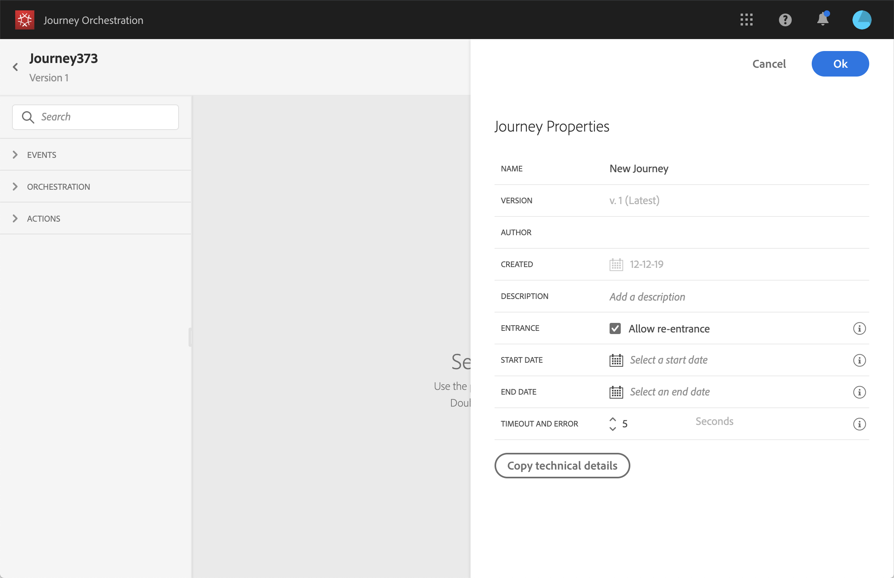

# Eigenschappen wijzigen {#concept_prq_wqt_52b}

Klik op het potloodpictogram in de rechterbovenhoek om de eigenschappen van de rit te openen.

U kunt de naam van de reis wijzigen, een beschrijving toevoegen, terugkeer toestaan, begin- en einddatum kiezen en een **[!UICONTROL Timeout and error]** duur definiëren als u beheerder bent.

## Entrance{#entrance}

Nieuwe reizen zijn standaard geschikt voor herbinnenkomst. U kunt de optie uitschakelen voor &#39;één opname&#39;-reizen, bijvoorbeeld als u een eenmalige gift wilt aanbieden wanneer een persoon een winkel betreedt. In dat geval, wilt u niet de klant de reis kunnen opnieuw ingaan en de aanbieding opnieuw ontvangen.

Wanneer een reis &quot;eindigt&quot;, zal het de status hebben **[!UICONTROL Closed (no entrance)]**. De reis zal het niet langer mogelijk maken dat nieuwe individuen de reis betreden. Personen die al op reis zijn, zullen de reis normaal afmaken.

## Time-out en fout in reisactiviteiten {#timeout_and_error}

Wanneer u een actie of voorwaardenactiviteit bewerkt, kunt u een alternatief pad definiëren in het geval van een fout of time-out. Als de verwerking van de activiteit die een derdensysteem ondervraagt de onderbrekingsduur overschrijdt die in de eigenschappen van de reis (**[!UICONTROL Timeout and  error]** gebied) wordt bepaald, zal de tweede weg worden gekozen om een potentiële terugvalactie uit te voeren.

Toegestane waarden liggen tussen 1 en 30 seconden.

Wij adviseren dat u een zeer korte **[!UICONTROL Timeout and error]** waarde bepaalt als uw reis tijdgevoelig is (voorbeeld: reageren op de locatie in real time van een persoon) omdat u de handeling niet langer dan een paar seconden kunt uitstellen. Als uw reis minder tijdgevoelig is, kunt u een langere waarde gebruiken om meer tijd aan het geroepen systeem te geven om een geldige reactie te verzenden.

[!DNL Journey Orchestration] gebruikt ook een algemene time-out. Zie de [volgende sectie](#global_timeout).

## Globale time-out voor transport {#global_timeout}

Naast de [time-out](#timeout_and_error) die wordt gebruikt bij reisactiviteiten, is er ook een wereldwijde time-out voor de reis die niet in de interface wordt weergegeven en niet kan worden gewijzigd. Deze onderbreking zal de vooruitgang van individuen in de reis 30 dagen na hun binnengaan stoppen. Dit betekent dat de reis van een individu niet langer mag duren dan 30 dagen. Na de periode van 30 dagen worden de gegevens van het individu verwijderd. Personen die aan het einde van de time-outperiode nog onderweg zijn, worden gestopt en als fouten in de rapportage worden ze in aanmerking genomen.

>[!NOTE]
>
>[!DNL Journey Orchestration] reageert niet rechtstreeks op verzoeken om privacy te weigeren, toegang te krijgen of te verwijderen. De wereldwijde time-out zorgt er echter voor dat individuen nooit langer dan 30 dagen op een reis blijven.

Vanwege de 30 dagen durende reistijd, wanneer het niet is toegestaan om de reis opnieuw te betreden, kunnen we er niet voor zorgen dat het blokkeren van de terugkeer meer dan 30 dagen zal duren. Aangezien we alle informatie over personen die 30 dagen na hun binnenkomst de reis hebben betreden, verwijderen, kunnen we niet weten dat de persoon eerder, meer dan 30 dagen geleden, is binnengekomen.

## Tijdzone en profieltijdzone {#timezone}

De tijdzone wordt gedefinieerd op het niveau van de reis.

U kunt een vaste tijdzone invoeren of Adobe Experience Platform-profielen gebruiken om de tijdzone van de reis te definiëren.

Zie voor meer informatie over tijdzonebeheer .
