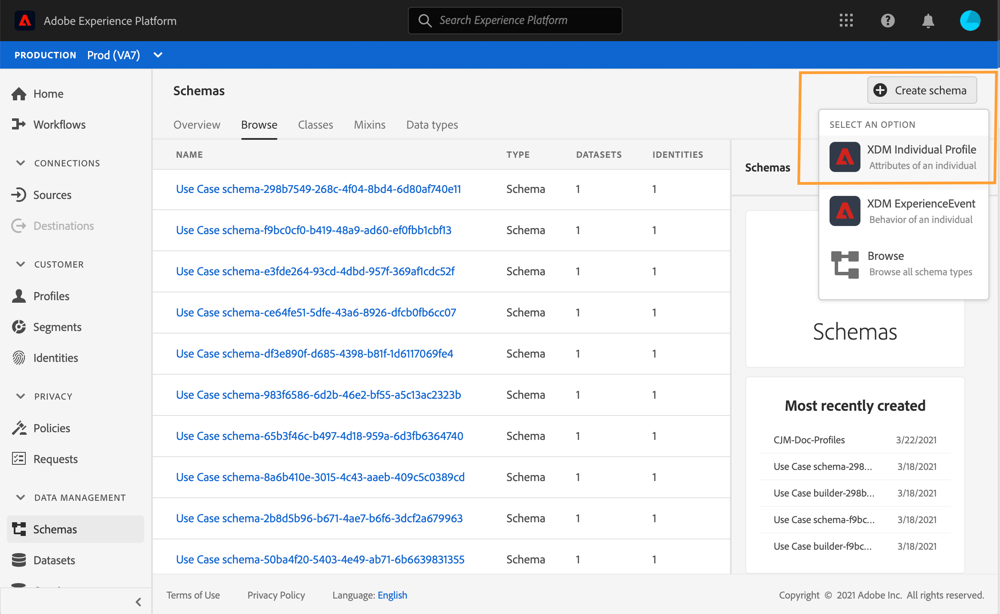
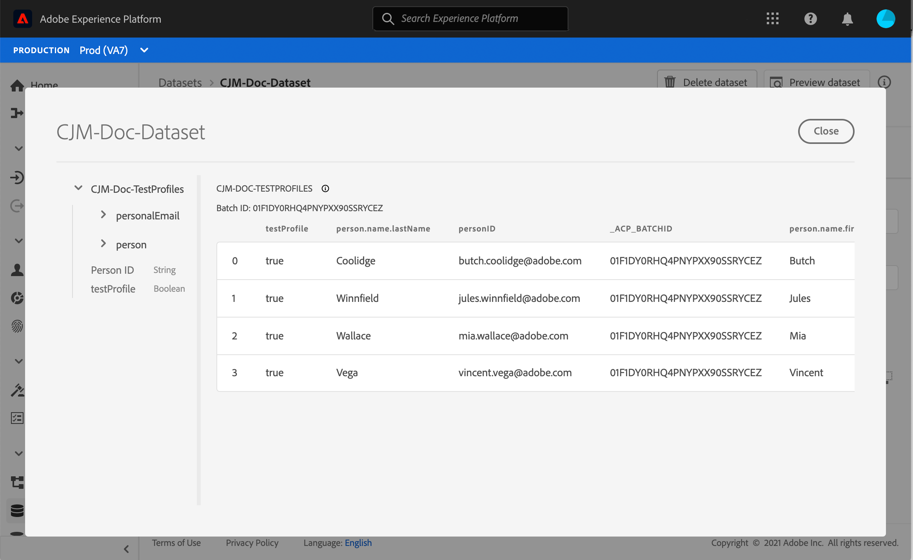

# Testprofielen maken {#create-test-profiles}


>[!CAUTION]
>
>**zoekend Adobe Journey Optimizer**? Klik [ hier ](https://experienceleague.adobe.com/nl/docs/journey-optimizer/using/ajo-home){target="_blank"} voor de documentatie van Journey Optimizer.
>
>
>_Deze documentatie verwijst naar erfenismaterialen van Journey Orchestration die door Journey Optimizer zijn vervangen. Neem contact op met uw accountteam als u vragen hebt over uw toegang tot Journey Orchestration of Journey Optimizer._


Testprofielen zijn vereist wanneer de testmodus op een reis wordt gebruikt. Leren hoe te om de testwijze te gebruiken, verwijs naar [ deze sectie ](../building-journeys/testing-the-journey.md).

Er zijn verschillende manieren om een testprofiel te maken in Adobe Experience Platform. In deze documentatie, concentreren wij ons op twee methodes: het uploaden van a [ csv- dossier ](../building-journeys/creating-test-profiles.md#create-test-profiles-csv) en het gebruiken van [ API vraag ](../building-journeys/creating-test-profiles.md#create-test-profiles-api). U kunt een jsdossier in een dataset ook uploaden, naar de [ documentatie van de Ingestie van Gegevens ](https://experienceleague.adobe.com/docs/experience-platform/ingestion/tutorials/ingest-batch-data.html?lang=nl-NL#add-data-to-dataset) verwijzen.

Met deze importmethoden kunt u ook profielkenmerken bijwerken. Op deze manier kunt u een bestaand profiel omzetten in een testprofiel. Gebruik gewoon een vergelijkbaar bestand- of API-aanroep en neem alleen het veld ‘testProfile’ op met de waarde ‘true’.

Het maken van een testprofiel lijkt op het maken van gewone profielen in Adobe Experience Platform. Voor meer informatie, verwijs naar de [ documentatie van het Profiel van de Klant in real time ](https://experienceleague.adobe.com/docs/experience-platform/profile/home.html?lang=nl).

## Vereisten{#test-profile-prerequisites}

Om profielen te kunnen tot stand brengen, moet u eerst een schema en een dataset in Adobe Experience Platform tot stand brengen.

Eerst, moet u een schema **tot stand brengen**. Voer de volgende stappen uit:

1. Klik in Adobe Experience Platform op **[!UICONTROL Schemas]** in het linkermenu.
   
1. Klik op **[!UICONTROL Create schema]** rechtsboven en selecteer een schematype, bijvoorbeeld **[!UICONTROL XDM Individual Profile]** .
   
1. Kies een naam voor het schema.
1. Klik in de sectie **[!UICONTROL Mixins]** op **[!UICONTROL Add]** .
   
1. Selecteer de juiste mixen. Voeg de **[!UICONTROL Profile test details]** -mix toe. Klik op **[!UICONTROL Add mixin]**.
   
De lijst van mengen wordt getoond op het scherm van het schemaoverzicht.
   
1. Klik in de lijst met velden op het veld dat u als primaire identiteit wilt definiëren.
   
1. Controleer in het deelvenster **[!UICONTROL Field properties]** rechts de opties **[!UICONTROL Identity]** en **[!UICONTROL Primary Identity]** en selecteer een naamruimte. Als u wilt dat de primaire identiteit een e-mailadres is, kiest u de naamruimte **[!UICONTROL Email]** . Klik op **[!UICONTROL Apply]**.
   
1. Selecteer het schema en schakel de optie **[!UICONTROL Profile]** in **[!UICONTROL Schema properties]** in.
   
1. Klik op **[!UICONTROL Save]**.

>[!NOTE]
>
>Voor meer informatie over schemaverwezenlijking, verwijs naar de [ documentatie XDM ](https://experienceleague.adobe.com/docs/experience-platform/xdm/ui/resources/schemas.html?lang=nl-NL#prerequisites).

Dan moet u **tot de dataset** leiden waarin de profielen zullen worden ingevoerd. Voer de volgende stappen uit:

1. Klik in Adobe Experience Platform op **[!UICONTROL Datasets]** in het linkermenu en klik vervolgens op **[!UICONTROL Create dataset]** .
   
1. Kies **[!UICONTROL Create dataset from schema]** .
   
1. Selecteer het eerder gemaakte schema en klik op **[!UICONTROL Next]** .
   
1. Kies een naam en klik op **[!UICONTROL Finish]** .
   
1. Schakel de optie **[!UICONTROL Profile]** in.
   

>[!NOTE]
>
> Voor meer informatie over datasetverwezenlijking, verwijs naar de [ documentatie van de Dienst van de Catalogus ](https://experienceleague.adobe.com/docs/experience-platform/catalog/datasets/user-guide.html?lang=nl-NL#getting-started).

## Een testprofiel maken met een CSV-bestand{#create-test-profiles-csv}

In Adobe Experience Platform kunt u profielen maken door een CSV-bestand met de verschillende profielvelden te uploaden naar uw gegevensset. Dit is de eenvoudigste methode.

1. Maak een eenvoudig CSV-bestand met behulp van een spreadsheetsoftware.
1. Voeg één kolom toe voor elk nodig veld. Voeg het primaire identiteitsveld (&quot;personID&quot; in het bovenstaande voorbeeld) en het veld &quot;testProfile&quot; toe op &quot;true&quot;.
   
1. Voeg één regel per profiel toe en vul de waarden voor elk veld in.
   
1. Sla het werkblad op als een CSV-bestand. Controleer of komma&#39;s als scheidingstekens worden gebruikt.
1. Klik in Adobe Experience Platform op **[!UICONTROL Workflows]** in het linkermenu.
   
1. Kies **[!UICONTROL Map CSV to XDM schema]** en klik op **[!UICONTROL Launch]** .
   
1. Selecteer de dataset u de profielen in wilt invoeren. Klik op **[!UICONTROL Next]**.
   
1. Klik op **[!UICONTROL Choose files]** en selecteer het CSV-bestand. Klik op **[!UICONTROL Next]** wanneer het bestand is geüpload.
   
1. Wijs de bronCSV gebieden aan de schemagebieden toe, dan klik **[!UICONTROL Finish]**.
   
1. Het importeren van de gegevens begint. De status wordt verplaatst van **[!UICONTROL Processing]** naar **[!UICONTROL Success]** . Klik op **[!UICONTROL Preview data set]** rechtsboven.
   
1. Controleer of de testprofielen correct zijn toegevoegd.
   

Uw testprofielen worden toegevoegd en kunnen nu worden gebruikt bij het testen van een reis. Zie [deze sectie](../building-journeys/testing-the-journey.md).
>[!NOTE]
>
> Voor meer informatie over csv de invoer, verwijs naar de [ documentatie van de Ingestie van Gegevens ](https://experienceleague.adobe.com/docs/experience-platform/ingestion/tutorials/map-a-csv-file.html?lang=nl-NL#tutorials).

## Testprofielen maken met API-aanroepen{#create-test-profiles-api}

U kunt testprofielen ook maken via API-aanroepen. Zie deze [pagina](https://experienceleague.adobe.com/docs/experience-platform/profile/home.html?lang=nl).

U moet een profielschema gebruiken dat de &quot;de testdetails van het Profiel&quot;mengen bevat. De markering testProfile maakt deel uit van deze mix.

Wanneer u een profiel maakt, moet u de waarde testProfile = true doorgeven.

U kunt een bestaand profiel ook bijwerken en de markering testProfile wijzigen in &quot;true&quot;.

Hier volgt een voorbeeld van een API-aanroep om een testprofiel te maken:

```
curl -X POST \
'https://dcs.adobedc.net/collection/xxxxxxxxxxxxxx' \
-H 'Cache-Control: no-cache' \
-H 'Content-Type: application/json' \
-H 'Postman-Token: xxxxx' \
-H 'cache-control: no-cache' \
-H 'x-api-key: xxxxx' \
-H 'x-gw-ims-org-id: xxxxx' \
-d '{
"header": {
"msgType": "xdmEntityCreate",
"msgId": "xxxxx",
"msgVersion": "xxxxx",
"xactionid":"xxxxx",
"datasetId": "xxxxx",
"imsOrgId": "xxxxx",
"source": {
"name": "Postman"
},
"schemaRef": {
"id": "https://example.adobe.com/mobile/schemas/xxxxx",
"contentType": "application/vnd.adobe.xed-full+json;version=1"
}
},
"body": {
"xdmMeta": {
"schemaRef": {
"contentType": "application/vnd.adobe.xed-full+json;version=1"
}
},
"xdmEntity": {
"_id": "xxxxx",
"_mobile":{
"ECID": "xxxxx"
},
"testProfile":true
}
}
}'
```
