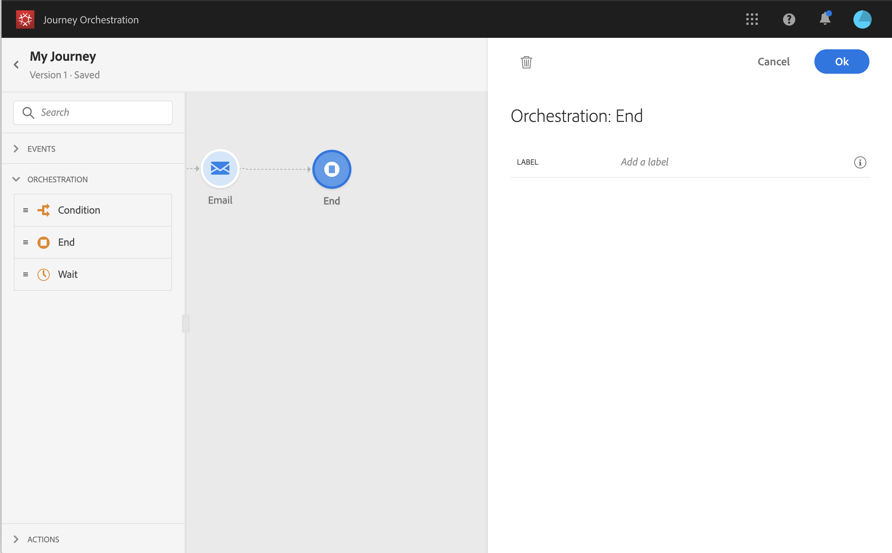

# Eindactiviteit{#section_vqp_4ft_dgb}

Met deze **[!UICONTROL End]** activiteit kunt u het einde van elk pad van de reis markeren. Het is niet verplicht, maar aanbevolen voor visuele duidelijkheid. Als de reis verschillende eindactiviteiten heeft, raden wij u aan om aan elk doel een label toe te voegen om de rapporten leesbaarder te maken. Zie [deze pagina](../reporting/about-journey-reports.md).

