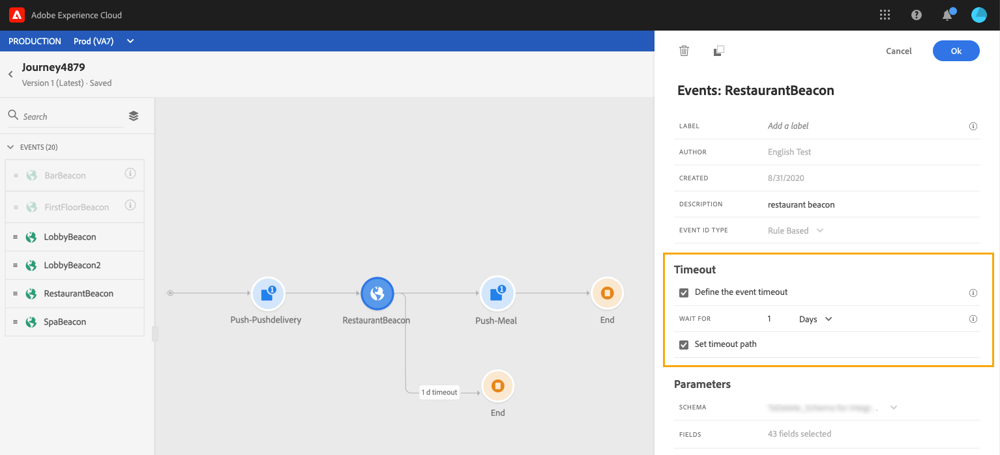

# Gebeurtenisactiviteiten {#concept_rws_1rt_52b}

>[!CAUTION]
>
>**zoekend Adobe Journey Optimizer**? Klik [&#x200B; hier &#x200B;](https://experienceleague.adobe.com/nl/docs/journey-optimizer/using/ajo-home){target="_blank"} voor de documentatie van Journey Optimizer.
>
>
>_Deze documentatie verwijst naar erfenismaterialen van Journey Orchestration die door Journey Optimizer zijn vervangen. Neem contact op met uw accountteam als u vragen hebt over uw toegang tot Journey Orchestration of Journey Optimizer._

De gebeurtenissen die door de technische gebruiker worden gevormd (zie [&#x200B; deze pagina &#x200B;](../event/about-events.md)) allen worden getoond in de eerste categorie van het palet, op de linkerkant van het scherm.

Begin altijd uw reis door een gebeurtenisactiviteit te slepen en neer te zetten. U kunt er ook op dubbelklikken.

Wanneer u op de gebeurtenisactiviteit in het canvas klikt, wordt de ruit van de activiteitenconfiguratie getoond. Wanneer u dezelfde gebeurtenis meerdere keren gebruikt, wordt standaard een verhoogd getal toegevoegd aan de naam van de gebeurtenis op het canvas. Daarnaast kunt u het veld **[!UICONTROL Label]** gebruiken om een achtervoegsel toe te voegen aan de naam van de gebeurtenis die onder uw activiteit op het canvas wordt weergegeven. Dit is handig als u gebeurtenissen op het canvas wilt identificeren, vooral als u dezelfde gebeurtenis meerdere keren gebruikt. Het zal ook het zuiveren in het geval van fouten gemakkelijker maken en het zal rapporten gemakkelijker te lezen maken.

## Luisteren naar gebeurtenissen tijdens een specifieke gebeurtenis {#listening}

Een gebeurtenisactiviteit die in de reis wordt geplaatst luistert voor onbepaalde tijd naar gebeurtenissen. Als u alleen tijdens een bepaalde tijd naar een gebeurtenis wilt luisteren, moet u een time-out voor de gebeurtenis configureren.

De reis zal dan aan de gebeurtenis tijdens de tijd luisteren die in de timeout wordt gespecificeerd. Als een gebeurtenis tijdens die periode wordt ontvangen, zal de persoon in de gebeurtenisweg stromen. Als niet, zal de klant of in de onderbrekingspad stromen als het wordt bepaald, of zal die reis voortzetten. Als er geen time-outpad is gedefinieerd, fungeert de time-outinstelling als een wachtbewerking. Het profiel wordt dan gedurende een bepaalde periode gewacht. Dit kan worden gestopt als een gebeurtenis plaatsvindt vóór het einde van die wachttijd. Als u profielen van die reis na onderbreking wilt worden uitgesloten, zult u een onderbrekingspad moeten plaatsen.

Voer de volgende stappen uit om een time-out voor een gebeurtenis te configureren:

1. Activeer de optie **[!UICONTROL Enable the event timeout]** vanuit de eigenschappen van de gebeurtenis.

1. Geef op hoeveel tijd de reis moet wachten op de gebeurtenis.

1. Schakel de optie **[!UICONTROL Set the timeout path]** in als u de personen naar een time-outpad wilt sturen wanneer er binnen de opgegeven time-out geen gebeurtenis is ontvangen. Als deze optie niet wordt ingeschakeld, wordt de reis voor de persoon voortgezet zodra de time-out is bereikt.

   

In dit voorbeeld, verzendt de reis een eerste welkome duw naar een klant. Het verzendt dan een duw van de maaltijdkorting slechts als de klant het restaurant binnen de volgende dag ingaat. Daarom hebben we de restaurant-gebeurtenis geconfigureerd met een time-out van 1 dag:

* Als de restaurantgebeurtenis minder dan 1 dag na de welkomstpush wordt ontvangen, wordt de pushactiviteit voor de maaltijdkorting verzonden.
* Als er de volgende dag geen restaurantgebeurtenis wordt ontvangen, loopt de persoon door het time-outpad.

Als u een time-out wilt configureren voor meerdere gebeurtenissen die zich na een **[!UICONTROL Wait]** -activiteit bevinden, moet u de time-out alleen configureren voor een van deze gebeurtenissen.

De time-out wordt toegepast op alle gebeurtenissen na de **[!UICONTROL Wait]** -activiteit. Als geen gebeurtenis vóór de gespecificeerde onderbreking wordt ontvangen, zullen de individuen in één enkel onderbreking weg stromen of zullen die reis door de tak voortzetten die de activiteit verlaten waar die onderbrekingsmontages zijn bepaald.

