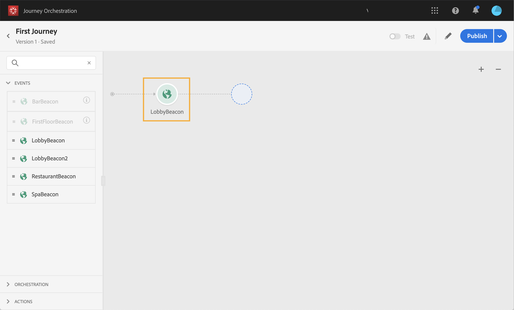

# Gebeurtenisactiviteiten {#concept_rws_1rt_52b}

De gebeurtenissen die door de technische gebruiker worden gevormd (zie [deze pagina](../event/about-events.md)) worden allen getoond in de eerste categorie van het palet, op de linkerkant van het scherm.

Begin altijd uw reis door een gebeurtenisactiviteit te slepen en neer te zetten. U kunt er ook op dubbelklikken.

Wanneer u op de gebeurtenisactiviteit in het canvas klikt, wordt de ruit van de activiteitenconfiguratie getoond. Wanneer u dezelfde gebeurtenis meerdere keren gebruikt, wordt standaard een verhoogd getal toegevoegd aan de naam van de gebeurtenis op het canvas. Daarnaast kunt u het veld **[!UICONTROL Label]** gebruiken om een achtervoegsel toe te voegen aan de naam van de gebeurtenis die onder uw activiteit op het canvas wordt weergegeven. Dit is handig als u gebeurtenissen op het canvas wilt identificeren, vooral als u dezelfde gebeurtenis meerdere keren gebruikt. Het zal ook het zuiveren in het geval van fouten gemakkelijker maken en het zal rapporten gemakkelijker te lezen maken.

## Luisteren naar gebeurtenissen tijdens een bepaald tijdstip

Een gebeurtenisactiviteit die in de reis wordt geplaatst luistert voor onbepaalde tijd naar gebeurtenissen. Als u alleen tijdens een bepaalde tijd naar een gebeurtenis wilt luisteren, moet u een time-out voor de gebeurtenis configureren.

De reis zal dan aan de gebeurtenis tijdens de tijd luisteren die in de timeout wordt gespecificeerd. Als een gebeurtenis tijdens die periode wordt ontvangen, zal de persoon in de gebeurtenisweg stromen. Als niet, zal de klant of in een onderbrekingspad stromen, of zijn reis beëindigen.

Voer de volgende stappen uit om een time-out voor een gebeurtenis te configureren:

1. Activeer de optie **[!UICONTROL Enable the event timeout]** uit de eigenschappen van de gebeurtenis.

1. Geef op hoeveel tijd de reis moet wachten op de gebeurtenis.

1. Schakel de optie **[!UICONTROL Set the timeout path]** in als u de personen naar een time-outpad wilt sturen wanneer er geen gebeurtenis binnen de opgegeven time-out is ontvangen. Als deze optie niet wordt ingeschakeld, eindigt de reis voor het individu zodra de time-out is bereikt.

   

In dit voorbeeld, verzendt de reis een eerste welkome duw naar een klant. Het verzendt dan een duw van de maaltijdkorting slechts als de klant het restaurant binnen de volgende dag ingaat. Daarom hebben we de restaurant-gebeurtenis geconfigureerd met een time-out van 1 dag:

* Als de restaurantgebeurtenis minder dan 1 dag uur na de welkomstpush wordt ontvangen, wordt de pushactiviteit voor de maaltijdkorting verzonden.
* Als er de volgende dag geen restaurantgebeurtenis wordt ontvangen, loopt de persoon door het time-outpad.

Merk op dat als u een onderbreking op veelvoudige gebeurtenissen wilt vormen die na een **[!UICONTROL Wait]** activiteit worden geplaatst, u onderbreking op één van deze gebeurtenissen slechts moet vormen.

De time-out wordt toegepast op alle gebeurtenissen die na de activiteit **[!UICONTROL Wait]** zijn geplaatst. Als er geen gebeurtenis wordt ontvangen na de opgegeven time-out, gaan de personen naar één enkel time-outpad of beëindigen ze hun reis.

