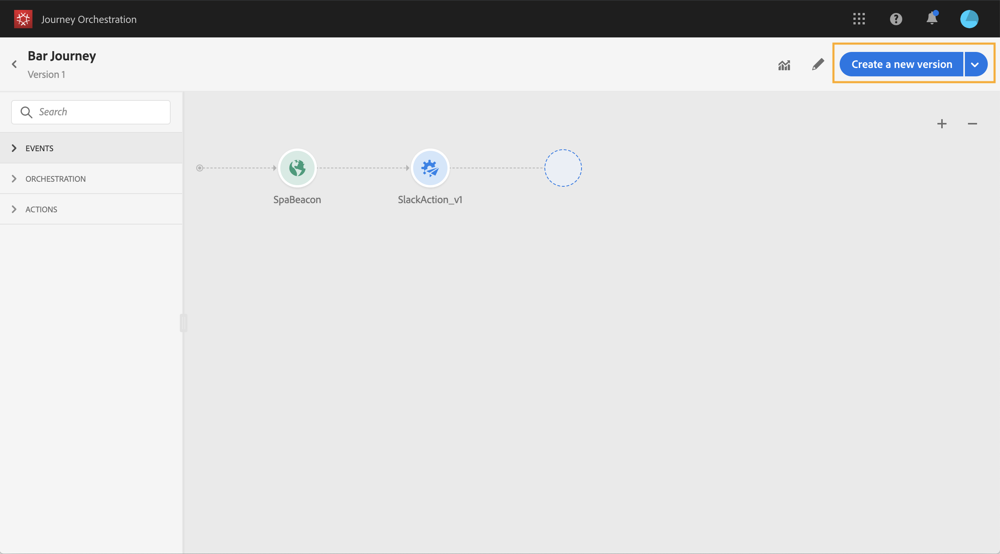

# Journeyversies{#concept_ldc_k55_zgb}

>[!CAUTION]
>
>**zoekend Adobe Journey Optimizer**? Klik [ hier ](https://experienceleague.adobe.com/nl/docs/journey-optimizer/using/ajo-home){target="_blank"} voor de documentatie van Journey Optimizer.
>
>
>_Deze documentatie verwijst naar erfenismaterialen van Journey Orchestration die door Journey Optimizer zijn vervangen. Neem contact op met uw accountteam als u vragen hebt over uw toegang tot Journey Orchestration of Journey Optimizer._

In de reislijst, worden alle reisversies getoond met het versieaantal. Zie [ deze pagina ](../building-journeys/using-the-journey-designer.md). Wanneer u een reis zoekt, verschijnen de nieuwste versies bij de eerste keer dat de toepassing wordt geopend boven aan de lijst. Vervolgens kunt u de gewenste sortering definiëren en wordt deze door de toepassing als gebruikervoorkeur behouden. De versie van de reis wordt ook weergegeven boven aan de interface van de reiseditie, boven het canvas.

Als u zich aan een levende reis moet aanpassen, moet u een nieuwe versie van uw reis tot stand brengen.

>[!NOTE]
>
>Meer op de beperkingen van de reisversies leren, zie [ deze pagina ](../about/limitations.md#journey-versions-limitations)

1. Open de meest recente versie van uw livereis, klik op **[!UICONTROL Create a new version]** en bevestig deze.

   

   >[!NOTE]
   >
   >U kunt alleen een nieuwe versie maken van de meest recente versie van een reis.

1. Breng uw wijzigingen aan, klik op **[!UICONTROL Publish]** en bevestig de selectie.

   

Vanaf het moment dat de reis wordt gepubliceerd, zullen individuen naar de recentste versie van de reis gaan. Mensen die al een vorige versie hebben ingevoerd, blijven er totdat ze klaar zijn met de reis. Als ze later weer dezelfde reis maken, gaan ze naar de meest recente versie.

Reisversies kunnen afzonderlijk worden gestopt. Alle versies van reizen hebben dezelfde naam.

>[!NOTE]
>
>Wanneer u een nieuwe versie van een reis publiceert, beëindigt de vorige versie automatisch en schakelt aan de **Gesloten** status. Er zal geen toegang tot de reis plaatsvinden. Zelfs als u de laatste versie stopt, blijft de vorige versie gesloten.
