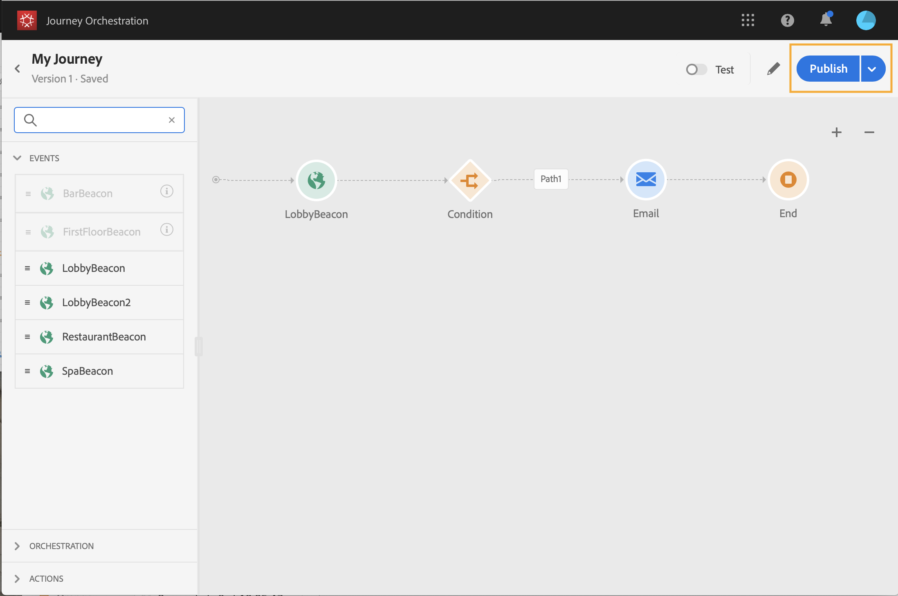

# Een journey maken {#concept_gq5_sqt_52b}

Deze stap wordt uitgevoerd door **zakelijke gebruiker**. Hier maak je je reizen. Combineer de verschillende actie-, orkestratie- en gebeurtenisactiviteiten om uw kanaaloverschrijdende scenario’s met meerdere stappen te maken.

Met de interface voor reizen kunt u activiteiten van het palet gemakkelijk naar het canvas slepen. U kunt ook dubbelklikken op een activiteit om deze in het canvas toe te voegen bij de volgende beschikbare stap. Elke activiteit heeft een specifieke rol en plaats in het proces. De activiteiten worden gesequenceerd. Wanneer een activiteit wordt gebeëindigd, gaat de stroom verder en verwerkt de volgende activiteit, etc.

Per reis is slechts één naamruimte toegestaan. Wanneer u de eerste gebeurtenis neerzet, worden gebeurtenissen met verschillende naamruimten grijs weergegeven. Als de eerste gebeurtenis geen naamruimte heeft, worden alle gebeurtenissen met een naamruimte grijs weergegeven. Zie [deze pagina](../event/selecting-the-namespace.md). Bovendien worden Adobe Experience Platform-veldgroepen grijs weergegeven als de rit gebeurtenissen zonder naamruimte bevat. En tot slot, als u verscheidene gebeurtenissen in de zelfde reis gebruikt, moeten zij zelfde namespace gebruiken.

Bij het starten van een nieuwe rit worden elementen die niet op het canvas kunnen worden neergezet als de eerste stap, verborgen. Dit heeft betrekking op alle handelingen, de activiteit van de aandoening, de wachttijd en de reactie.

## Snel starten {#creating_journey}

Hier volgen de belangrijkste stappen voor het maken en publiceren van een reis.

1. Klik in het bovenste menu op het tabblad **[!UICONTROL Home]**.

   De lijst met reizen wordt weergegeven. Raadpleeg [deze pagina](../building-journeys/using-the-journey-designer.md) voor meer informatie over de interface.

   

1. Klik **[!UICONTROL Create]** om een nieuwe reis tot stand te brengen.

   

1. Bewerk de eigenschappen van de journey in het configuratievenster dat aan de rechterkant wordt weergegeven. Zie [deze pagina](../building-journeys/changing-properties.md).

   

1. Begin door een gebeurtenisactiviteit van het palet naar het canvas te slepen. U kunt ook dubbelklikken op een activiteit om deze aan het canvas toe te voegen.

   

1. Sleep en zet uw andere activiteiten neer en vorm hen. Zie de pagina&#39;s [Gebeurtenisactiviteiten](../building-journeys/event-activities.md), [Informatie over orkestatieactiviteiten](../building-journeys/about-orchestration-activities.md) en [Informatie over actieactiviteiten](../building-journeys/about-action-activities.md).

   

1. Uw reis wordt automatisch bewaard. Test uw reis en publiceer deze. Zie [de reis testen](../building-journeys/testing-the-journey.md) en [De reis publiceren](../building-journeys/publishing-the-journey.md).

   

## Een reis {#ending_a_journey} beëindigen

Er zijn twee manieren om een reis te beëindigen:

* De persoon komt bij de laatste activiteit van een weg aan. Deze laatste activiteit kan een eindactiviteit of een andere activiteit zijn. Er bestaat geen verplichting om een pad met een eindactiviteit te beëindigen. Zie [deze pagina](../building-journeys/end-activity.md).
* De persoon komt bij een voorwaardenactiviteit (of een wachttijdactiviteit met een voorwaarde) aan en past geen van de voorwaarden aan.

De persoon kan dan opnieuw de reis betreden als herbinnenkomst is toegestaan. Zie [deze pagina](../building-journeys/changing-properties.md).
