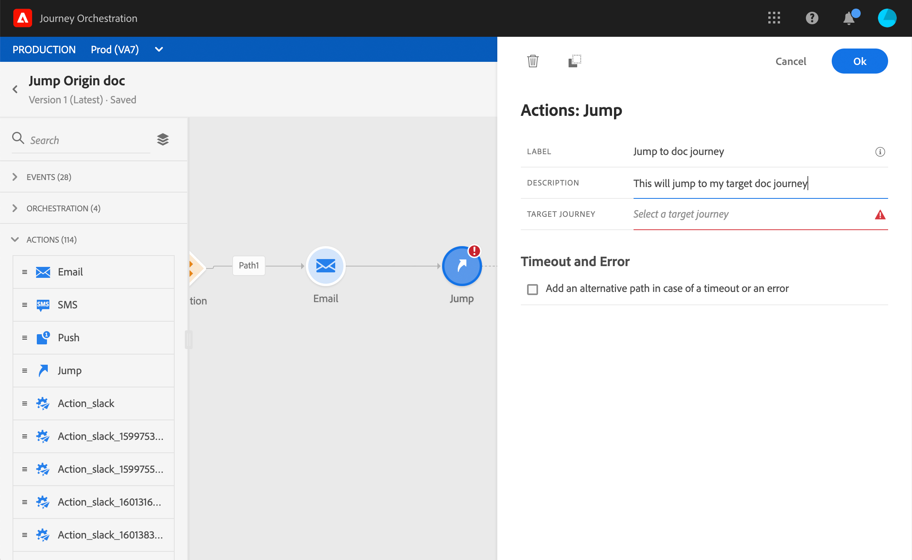

# Overstappen van de ene reis naar de andere {#jump}

>[!NOTE]
>
>Effectieve beschikbaarheid: 15 november 2020

Met de **actie Snelheid** kunt u individuen van de ene reis naar de andere duwen. Met deze functie kunt u:

* vereenvoudigen het ontwerp van zeer complexe reizen door deze in verschillende te splitsen
* ritten bouwen op basis van gemeenschappelijke en herbruikbare reispatronen

In de oorspronkelijke reis voegt u gewoon een **sprongreis** toe en selecteert u een doelreis. Wanneer het individu de sprongstap ingaat, wordt een interne gebeurtenis verzonden naar de eerste gebeurtenis van de doelreis. Als de sprongreactie succesvol is, gaat het individu verder in de reis. Het gedrag is vergelijkbaar met andere acties.

In de doelreis, zal de eerste gebeurtenis die intern door de sprong wordt teweeggebracht de individuele stroom in de reis maken.

## Levenscyclus

Laten we zeggen dat je een sprong hebt toegevoegd in een reis A naar een reis B. Reis A is de **oorspronkelijke reis** en reis B, de **doelreis**.
Hier volgen de verschillende stappen van het uitvoeringsproces:

**Reis A** wordt geactiveerd na een externe gebeurtenis:

1. Reis A ontvangt een externe gebeurtenis met betrekking tot een individu.
1. De persoon bereikt de sprongregel.
1. Het individu wordt naar Journey B geduwd en gaat naar de volgende stappen in Reis A, na de sprong.

In **reis B** kan het eerste evenement extern (als een gewone gebeurtenis) of intern worden geactiveerd via een sprong van reis A:

1. Journey B ontving een intern evenement van Journey A.
1. De eerste gebeurtenis van Journey B wordt gestart met de informatie afkomstig van Journey A.
1. Het individu begint te stromen in Journey B.

## Belangrijke opmerkingen

* U kunt alleen naar een reis springen die dezelfde naamruimte gebruikt als de oorspronkelijke reis.
* U kunt niet naar een reis springen die met een de kwalificatiegebeurtenis **van het** Segment begint.
* Wanneer de sprong wordt uitgevoerd, wordt de recentste versie van de doelreis teweeggebracht.
* U kunt zo veel sprongen omvatten aangezien u in een reis nodig hebt. Na een sprong kunt u alle benodigde activiteiten toevoegen.
* U kunt zo veel sprongniveaus hebben zoals nodig. Reis A springt bijvoorbeeld naar reis B, die naar reis C gaat enzovoort.
* De doelreis kan ook zoveel pompen bevatten als nodig is.
* Luspatronen worden niet ondersteund. Er is geen manier om twee of meer reizen aan elkaar te koppelen, wat een oneindige lus zou creëren. Het scherm van de de activiteitenconfiguratie van de **Sprong** verhindert u dit te doen.
* Zoals gebruikelijk kan een uniek individu slechts eenmaal op dezelfde reis aanwezig zijn. Als het individu dat van de oorspronkelijke reis werd geduwd al op de doelreis zit, zal het individu dus niet de doelreis betreden. Er wordt geen fout gerapporteerd bij de sprong omdat dit een normaal gedrag is.

## De sprong configureren

1. Ontwerp uw oorspronkelijke reis.

   

1. Voeg bij elke stap van de reis een **sprongactiviteit** toe vanuit de categorie **Actie** . Voeg een label en beschrijving toe.

   

1. Klik in het veld **Doel** .
De lijst toont alle reisversies die ontwerp, levend of in testwijze zijn. De reizen die een verschillende namespace gebruiken of die met een **de kwalificatiegebeurtenis** van het Segment beginnen zijn niet beschikbaar. Doeltrajecten die een luspatroon zouden maken, worden ook uitgefilterd.

   

   >[!NOTE]
   >
   >U kunt op het pictogram Doelreis **** openen aan de rechterkant klikken om de doelreis in een nieuw tabblad te openen.

1. Selecteer de doelreis waarnaar u wilt springen.
Het veld **Eerste gebeurtenis** wordt voorgevuld met de naam van de eerste gebeurtenis van de doelreis. Als uw doelreis veelvoudige gebeurtenissen omvat, wordt de sprong slechts toegestaan op de eerste gebeurtenis.

   

1. In de sectie Parameters **van** Handeling worden alle velden van de doelgebeurtenis weergegeven. Net als bij andere typen acties wijst u elk veld met velden uit de gebeurtenis van oorsprong of de gegevensbron toe. Deze informatie wordt tijdens runtime doorgegeven aan de doelroute.
1. Voeg de volgende activiteiten toe om uw oorspronkelijke reis te voltooien.

   

Uw sprong wordt gevormd. Zodra je reis live is of in testmodus, zullen individuen die de sprong bereiken, van de doelreis worden verplaatst.

Wanneer een sprong in een reis wordt gevormd, wordt een pictogram van de sprongingang automatisch toegevoegd aan het begin van de doelreis. Dit helpt u identificeren dat de reis extern maar ook intern van een sprong kan worden teweeggebracht.

## Problemen oplossen

Bij publicatie van de reis of in testmodus treden fouten op als:
* de beoogde reis is niet langer mogelijk
* de doelreis is een concept, een gesloten of een stilstand
* als de eerste gebeurtenis van de doelreis is gewijzigd en de mapping is verbroken
