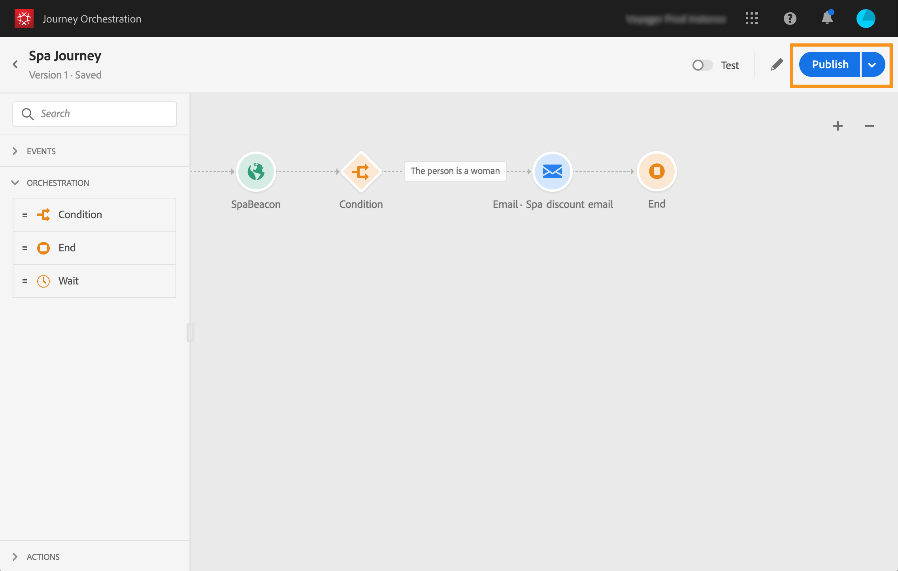

# De reis publiceren{#concept_mtc_lrt_52b}

U kunt een reis publiceren nadat u de geldigheid ervan hebt getest.

Als u wijzigingen in een gepubliceerde reis moet aanbrengen, moet u een nieuwe versie van uw reis tot stand brengen. Zie . Als een reis alleen-lezen is, kunt u alleen de activiteitslabels en -beschrijvingen, de naam van de reis en de beschrijving van de reis wijzigen.

Als je een reis stopt, wordt deze definitief gestopt. Alle mensen die op de reis gaan, zullen permanent worden gestopt en de reis zal ophouden nieuwkomers toe te laten. Als u de reis opnieuw moet gebruiken, moet u het dupliceren en het publiceren.

1. Controleer voordat u uw reis publiceert of deze geldig is en of er geen fout optreedt. U kunt geen reis met fouten publiceren. Zie . Het wordt ook aanbevolen uw reis vóór publicatie te testen. Zie .
1. Als u de rit wilt publiceren, klikt u op de **[!UICONTROL Publish]** optie in het keuzemenu rechtsboven.

   

Wanneer de reis wordt gepubliceerd, is het op read-only wijze.
