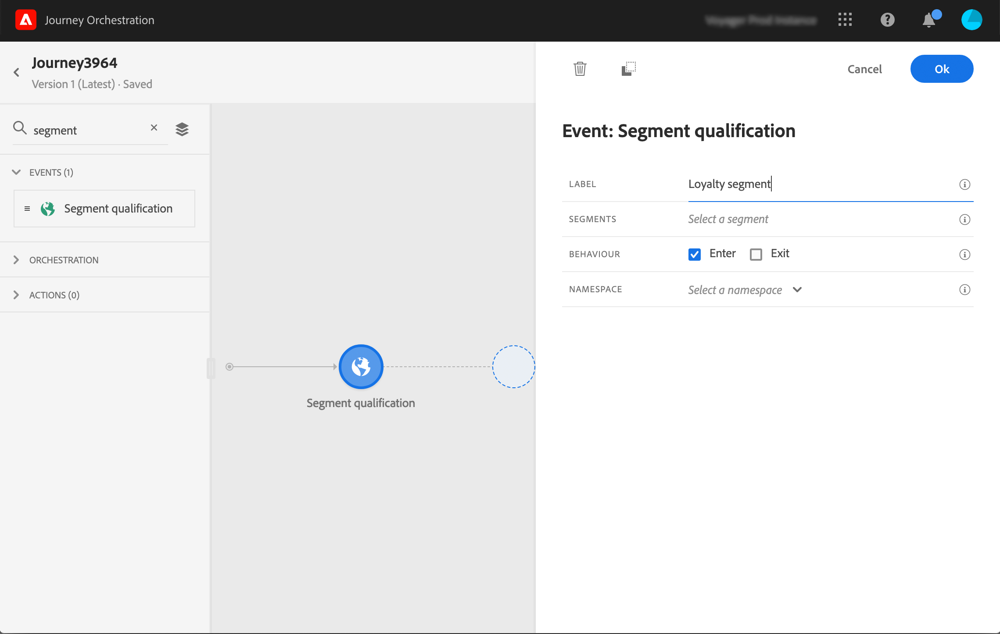
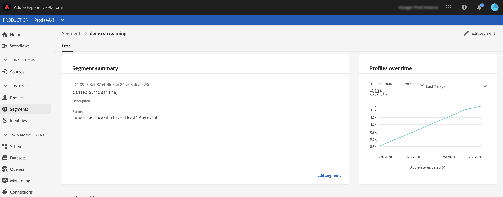

# Segmentkwalificatiegebeurtenissen {#segment-qualification}

## Informatie over segmentkwalificatiegebeurtenissen{#about-segment-qualification}

Met deze activiteit kunt u luisteren naar de ingangen en uitgangen van profielen in Adobe Experience Platform-segmenten om ervoor te zorgen dat individuen op reis kunnen gaan of vooruit kunnen gaan. For more information on segment creation, refer to this [section](../segment/about-segments.md).

Laten we zeggen dat je een &quot;zilveren klant&quot;-segment hebt. Met deze activiteit, kunt u alle nieuwe zilveren klanten een reis maken en hen een reeks gepersonaliseerde berichten verzenden.

Dit type gebeurtenis kan als eerste stap of later in de reis worden geplaatst.

>[!IMPORTANT]
>
>Houd er rekening mee dat Adobe Experience Platform-segmenten één keer per dag (**batchsegmenten** ) of in realtime (**gestreamde** segmenten, met de optie Frequentie publiek van Adobe Experience Platform) worden berekend.
>
>Als het geselecteerde segment wordt gestreamd, zullen de individuen die tot dit segment behoren potentieel de reis in real time ingaan. Als het segment partij is, zullen de mensen die nieuw voor dit segment worden gekwalificeerd de reis potentieel ingaan wanneer de segmentberekening op Adobe Experience Platform wordt uitgevoerd.

1. Ontvouw de **[!UICONTROL Events]** categorie en laat een **[!UICONTROL Segment qualification]** activiteit op uw canvas vallen.

   

1. Voeg een **[!UICONTROL Label]** aan de activiteit toe. Deze stap is optioneel.

1. Klik in het **[!UICONTROL Segment]** veld en selecteer de segmenten die u wilt benutten.

   >[!NOTE]
   >
   >U kunt de kolommen in de lijst aanpassen en sorteren.

   

   Zodra het segment wordt toegevoegd, staat de **[!UICONTROL Copy]** knoop u toe om zijn naam en identiteitskaart te kopiëren:

   `{"name":"Loyalty membership“,”id":"8597c5dc-70e3-4b05-8fb9-7e938f5c07a3"}`

   

1. Kies in het **[!UICONTROL Behavior]** veld of u wilt luisteren naar segmentingangen, uitgangen of beide.

1. Selecteer een naamruimte. Dit is alleen nodig als het evenement als de eerste stap van de reis wordt geplaatst.

   

De nuttige lading bevat de volgende contextinformatie, die u in voorwaarden en acties kunt gebruiken:

* het gedrag (ingang, uitgang)
* het tijdstempel van de kwalificatie
* segment-id

Wanneer u de expressie-editor gebruikt in een voorwaarde of handeling die volgt op een **[!UICONTROL Segment qualification]** activiteit, hebt u toegang tot het **[!UICONTROL SegmentQualification]** knooppunt. U kunt kiezen tussen **[!UICONTROL Last qualification time]** en **[!UICONTROL status]** (Enter of exit).

Zie [Condition activity](../building-journeys/condition-activity.md#about_condition).

## Aanbevolen procedures {#best-practices-segments}

De **[!UICONTROL Segment Qualification]** activiteit maakt het mogelijk dat personen die gekwalificeerd of gediskwalificeerd zijn, onmiddellijk toegang krijgen tot de reis.

De ontvangstsnelheid van deze informatie is hoog. Uit de uitgevoerde metingen blijkt een snelheid van 10.000 ontvangen gebeurtenissen per seconde. Als gevolg hiervan moet u er zeker van zijn dat u begrijpt hoe pieken in de toegang kunnen optreden, hoe u ze kunt vermijden en hoe u uw reis voor hen gereed kunt maken.

### Batchsegmenten{#batch-speed-segment-qualification}

Wanneer het gebruiken van segmentkwalificatie voor een partijsegment, merk op dat een piek van ingang op het tijdstip van de dagelijkse berekening zal gebeuren. De omvang van de piek hangt af van het aantal personen dat dagelijks het segment betreedt (of verlaat).

Als het batchsegment nieuw wordt gemaakt en onmiddellijk wordt gebruikt in een reis, kan de eerste batch van de berekening bovendien een zeer groot aantal personen de reis binnenkomen.

### Gestroomde segmenten{#streamed-speed-segment-qualification}

Wanneer het gebruiken van segmentkwalificatie voor gestroomde segmenten, is er minder risico om grote pieken van ingangen/uitgangen te krijgen toe te schrijven aan de ononderbroken evaluatie van het segment. Maar als de segmentdefinitie ertoe leidt dat een groot aantal klanten tegelijkertijd in aanmerking komt, kan er ook een piek zijn.

For more information on streaming segmentation, refer to this [page](https://experienceleague.adobe.com/docs/experience-platform/segmentation/api/streaming-segmentation.html#api)

### Overbelasting voorkomen{#overloads-speed-segment-qualification}

Hier volgen een paar voorbeelden van beste praktijken die zullen helpen om overladende systemen te vermijden leveraged in reizen (gegevensbronnen, douaneacties, acties van Adobe Campaign Standard).

Gebruik in een **[!UICONTROL Segment Qualification]** activiteit niet onmiddellijk na het aanmaken een batchsegment. Hiermee wordt de eerste rekenpiek vermeden. Merk op dat er een gele waarschuwing in het reiscanvas zal zijn als u op het punt staat om een segment te gebruiken dat nooit is berekend.

Plaats een plafondregel voor gegevensbronnen en handelingen die tijdens reizen worden gebruikt om overbelasting te voorkomen (zie deze [sectie](../api/capping.md)). De bijschilderregel hoeft niet opnieuw te worden uitgevoerd. Als u het opnieuw moet proberen, moet u een alternatief pad in de reis gebruiken door de doos **[!UICONTROL Add an alternative path in case of a timeout or an error]** in voorwaarden of acties te controleren.

Voordat u het segment in een productietraject gaat gebruiken, moet u altijd eerst het aantal personen beoordelen dat dagelijks voor dit segment in aanmerking komt. U kunt dit doen door de **[!UICONTROL Segments]** sectie in de Adobe Experience Platform te controleren en de grafiek aan de rechterkant te bekijken.

