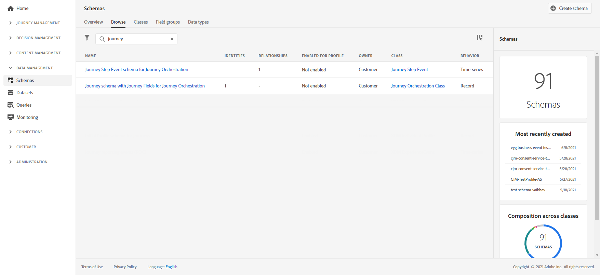

# Overzicht van stap delen voor reizen{#sharing-overview}

[!DNL Journey Orchestration] stuurt automatisch gegevens over de reisprestaties naar het Adobe Experience Platform zodat deze voor analysedoeleinden met andere gegevens kunnen worden gecombineerd.

U hebt bijvoorbeeld een reis ingesteld die meerdere e-mails verzendt. Met deze functie kunt u [!DNL Journey Orchestration] gegevens combineren met gegevens over gebeurtenissen stroomafwaarts, zoals hoeveel conversies er hebben plaatsgevonden, hoeveel betrokkenheid er op de website heeft plaatsgevonden of hoeveel transacties er in de winkel hebben plaatsgevonden. De reisinformatie kan worden gecombineerd met gegevens over het Adobe Experience Platform, hetzij uit andere digitale eigenschappen, hetzij uit offline eigenschappen, om een vollediger beeld van de prestaties te geven.

[!DNL Journey Orchestration] leidt automatisch tot de noodzakelijke schema&#39;s en stromen in datasets aan het Adobe Experience Platform voor elke stap een individu in een reis neemt. Een step-gebeurtenis komt overeen met een individuele gebeurtenis die zich tijdens een rit van het ene knooppunt naar het andere verplaatst. Bijvoorbeeld, in een reis die een gebeurtenis, een voorwaarde en een actie heeft, worden de drie stapgebeurtenissen verzonden naar het Adobe Experience Platform.

De lijst met XDM-velden die worden doorgegeven, is uitgebreid. Sommige bevatten door het systeem gegenereerde codes en andere hebben door mensen leesbare vriendelijke namen. Voorbeelden zijn het etiket van de reisactiviteit of de stapstatus: hoe vaak een time-out of een fout is opgetreden.

>[!CAUTION]
>
>Datasets kunnen niet worden ingeschakeld voor realtime profielservice. Zorg dat de **[!UICONTROL Profile]** schakeloptie is uitgeschakeld

De reizen verzenden gegevens aangezien het voorkomt, op een het stromen manier. U kunt deze gegevens vragen met de Query-service. U kunt verbinding maken met Customer Journey Analytics of andere BI-gereedschappen om gegevens met betrekking tot deze stappen weer te geven.

De volgende schema&#39;s worden gemaakt:

* Het schema van de Gebeurtenis van het Profiel van de Stap van de reis voor - de Gebeurtenissen van de Ervaring voor stappen die in een Reizen samen met een Kaart van de Identiteit worden genomen die voor afbeelding aan een individuele Deelnemer van de Reizen moeten worden gebruikt. [!DNL Journey Orchestration]
* Gebeurtenisschema voor stap van de reis voor [!DNL Journey Orchestration] - gebeurtenis van de stap van de reis die aan een Meta-gegevens van de Reis wordt gebonden.
* Reisschema met reisvelden voor [!DNL Journey Orchestration] - Reismetagegevens voor het beschrijven van reizen.

De volgende datasets worden overgegaan:

* Gebeurtenisschema voor stapsgewijze reis voor [!DNL Journey Orchestration]
* Gebeurtenissen reisstap
* Reizen

De lijsten van gebieden XDM die tot het Adobe Experience Platform worden overgegaan zijn hier gedetailleerd:

* [tripSteps-gebeurtenissen - gemeenschappelijke velden](../building-journeys/sharing-common-fields.md)
* [uitvoeringsvelden van handelingen voor gebeurtenissen van de tripStep](../building-journeys/sharing-execution-fields.md)
* [gegevens ophalen van gebeurtenissen van de tripStep velden](../building-journeys/sharing-fetch-fields.md)
* [identiteitsvelden van gebeurtenissen van de tripStep](../building-journeys/sharing-identity-fields.md)
* [reisvelden](../building-journeys/sharing-journey-fields.md)

Bekijk deze [zelfstudievideo](https://docs.adobe.com/content/help/en/journey-orchestration-learn/tutorials/reporting-step-events-to-adobe-experience-platform.html)voor meer informatie over stapgebeurtenissen die aan het Adobe Experience Platform worden gerapporteerd.
