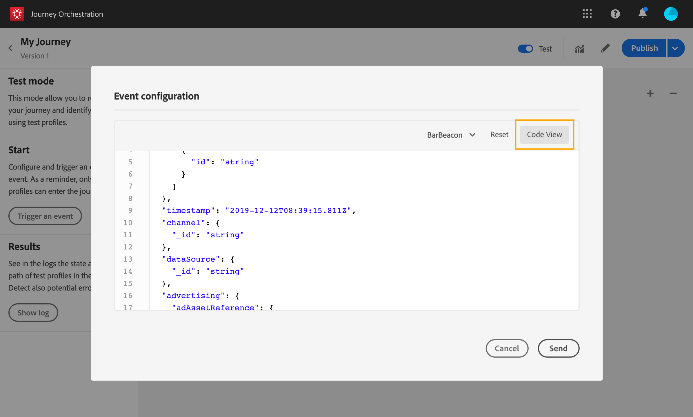

# Journey testen{#testing_the_journey}

Voordat u uw reis kunt testen, moet u alle eventuele fouten oplossen. Zie [](../about/troubleshooting.md#section_h3q_kqk_fhb).

U kunt uw reis testen voordat deze wordt gepubliceerd, met behulp van testprofielen. Dit staat u toe om te analyseren hoe de individuen in de reis stromen en problemen vóór publicatie oplossen.

Voer de volgende stappen uit om de testmodus te gebruiken:

1. Controleer voordat u de reis test of deze geldig is en of er geen fout optreedt. U kunt een test van een reis met fouten niet starten. Zie [](../about/troubleshooting.md#section_h3q_kqk_fhb). Er wordt een waarschuwingssymbool weergegeven wanneer er fouten optreden.

1. U activeert de testmodus door te klikken op de **[!UICONTROL Test]** schakeloptie in de rechterbovenhoek.

   

1. Gebruik de **[!UICONTROL Wait time in test]** parameter, in de bodem linkerhoek, om de tijd te bepalen dat elke wachttijdactiviteit op testwijze zal duren. De standaardtijd is 10 seconden. Zo krijgt u de testresultaten snel. Deze parameter verschijnt slechts als u één of meerdere wachtactiviteiten in uw reis hebt gelaten vallen.

   

1. Klik **[!UICONTROL Trigger an event]** om gebeurtenissen aan de reis te vormen en te verzenden. Zorg ervoor dat u gebeurtenissen verzendt die betrekking hebben op testprofielen. Zie [Uw gebeurtenissen](#firing_events)starten.

   

1. Nadat de gebeurtenissen worden ontvangen, klik de **[!UICONTROL Show log]** knoop om het testresultaat te bekijken en hen te verifiëren. Zie De logboeken [weergeven](#viewing_logs).

   

1. Als er een fout optreedt, deactiveert u de testmodus, wijzigt u de journey en test u deze opnieuw. Wanneer de test overtuigend is, kunt u uw reis publiceren. Zie [](../building-journeys/publishing-the-journey.md).

## Belangrijke opmerkingen {#important_notes}

* Er is een interface beschikbaar voor het afvuren van gebeurtenissen naar de geteste reis, maar evenementen kunnen ook door systemen van derden, zoals Postman, worden verzonden.
* Alleen personen die zijn gemarkeerd als &quot;testprofielen&quot; in de realtime klantenprofielservice mogen de geteste reis betreden. Zie [](../building-journeys/testing-the-journey.md#create-test-profile).
* De testmodus is alleen beschikbaar voor conceptochten waarbij een naamruimte wordt gebruikt. In de testmodus moet worden gecontroleerd of een persoon die de reis betreedt een testprofiel is en moet dus de Adobe Experience Platform kunnen bereiken.
* Het maximumaantal testprofielen dat een reis tijdens een testsessie kan betreden, is 100.
* Wanneer u de testmodus uitschakelt, worden de reizen verwijderd van alle mensen die het in het verleden hebben betreden of die er momenteel in zitten. Ook wordt de rapportage gewist.
* U kunt de testmodus zo vaak als nodig in- en uitschakelen.
* U kunt uw reis niet wijzigen wanneer de testwijze wordt geactiveerd. In de testmodus kunt u de rit rechtstreeks publiceren. U hoeft de testmodus daarvoor niet te deactiveren.

## Creating a test profile{#create-test-profile}

Het maken van een testprofiel gebeurt op dezelfde manier als wanneer u een profiel maakt in de Adobe Experience Platform. Het wordt uitgevoerd door API vraag. See this [page](https://docs.adobe.com/content/help/nl-NL/experience-platform/profile/home.html)

U moet een profielschema gebruiken dat de &quot;details van de profieltest&quot;mengen bevat. De markering testProfile maakt deel uit van deze mix.

Wanneer u een profiel maakt, moet u de waarde doorgeven: testprofile = true.

U kunt een bestaand profiel ook bijwerken en de markering testProfile wijzigen in &quot;true&quot;.

Hier volgt een voorbeeld van een API-aanroep om een testprofiel te maken:

```
curl -X POST \
'https://dcs.adobedc.net/collection/xxxxxxxxxxxxxx' \
-H 'Cache-Control: no-cache' \
-H 'Content-Type: application/json' \
-H 'Postman-Token: xxxxx' \
-H 'cache-control: no-cache' \
-H 'x-api-key: xxxxx' \
-H 'x-gw-ims-org-id: xxxxx' \
-d '{
"header": {
"msgType": "xdmEntityCreate",
"msgId": "xxxxx",
"msgVersion": "xxxxx",
"xactionid":"xxxxx",
"datasetId": "xxxxx",
"imsOrgId": "xxxxx",
"source": {
"name": "Postman"
},
"schemaRef": {
"id": "https://example.adobe.com/mobile/schemas/xxxxx",
"contentType": "application/vnd.adobe.xed-full+json;version=1"
}
},
"body": {
"xdmMeta": {
"schemaRef": {
"contentType": "application/vnd.adobe.xed-full+json;version=1"
}
},
"xdmEntity": {
"_id": "xxxxx",
"_mobile":{
"ECID": "xxxxx"
},
"testProfile":true
}
}
}'
```

## Gebeurtenissen starten {#firing_events}

De **[!UICONTROL Trigger an event]** knoop staat u toe om een gebeurtenis te vormen die een persoon de reis zal maken.

>[!NOTE]
>
>Wanneer u een gebeurtenis in testmodus activeert, wordt een echte gebeurtenis gegenereerd. Dit betekent dat ook andere reizen naar deze gebeurtenis worden beïnvloed.

Als voorwaarde moet u weten welke profielen in de Adobe Experience Platform zijn gemarkeerd als testprofielen. In de testmodus zijn deze profielen alleen toegestaan tijdens de reis en moet het evenement een id bevatten. De verwachte id is afhankelijk van de gebeurtenisconfiguratie. Het kan bijvoorbeeld een ECID zijn.

Als uw reis verscheidene gebeurtenissen bevat, gebruik de drop-down lijst om een gebeurtenis te selecteren. Configureer vervolgens voor elke gebeurtenis de doorgegeven velden en de uitvoering van de gebeurtenis die de gebeurtenis verzendt. De interface helpt u de juiste informatie in de gebeurtenislading overgaan en ervoor zorgen het informatietype correct is. In de testmodus worden de laatste parameters die in een testsessie worden gebruikt, opgeslagen voor later gebruik.


Met de interface kunt u eenvoudige gebeurtenisparameters doorgeven. Als u verzamelingen of andere geavanceerde objecten in de gebeurtenis wilt doorgeven, kunt u op klikken **[!UICONTROL Code View]** om de volledige code van de laadbewerking te zien en deze te wijzigen. U kunt bijvoorbeeld gebeurtenisgegevens kopiëren en plakken die door een technische gebruiker zijn voorbereid.



Een technische gebruiker kan deze interface ook gebruiken om gebeurtenislading samen te stellen en gebeurtenissen teweeg te brengen zonder het moeten een derdehulpmiddel gebruiken.

Wanneer u op de **[!UICONTROL Send]** knop klikt, wordt de test gestart. De voortgang van het individu tijdens de reis wordt weergegeven door een visuele stroom. Het pad wordt steeds groen naarmate het individu over de reis beweegt. Als er een fout optreedt, wordt er een waarschuwingssymbool weergegeven bij de bijbehorende stap. U kunt de cursor erop plaatsen om meer informatie over de fout weer te geven en volledige details te openen (indien beschikbaar).


Wanneer u een ander testprofiel in het scherm van de gebeurtenisconfiguratie selecteert en de test opnieuw in werking stelt, wordt de visuele stroom ontruimd en toont de weg van nieuw individu.

Wanneer u een rit tijdens de test opent, komt het weergegeven pad overeen met de laatste uitgevoerde test.

De visuele stroom werkt of de gebeurtenis via de interface of extern (bijvoorbeeld met Postman) wordt geactiveerd.

## Logboeken weergeven {#viewing_logs}

Met de **[!UICONTROL Show log]** knop kunt u de testresultaten bekijken. Op deze pagina worden de huidige gegevens van de reis in JSON-indeling weergegeven. Met een knop kunt u hele knooppunten kopiëren. U moet de pagina handmatig vernieuwen om de testresultaten van de reis bij te werken.


>[!NOTE]
>
>In de testlogboeken, in het geval van een fout wanneer het roepen van een derdesysteem (gegevensbron of actie), worden de foutencode en foutenreactie getoond.

Het aantal personen (technisch gesproken worden ze instanties genoemd) dat zich momenteel in de reis bevindt, wordt weergegeven. Hier volgt nuttige informatie die voor elk individu wordt weergegeven:

* _Id_: de interne identiteitskaart van de persoon tijdens de reis. Dit kan voor het zuiveren doeleinden worden gebruikt.
* _huidige_ stap: de stap waar het individu op de reis is. We raden u aan labels aan uw activiteiten toe te voegen om ze gemakkelijker te kunnen identificeren.
* _currentstep_ > phase: de status van de reis van de betrokkene (aflopend, voltooid, fout of time-out). Zie hieronder voor meer informatie.
* _currentstep_ > _extraInfo_: beschrijving van de fout en andere contextuele informatie.
* _currentStep_ > _fetchErrors_: informatie over de fouten van de ophaalgegevens die tijdens deze stap voorkwamen.
* _externalKeys_: de waarde voor de sleutelformule die in de gebeurtenis wordt bepaald.
* _enrichedData_: de gegevens die de reis heeft opgehaald als de reis gegevensbronnen gebruikt.
* _transitionHistory_: de lijst met stappen die de persoon heeft gevolgd. Voor gebeurtenissen wordt de payload weergegeven.
* _actionExecutionErrors_ : informatie over de fouten die zijn opgetreden.

Hier zijn de verschillende statussen van de reis van een individu:

* _Wordt uitgevoerd_: het individu is momenteel onderweg .
* _Voltooid_: het individu bevindt zich aan het einde van de reis .
* _Fout_: het individu tijdens de reis wordt gestopt als gevolg van een fout.
* _Onderbroken_: het individu wordt tijdens de reis tegengehouden vanwege een stap die te veel tijd heeft gekost .

Wanneer een gebeurtenis gebruikend de testwijze wordt teweeggebracht, wordt een dataset automatisch geproduceerd met de naam van de bron.

Wanneer een gebeurtenis gebruikend de testwijze wordt teweeggebracht, wordt een dataset automatisch geproduceerd met de naam van de bron.

In de testmodus wordt automatisch een Experience Event gemaakt en naar Adobe Experience Platform verzonden. De naam van de bron voor deze ervaringsgebeurtenis is &quot;Journey Orchestration Test Events&quot;.

In het geval van meerdere gebeurtenissen die het gevolg zijn van meerdere reizen

Er is een scenario wanneer er meerdere gebeurtenissen worden verzonden van meerdere reizen die verschillende schema&#39;s zullen hebben. Kan een schemakaart aan 1 dataset? Als niet, dan zullen wij veelvoudige vereiste datasets hebben.

De automatische verwezenlijking en de naam van deze datasets worden uitgevoerd als een bestemmingsdataset niet inbegrepen in de ervaringsgebeurtenis is. Daarom zien we vandaag de &#39;Automatisch gemaakte dataset voor de voyager&#39;.

De naamgeving van onze bron is de drijvende kracht achter het automatisch maken. Als we meerdere gebeurtenissen hebben, moeten we de Journey Orchestration Test Event - NAME OF SCHEMA samenvoegen. Dit zal automatisch aan &quot;automatisch geproduceerde dataset voor de Gebeurtenis van de Test van de Journey Orchestration - NAAM VAN SCHEMA&quot;draaien.

