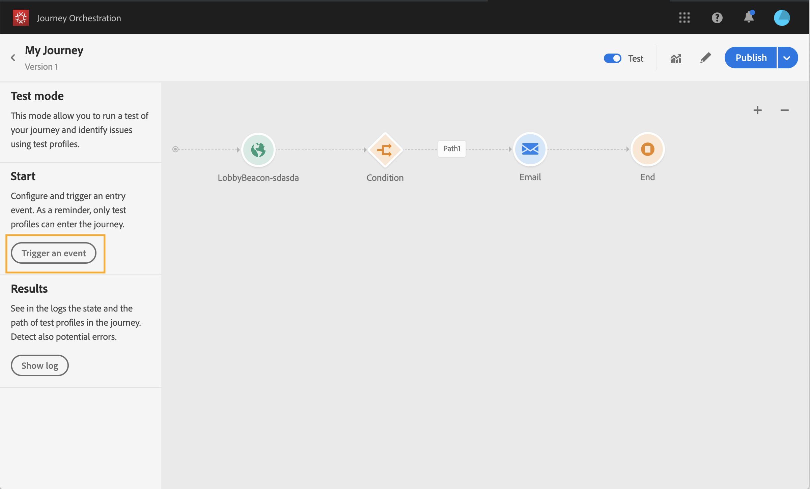

# De reis testen{#testing_the_journey}

Voordat u uw reis kunt testen, moet u alle eventuele fouten oplossen. Zie .

U kunt uw reis testen voordat deze wordt gepubliceerd, met behulp van testprofielen. Dit staat u toe om te analyseren hoe de individuen in de reis stromen en problemen vóór publicatie oplossen.

Voer de volgende stappen uit om de testmodus te gebruiken:

1. Controleer voordat u de reis test of deze geldig is en of er geen fout optreedt. U kunt een test van een reis met fouten niet starten. Zie . Er wordt een waarschuwingssymbool weergegeven wanneer er fouten optreden.

1. U activeert de testmodus door te klikken op de **[!UICONTROL Test]** schakeloptie in de rechterbovenhoek.

   

1. Gebruik de **Wacht tijd in testparameter** , in de bodem linkerhoek, om de tijd te bepalen dat elke wachttijdactiviteit op testwijze zal duren. De standaardtijd is 10 seconden. Zo krijgt u de testresultaten snel. Deze parameter verschijnt slechts als u één of meerdere wachtactiviteiten in uw reis hebt gelaten vallen.

   

1. Klik **[!UICONTROL Trigger an event]** om gebeurtenissen aan de reis te vormen en te verzenden. Zorg ervoor dat u gebeurtenissen verzendt die betrekking hebben op testprofielen. Zie [Uw gebeurtenissen](#firing_events)starten.

   

1. Nadat de gebeurtenissen worden ontvangen, klik de **[!UICONTROL Show log]** knoop om het testresultaat te bekijken en hen te verifiëren. Zie De logboeken [weergeven](#viewing_logs).

   

1. Als er een fout optreedt, deactiveert u de testmodus, wijzigt u de reis en test u deze opnieuw. Wanneer de test overtuigend is, kunt u uw reis publiceren. Zie .

## Belangrijke opmerkingen {#important_notes}

* Er is een interface beschikbaar voor het afvuren van gebeurtenissen naar de geteste reis, maar evenementen kunnen ook door systemen van derden, zoals Postman, worden verzonden.
* Alleen personen die zijn gemarkeerd als &quot;testprofielen&quot; in de realtime klantenprofielservice mogen de geteste reis betreden. Het proces voor het maken van een testprofiel is gelijk aan het proces voor het maken van een profiel in het gegevensplatform. U hoeft alleen maar te controleren of de markering voor het testprofiel waar is. U kunt de sectie van Segmenten in de interface van het Platform van Gegevens gebruiken om een segment van testprofielen in uw Platform van Gegevens tot stand te brengen en een niet-limitatieve lijst te zien. De volledige lijst kan voorlopig niet worden weergegeven.
* De testmodus is alleen beschikbaar voor conceptochten waarbij een naamruimte wordt gebruikt. In de testmodus moet namelijk worden nagegaan of een persoon die de reis betreedt al dan niet een testprofiel is en moet hij dus in staat zijn het gegevensplatform te bereiken.
* Het maximumaantal testprofielen dat een reis tijdens een testsessie kan betreden, is 100.
* Wanneer u de testmodus uitschakelt, worden de reizen verwijderd van alle mensen die het in het verleden hebben betreden of die er momenteel in zitten.
* U kunt de testmodus zo vaak als nodig in- en uitschakelen.
* U kunt uw reis niet wijzigen wanneer de testwijze wordt geactiveerd. In de testmodus kunt u de rit rechtstreeks publiceren. U hoeft de testmodus daarvoor niet te deactiveren.

## Gebeurtenissen starten {#firing_events}

De **[!UICONTROL Trigger an event]** knoop staat u toe om een gebeurtenis te vormen die een persoon de reis zal maken.

Als voorwaarde moet u weten welke profielen als testprofielen zijn gemarkeerd in het gegevensplatform. In de testmodus zijn deze profielen alleen toegestaan tijdens de reis en moet het evenement een id bevatten. De verwachte id is afhankelijk van de gebeurtenisconfiguratie. Het kan bijvoorbeeld een ECID zijn.

Als uw reis verscheidene gebeurtenissen bevat, gebruik de drop-down lijst om een gebeurtenis te selecteren. Configureer vervolgens voor elke gebeurtenis de doorgegeven velden en de uitvoering van de gebeurtenis die de gebeurtenis verzendt. De interface helpt u de juiste informatie in de gebeurtenislading overgaan en ervoor zorgen het informatietype correct is. In de testmodus worden de laatste parameters die in een testsessie worden gebruikt, opgeslagen voor later gebruik.

Met de interface kunt u eenvoudige gebeurtenisparameters doorgeven. Als u verzamelingen of andere geavanceerde objecten in de gebeurtenis wilt doorgeven, kunt u op klikken **[!UICONTROL Code View]** om de volledige code van de laadbewerking te zien en deze te wijzigen. U kunt bijvoorbeeld gebeurtenisgegevens kopiëren en plakken die door een technische gebruiker zijn voorbereid.

Een technische gebruiker kan deze interface ook gebruiken om gebeurtenislading samen te stellen en gebeurtenissen teweeg te brengen zonder het moeten een derdehulpmiddel gebruiken.

## Logboeken weergeven {#viewing_logs}

Met de **[!UICONTROL Show log]** knop kunt u de testresultaten bekijken. Op deze pagina worden de huidige gegevens van de reis in JSON-indeling weergegeven. Met een knop kunt u hele knooppunten kopiëren. U moet de pagina handmatig vernieuwen om de testresultaten van de reis bij te werken.

>[!NOTE]
>
>In de testlogboeken, in het geval van een fout wanneer het roepen van een derdesysteem (gegevensbron of actie), worden de foutencode en foutenreactie getoond.

Het aantal personen (technisch gesproken worden ze instanties genoemd) dat zich momenteel in de reis bevindt, wordt weergegeven. Hier volgt nuttige informatie die voor elk individu wordt weergegeven:

* _Id_: de interne identiteitskaart van de persoon tijdens de reis. Dit kan voor het zuiveren doeleinden worden gebruikt.
* _huidige_ stap: de stap waar het individu op de reis is. We raden u aan labels aan uw activiteiten toe te voegen om ze gemakkelijker te kunnen identificeren.
* _currentstep_ > phase: de status van de reis van de betrokkene (aflopend, voltooid, fout of time-out). Zie hieronder voor meer informatie.
* _currentstep_ > _extraInfo_: beschrijving van de fout en andere contextuele informatie.
* _externalKeys_: de waarde voor de sleutelformule die in de gebeurtenis wordt bepaald.
* _enrichedData_: de gegevens die de reis heeft opgehaald als de reis gegevensbronnen gebruikt.
* _transitionHistory_: de lijst met stappen die de persoon heeft gevolgd. Voor gebeurtenissen wordt de payload weergegeven.

