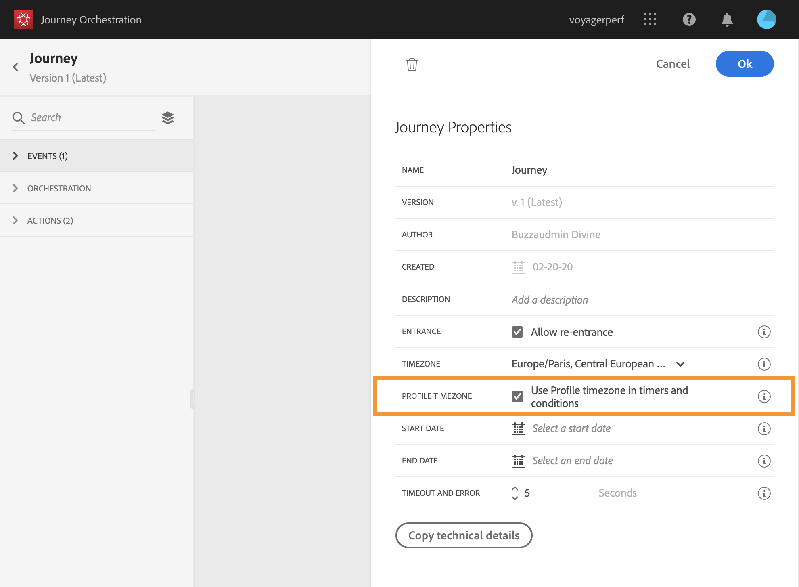

# Tijdzonebeheer {#timezone_management}

>[!CAUTION]
>
>**zoekend Adobe Journey Optimizer**? Klik [ hier ](https://experienceleague.adobe.com/en/docs/journey-optimizer/using/ajo-home){target="_blank"} voor de documentatie van Journey Optimizer.
>
>
>_Deze documentatie verwijst naar erfenismaterialen van Journey Orchestration die door Journey Optimizer zijn vervangen. Neem contact op met uw accountteam als u vragen hebt over uw toegang tot Journey Orchestration of Journey Optimizer._

U kunt een tijdzone in de [ eigenschappen ](../building-journeys/changing-properties.md) van uw reis bepalen.

Als u eigenschappen wilt openen, klikt u op het potloodpictogram rechtsboven in het scherm.

Deze tijdzone wordt gebruikt voor elke activiteit van de reis die een tijdselement bevat, zoals:

* [Tijdconditie](../building-journeys/condition-activity.md#time_condition)
* [Datumvoorwaarde](../building-journeys/condition-activity.md#date_condition)
* [Aangepast wachten](../building-journeys/wait-activity.md#custom)

U kunt een tijdzone selecteren of de tijdzone gebruiken die is gedefinieerd in het gebruikersprofiel.

>[!NOTE]
>
>De streek van de profieltijd werkt met het **timeZone** gebied bestaand in de **3&rbrace; gebiedsgroep van de Details van de Voorkeur &lbrace;.**

## Een vaste tijdzone definiëren {#fixed-timezone}

De tijdzone kan ook worden vastgesteld. Wis de vooraf gedefinieerde tijdzone en kies een tijdzone in de vervolgkeuzelijst. Als je een vaste tijdzone gebruikt, zal dat hetzelfde zijn voor iedereen die de reis binnenkomt.

Selecteer hiertoe in **[!UICONTROL Properties]** een tijdzone.

## Profielen gebruiken om de tijdzone voor het transport te definiëren {#timezone-from-profiles}

Als de entry-gebeurtenis van de reis een naamruimte heeft, wat betekent dat de reis de Real-time service van het Profiel van de Klant van Adobe Experience Platform kan bereiken, kunt u de tijdzone willen gebruiken die op het profielniveau wordt bepaald. Om dit, in **Eigenschappen** te doen, controleer **de tijdzone van het Profiel van het Gebruik in wacht en voorwaarden**. Deze optie is niet standaard ingeschakeld.

Als een tijdzone voor een profiel is gedefinieerd, zal het door de reis worden teruggewonnen en gebruikt. Als dit niet het geval is, wordt de tijdzone gebruikt die is gedefinieerd in het tijdzone-veld.

## Tijdzones gebruiken in expressies {#timezone-in-expressions}

De begin- en einddatum van een reis kunnen niet worden gekoppeld aan een specifieke tijdzone. Ze worden automatisch gekoppeld aan de tijdzone van de instantie.
