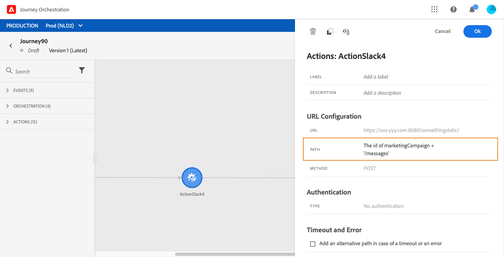

# Aangepaste acties gebruiken {#section_f2c_hbg_nhb}

De ruit van de activiteitenconfiguratie toont de URL configuratieparameters en de authentificatieparameters die voor de douaneactie worden gevormd. [Meer informatie](../action/about-custom-action-configuration.md).

>[!NOTE]
>
>U kunt geen eenvoudige verzameling doorgeven in parameters voor aangepaste handelingen. Complexere verzamelingsvelden (arrays van objecten) worden niet ondersteund.  Let ook op dat de parameters een verwacht formaat hebben (voorbeeld: tekenreeks, decimaal, enz.). U moet deze verwachte formaten zorgvuldig respecteren.

## URL-configuratie

### Dynamisch pad

Als de URL een dynamisch pad bevat, geeft u het pad op in het veld **[!UICONTROL Path]**.

>[!NOTE]
>
>U kunt niet opstelling het statische deel van URL in de reis, maar in de globale configuratie van de douaneactie. [Meer informatie](../action/about-custom-action-configuration.md).

Als u velden en onbewerkte teksttekenreeksen wilt samenvoegen, gebruikt u de tekenreeksfuncties of het plusteken (+) in de geavanceerde expressie-editor. Plaats normale teksttekenreeksen tussen enkele aanhalingstekens (&#39;) of tussen dubbele aanhalingstekens (&#39;). [Meer informatie](../expression/expressionadvanced.md).

In deze tabel ziet u een voorbeeld van configuratie:

| Veld | Waarde |
| --- | --- |
| URL | `https://xxx.yyy.com:8080/somethingstatic/` |
| Pad | `The id of marketingCampaign + '/messages'` |

De samengevoegde URL heeft de volgende vorm:

`https://xxx.yyy.com:8080/somethingstatic/`\&lt;campaign ID=&quot;&quot;>`/messages`

### Kopteksten

De sectie **[!UICONTROL URL Configuration]** toont de dynamische kopbalgebieden, maar niet de constante kopbalgebieden. Dynamische headervelden zijn HTTP-headervelden waarvan de waarde is geconfigureerd als een variabele. [Meer informatie](../action/about-custom-action-configuration.md).

Geef zo nodig de waarde van dynamische koptekstvelden op:

1. Selecteer de aangepaste handeling tijdens de rit.
1. Klik in het configuratievenster op het potloodpictogram naast het koptekstveld in de sectie **[!UICONTROL URL Configuration]**.

   

1. Selecteer een veld en klik op **[!UICONTROL OK]**.

## Handelingsparameters

In **[!UICONTROL Action parameters]** sectie, zult u de berichtparameters zien die als _&quot;Variabele&quot;_ worden bepaald. Voor deze parameters kunt u definiëren waar deze informatie moet worden opgehaald (voorbeeld: gebeurtenissen, gegevensbronnen), geeft u waarden handmatig door of gebruikt u de geavanceerde expressie-editor voor gevallen van geavanceerd gebruik. Gevallen van geavanceerd gebruik kunnen gegevensmanipulatie en ander functiegebruik zijn. [Meer informatie](../expression/expressionadvanced.md).

**Verwante onderwerpen**

[Een actie configureren](../action/about-custom-action-configuration.md)
