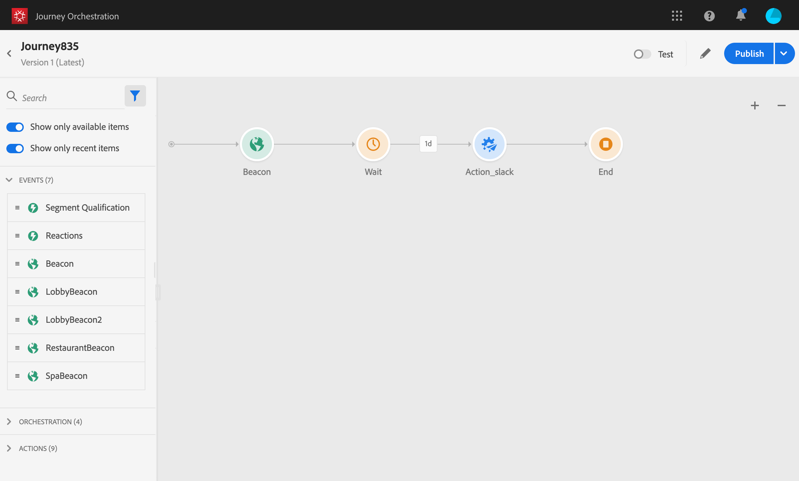

# Journeyontwerper gebruiken {#concept_m1g_5qt_52b}

Met het menu Start kunt u de **lijst met reizen** weergeven. Creeer een nieuwe reis of klik op bestaande om **de interface van de reisontwerper** te openen. De ontwerper bestaat uit de volgende zones: het palet, het canvas en het deelvenster Activiteitsconfiguratie.

## De reislijst {#journey_list}

Met de **reislijst** kunt u al uw reizen tegelijk bekijken, hun status bekijken en basishandelingen uitvoeren. U kunt uw journey’s dupliceren, stopzetten of verwijderen. Afhankelijk van de journey zijn bepaalde acties mogelijk niet beschikbaar. U kunt bijvoorbeeld een gesloten journey niet verwijderen of opnieuw starten. U kunt er een nieuwe versie van maken, deze dupliceren of stoppen. U kunt ook de zoekbalk gebruiken om een journey te zoeken.

U kunt het dialoogvenster **[!UICONTROL Filters]** openen door te klikken op het filterpictogram linksboven van de lijst. Met het menu Filters kunt u de weergegeven ritten filteren op basis van verschillende criteria (status, de criteria die u hebt gemaakt, de criteria die in de laatste 30 dagen zijn gewijzigd, alleen de laatste versies, enzovoort). U kunt er ook voor kiezen om alleen de ritten weer te geven die een bepaalde gebeurtenis, veldgroep of handeling gebruiken. Kolommen die in de lijst worden weergegeven, kunnen worden geconfigureerd. Alle filters en kolommen worden per gebruiker opgeslagen.

Alle versies van uw reizen worden in de lijst weergegeven met het versienummer. Zie [deze pagina](../building-journeys/journey-versions.md).

>[!NOTE]
>
>Als u het canvas van een rit wilt openen op een ander browsertabblad, houdt u **Control** of **Command** ingedrukt en klikt u op de rit.

## Het palet {#palette}

Het **palet** bevindt zich aan de linkerkant van het scherm. Alle beschikbare activiteiten worden ingedeeld in verschillende categorieën: **[!UICONTROL Events]**, **[!UICONTROL Orchestration]** en **[!UICONTROL Actions]**. U kunt de verschillende categorieën uit- of samenvouwen door op de naam ervan te klikken. Als u een activiteit wilt gebruiken tijdens uw reis, sleept u deze van het palet naar het canvas. U kunt ook dubbelklikken op een activiteit in het palet om deze aan het canvas toe te voegen, bij de volgende beschikbare stap. U moet elke activiteit vormen die vanaf het palet wordt toegevoegd alvorens de reis te publiceren. Als u een activiteit in het canvas laat vallen en zijn configuratie niet voltooit, zal het in het canvas blijven maar een rode waarschuwing zal erop wijzen dat de configuratie niet gebeëindigd voor deze activiteit is.

>[!NOTE]
>
>Merk op dat er regels zijn wanneer het vestigen van een reis. Niet-toegestane configuratie wordt genegeerd. U kunt bijvoorbeeld geen acties parallel plaatsen, een activiteit aan een vorige stap koppelen om een lijn te creëren, een reis met iets anders dan een gebeurtenis te beginnen, etc.

Met het pictogram **[!UICONTROL Filter items]** in de linkerbovenhoek kunt u de volgende filters weergeven:

* **Alleen beschikbare objecten** tonen: niet-beschikbare elementen in het palet verbergen of weergeven, bijvoorbeeld gebeurtenissen die een andere naamruimte gebruiken dan de gebeurtenissen die tijdens de reis worden gebruikt. Niet-beschikbare items zijn standaard verborgen. Als u deze weergeeft, worden ze grijs weergegeven.

* **Alleen recente objecten** tonen: Met dit filter kunt u alleen de laatste vijf gebruikte gebeurtenissen en handelingen weergeven, naast de gebeurtenissen en handelingen die buiten de box vallen. Dit geldt specifiek voor elke gebruiker. Standaard worden alle items weergegeven.

U kunt ook het veld **[!UICONTROL Search]** gebruiken.

## Het canvas {#canvas}

Het **canvas** is de centrale zone in de reisontwerper. Het is in deze streek dat u uw activiteiten kunt laten vallen en hen vormen. Klik op een activiteit op het canvas om deze te configureren. Dit opent de ruit van de activiteitenconfiguratie op de rechterkant. U kunt in- en uitzoomen met de knoppen &quot;+&quot; en &quot;-&quot; in de rechterbovenhoek. Op het canvas kunt u met alle activiteiten een volgende stap toevoegen, behalve **[!UICONTROL End]**-activiteiten (zie [deze pagina](../building-journeys/end-activity.md)).

## Het deelvenster Activiteitenconfiguratie {#configuration_pane}

Het **activiteitenconfiguratievenster** verschijnt wanneer u op een activiteit in het palet klikt. Vul de vereiste velden in. Klik op het pictogram **[!UICONTROL Delete]** om de activiteit te verwijderen. Klik op **[!UICONTROL Cancel]** om de wijzigingen te annuleren of **[!UICONTROL Ok]** om te bevestigen. Als u activiteiten wilt verwijderen, kunt u ook één activiteit (of meerdere activiteiten) selecteren en op de backspace-toets drukken. Als u op de escape-toets drukt, wordt het deelvenster voor activiteitenconfiguratie gesloten.

Op het canvas worden uw actie en gebeurtenisactiviteiten vertegenwoordigd door een pictogram met de naam van de gebeurtenis of actie die onder wordt weergegeven. In de ruit van de activiteitenconfiguratie, kunt u het **[!UICONTROL Label]** gebied gebruiken om een achtervoegsel aan de activiteitennaam toe te voegen. Deze labels helpen u bij het contextualiseren van het gebruik van gebeurtenissen en handelingen, vooral wanneer u dezelfde gebeurtenis of handeling meerdere malen gebruikt op uw reis. U zult ook de etiketten kunnen zien u in [!DNL Journey Orchestration] het melden toevoegde. U kunt ook labels definiëren voor activiteiten in uw toestand.

Standaard worden alleen-lezen velden verborgen. Als u alleen-lezen velden wilt weergeven, klikt u op het pictogram **Alleen-lezen velden** linksboven in het deelvenster Activiteitsconfiguratie. Deze instelling geldt voor alle activiteiten op alle reizen.

## De acties op de bovenste balk {#top_actions}

Afhankelijk van de status van de reis kunt u verschillende handelingen op uw reis uitvoeren met de knoppen in de rechterbovenhoek: **[!UICONTROL Publish]**, **[!UICONTROL Duplicate]**, **[!UICONTROL Delete]**, **[!UICONTROL Journey properties]**, **[!UICONTROL Test]**. Deze knoppen worden weergegeven als er geen activiteit is geselecteerd. Sommige knoppen worden contextueel weergegeven. De knop voor het logbestand van de testmodus wordt weergegeven wanneer de testmodus wordt geactiveerd (zie [deze pagina](../building-journeys/testing-the-journey.md)). De rapportknop wordt weergegeven wanneer de reis live, gestopt of gesloten is.

## Het gebruik van paden in het canvas {#paths}

Met verschillende activiteiten (**[!UICONTROL Condition]**, **[!UICONTROL Action]** activiteiten) kunt u een fallback-actie definiëren in het geval van een fout of time-out. Schakel het selectievakje in het deelvenster Activiteitenconfiguratie in: **[!UICONTROL Add an alternative path in case of a timeout or an error]**. Na de activiteit wordt een ander pad toegevoegd. De time-outduur wordt gedefinieerd in de eigenschappen van het transport (zie [deze pagina](../building-journeys/changing-properties.md) door een beheerder. Als het bijvoorbeeld te lang duurt om een e-mail te verzenden of als er een fout optreedt, kunt u een SMS-bericht verzenden.

Met verschillende activiteiten (gebeurtenis, handeling, wachten) kunt u verschillende paden na deze toevoegen. Plaats de cursor op de activiteit en klik op het plusteken (+). Alleen gebeurtenis- en wachtactiviteiten kunnen parallel worden ingesteld. Als meerdere gebeurtenissen parallel worden ingesteld, is het gekozen pad het eerste evenement dat plaatsvindt.

Wanneer u naar een gebeurtenis luistert, raden we u aan niet oneindig op de gebeurtenis te wachten. Het is niet verplicht, maar slechts een goede praktijk. Als u slechts gedurende een bepaalde tijd naar een of meerdere gebeurtenissen wilt luisteren, plaatst u een of meerdere gebeurtenissen en een wachtbewerking parallel. Zie [deze sectie](../building-journeys/event-activities.md#section_vxv_h25_pgb).

Als u het pad wilt verwijderen, plaatst u de cursor op het pad en klikt u op het pictogram **[!UICONTROL Delete arrow]**.

Wanneer twee activiteiten op het canvas worden losgekoppeld, wordt een waarschuwing weergegeven. Plaats de cursor op het waarschuwingspictogram om het foutbericht weer te geven. U kunt het probleem verhelpen door de ontkoppelde activiteit te verplaatsen en deze aan te sluiten op de vorige activiteit.

## Kopiëren en plakken {#copy-paste}

U kunt een of meer activiteiten van een reis kopiëren en deze in dezelfde of een andere reis plakken. Dit staat u toe om tijd te besparen als u talrijke activiteiten wilt hergebruiken die reeds in een vorige reis zijn gevormd.

**Belangrijke opmerkingen**

* U kunt kopiëren/plakken over verschillende tabbladen en browsers. U kunt alleen activiteiten kopiëren/plakken binnen dezelfde instantie.
* U kunt een gebeurtenis niet kopiëren/plakken als de doelreis een gebeurtenis heeft die een andere naamruimte gebruikt.
* Geplakte activiteiten kunnen verwijzen naar gegevens die niet aanwezig zijn in de doelreis, bijvoorbeeld als u kopieert/plakt over verschillende sandboxen. Controleer altijd op fouten en breng de vereiste aanpassingen aan.
* Houd er rekening mee dat u een handeling niet ongedaan kunt maken. Als u geplakte activiteiten wilt verwijderen, moet u deze selecteren en verwijderen. Zorg er daarom voor dat u alleen de activiteiten selecteert die u nodig hebt voordat u deze kopieert.
* U kunt activiteiten van om het even welke reis kopiëren, zelfs degenen die in read-only zijn.
* U kunt elke activiteit selecteren, ook als deze niet is gekoppeld. Gekoppelde activiteiten blijven gekoppeld nadat ze zijn geplakt.

Hier volgen de stappen voor het kopiëren/plakken van activiteiten:

1. Open een reis.
1. Selecteer de activiteiten die u wilt kopiëren door de muis te verplaatsen terwijl u klikt. U kunt ook op elke activiteit klikken terwijl het drukken van **Ctrl/Command** sleutel. Gebruik **Ctrl/Command + A** als u alle activiteiten wilt selecteren.
   
1. Druk op **Ctrl/Command + C**.
Als u slechts één activiteit wilt kopiëren, kunt u op het klikken en het **pictogram van het Exemplaar** in de bovenkant verlaten van de ruit van de activiteitenconfiguratie gebruiken.
   
1. Druk tijdens elke reis op **Ctrl/Command + V** om de activiteiten te plakken zonder deze aan een bestaand knooppunt te koppelen. Geplakte activiteiten worden in dezelfde volgorde geplaatst. Na het plakken blijven de activiteiten geselecteerd zodat u ze gemakkelijk kunt verplaatsen. U kunt de cursor ook op een lege plaatsaanduiding plaatsen en op **Ctrl/Command + V** drukken. Geplakte activiteiten worden gekoppeld aan het knooppunt.
   
