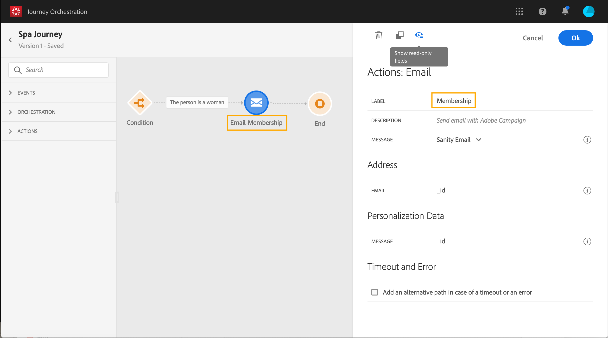

# Journeyontwerper gebruiken {#concept_m1g_5qt_52b}

>[!CAUTION]
>
>**zoekend Adobe Journey Optimizer**? Klik [ hier ](https://experienceleague.adobe.com/en/docs/journey-optimizer/using/ajo-home){target="_blank"} voor de documentatie van Journey Optimizer.
>
>
>_Deze documentatie verwijst naar erfenismaterialen van Journey Orchestration die door Journey Optimizer zijn vervangen. Neem contact op met uw accountteam als u vragen hebt over uw toegang tot Journey Orchestration of Journey Optimizer._

Het menu van het reisHuis staat u toe om de **lijst van reizen** te bekijken. Creeer een nieuwe reis of klik op bestaande om de **interface van de reisontwerper** te openen. De ontwerper bestaat uit de volgende zones: het palet, het canvas en het deelvenster voor activiteitenconfiguratie.

## De reislijst {#journey_list}

De **reislijst** staat u toe om al uw reizen in één keer te bekijken, hun status te zien en basisacties uit te voeren. U kunt uw journey’s dupliceren, stopzetten of verwijderen. Afhankelijk van de journey zijn bepaalde acties mogelijk niet beschikbaar. U kunt bijvoorbeeld een gesloten journey niet verwijderen of opnieuw starten. U kunt er een nieuwe versie van maken, deze dupliceren of stoppen. U kunt ook de zoekbalk gebruiken om een journey te zoeken.

U kunt het dialoogvenster **[!UICONTROL Filters]** openen door te klikken op het filterpictogram linksboven van de lijst. Met het menu Filters kunt u de weergegeven ritten filteren op basis van verschillende criteria (status, de criteria die u hebt gemaakt, de criteria die in de laatste 30 dagen zijn gewijzigd, alleen de laatste versies, enzovoort). U kunt er ook voor kiezen om alleen de ritten weer te geven die een bepaalde gebeurtenis, veldgroep of handeling gebruiken. Kolommen die in de lijst worden weergegeven, kunnen worden geconfigureerd. Alle filters en kolommen worden per gebruiker opgeslagen.

Alle versies van uw reizen worden in de lijst weergegeven met het versienummer. Zie [deze pagina](../building-journeys/journey-versions.md).

>[!NOTE]
>
>Om het canvas van een reis in een verschillend browser lusje te openen, houd de **sleutel van de Controle** of **van het Bevel** en klik op de reis.

## Het palet {#palette}

Het **palet** is op de linkerkant van het scherm. Alle beschikbare activiteiten worden in verschillende categorieën gesorteerd: **[!UICONTROL Events]** , **[!UICONTROL Orchestration]** en **[!UICONTROL Actions]** . U kunt de verschillende categorieën uit- of samenvouwen door op de naam ervan te klikken. Als u een activiteit wilt gebruiken tijdens uw reis, sleept u deze van het palet naar het canvas. U kunt ook dubbelklikken op een activiteit in het palet om deze aan het canvas toe te voegen, bij de volgende beschikbare stap. U moet elke activiteit vormen die vanaf het palet wordt toegevoegd alvorens de reis te publiceren. Als u een activiteit in het canvas laat vallen en zijn configuratie niet voltooit, zal het in het canvas blijven maar een rode waarschuwing zal erop wijzen dat de configuratie niet gebeëindigd voor deze activiteit is.

>[!NOTE]
>
>Merk op dat er regels zijn wanneer het vestigen van een reis. Niet-toegestane configuratie wordt genegeerd. U kunt bijvoorbeeld geen acties parallel plaatsen, een activiteit aan een vorige stap koppelen om een lijn te creëren, een reis met iets anders dan een gebeurtenis te beginnen, etc.

Met het pictogram **[!UICONTROL Filter items]** in de linkerbovenhoek kunt u de volgende filters weergeven:

* **toon slechts beschikbare punten**: verberg of toon niet beschikbare elementen in het palet, bijvoorbeeld de gebeurtenissen die een verschillende namespace dan degenen gebruiken die in uw reis worden gebruikt. Niet-beschikbare items worden standaard verborgen. Als u deze weergeeft, worden ze grijs weergegeven.

* **toon slechts recente punten**: dit filter staat u toe om de laatste vijf gebruikte gebeurtenissen en acties slechts te tonen, naast uit-van-de-doos degenen. Dit geldt specifiek voor elke gebruiker. Standaard worden alle items weergegeven.

U kunt ook het veld **[!UICONTROL Search]** gebruiken. Alleen gebeurtenissen en handelingen worden gefilterd.

## Het canvas {#canvas}

Het **canvas** is de centrale streek in de reisontwerper. Het is in deze streek dat u uw activiteiten kunt laten vallen en hen vormen. Klik op een activiteit op het canvas om deze te configureren. Dit opent de ruit van de activiteitenconfiguratie op de rechterkant. U kunt in- en uitzoomen met de knoppen &quot;+&quot; en &quot;-&quot; in de rechterbovenhoek. In het canvas, staan alle activiteiten u toe om een volgende stap na hen toe te voegen, behalve **[!UICONTROL End]** activiteiten (zie [ deze pagina ](../building-journeys/end-activity.md)).

## Het deelvenster Activiteitenconfiguratie {#configuration_pane}

De **ruit van de activiteitenconfiguratie** verschijnt wanneer u op een activiteit in het palet klikt. Vul de vereiste velden in. Klik op het pictogram **[!UICONTROL Delete]** om de activiteit te verwijderen. Klik op **[!UICONTROL Cancel]** om de wijzigingen te annuleren of op **[!UICONTROL Ok]** om te bevestigen. Als u activiteiten wilt verwijderen, kunt u ook één activiteit (of meerdere activiteiten) selecteren en op de backspace-toets drukken. Als u op de escape-toets drukt, wordt het deelvenster voor activiteitenconfiguratie gesloten.

Op het canvas worden uw actie en gebeurtenisactiviteiten vertegenwoordigd door een pictogram met de naam van de gebeurtenis of actie die onder wordt weergegeven. In het deelvenster Activiteitsconfiguratie kunt u het veld **[!UICONTROL Label]** gebruiken om een achtervoegsel aan de naam van de activiteit toe te voegen. Deze labels helpen u bij het contextualiseren van het gebruik van gebeurtenissen en handelingen, vooral wanneer u dezelfde gebeurtenis of handeling meerdere malen gebruikt op uw reis. U kunt ook de labels zien die u hebt toegevoegd in de [!DNL Journey Orchestration] -rapportage. U kunt ook labels definiëren voor activiteiten in uw toestand.

Velden met het kenmerk Alleen-lezen zijn standaard verborgen. Om read-only gebieden te tonen, klik **read-only gebieden** pictogram bij de bovenkant verlaten van de ruit van de activiteitenconfiguratie tonen. Deze instelling geldt voor alle activiteiten op alle reizen.

## De acties op de bovenste balk {#top_actions}

Afhankelijk van de status van de rit kunt u verschillende handelingen op uw reis uitvoeren met behulp van de knoppen in de rechterbovenhoek: **[!UICONTROL Publish]**, **[!UICONTROL Duplicate]**, **[!UICONTROL Delete]**, **[!UICONTROL Journey properties]**, **[!UICONTROL Test]** . Deze knoppen worden weergegeven wanneer er geen activiteit is geselecteerd. Sommige knoppen worden contextueel weergegeven. De knoop van het het logboek van de testwijze verschijnt wanneer de testwijze wordt geactiveerd (zie [ deze pagina ](../building-journeys/testing-the-journey.md)). De rapportknop wordt weergegeven wanneer de reis live, gestopt of gesloten is.

## Het gebruik van paden in het canvas {#paths}

Met verschillende activiteiten (**[!UICONTROL Condition]**, **[!UICONTROL Action]** -activiteiten) kunt u een fallback-actie definiëren in het geval van een fout of time-out. Schakel in het deelvenster Activiteitsconfiguratie het selectievakje **[!UICONTROL Add an alternative path in case of a timeout or an error]** in. Na de activiteit wordt een ander pad toegevoegd. De onderbrekingsduur wordt bepaald in de eigenschappen van de reis (zie [ deze pagina ](../building-journeys/changing-properties.md) door een admin gebruiker. Als het bijvoorbeeld te lang duurt om een e-mail te verzenden of als er een fout optreedt, kunt u besluiten een SMS-bericht te verzenden.

Met verschillende activiteiten (gebeurtenis, handeling, wachten) kunt u verschillende paden na deze toevoegen. Plaats de cursor op de activiteit en klik op het plusteken (+) om dit te doen. Alleen gebeurtenis- en wachtactiviteiten kunnen parallel worden ingesteld. Als meerdere gebeurtenissen parallel worden ingesteld, is het gekozen pad het eerste evenement dat plaatsvindt.

Wanneer u naar een gebeurtenis luistert, raden we u aan niet oneindig op de gebeurtenis te wachten. Het is niet verplicht, maar slechts een goede praktijk. Als u slechts gedurende een bepaalde tijd naar een of meerdere gebeurtenissen wilt luisteren, plaatst u een of meerdere gebeurtenissen en een wachtbewerking parallel. Zie [deze sectie](../building-journeys/event-activities.md#section_vxv_h25_pgb).

Als u het pad wilt verwijderen, plaatst u de cursor op het pad en klikt u op het pictogram **[!UICONTROL Delete arrow]** .

Wanneer twee activiteiten op het canvas worden losgekoppeld, wordt een waarschuwing weergegeven. Plaats de cursor op het waarschuwingspictogram om het foutbericht weer te geven. U kunt het probleem verhelpen door de ontkoppelde activiteit te verplaatsen en deze aan te sluiten op de vorige activiteit.

## Kopiëren en plakken {#copy-paste}

U kunt een of meer activiteiten van een reis kopiëren en deze in dezelfde of een andere reis plakken. Dit staat u toe om tijd te besparen als u talrijke activiteiten wilt hergebruiken die reeds in een vorige reis zijn gevormd.

**Belangrijke nota&#39;s**

* U kunt kopiëren/plakken over verschillende tabbladen en browsers. U kunt alleen activiteiten kopiëren/plakken binnen dezelfde instantie.
* U kunt een gebeurtenis niet kopiëren/plakken als de doelreis een gebeurtenis heeft die een andere naamruimte gebruikt.
* Geplakte activiteiten kunnen verwijzen naar gegevens die niet aanwezig zijn in de doelreis, bijvoorbeeld als u kopieert/plakt over verschillende sandboxen. Controleer altijd op fouten en breng de vereiste aanpassingen aan.
* Houd er rekening mee dat u een handeling niet ongedaan kunt maken. Als u geplakte activiteiten wilt verwijderen, moet u deze selecteren en verwijderen. Zorg er daarom voor dat u alleen de activiteiten selecteert die u nodig hebt voordat u deze kopieert.
* U kunt activiteiten van om het even welke reis kopiëren, zelfs degenen die in read-only zijn.
* U kunt elke activiteit selecteren, ook als deze niet is gekoppeld. Gekoppelde activiteiten blijven gekoppeld na het plakken.

Hier volgen de stappen voor het kopiëren/plakken van activiteiten:

1. Open een reis.
1. Selecteer de activiteiten die u wilt kopiëren door de muis te verplaatsen terwijl u klikt. U kunt op elke activiteit ook klikken terwijl het drukken van de **CTRL/sleutel van het Bevel**. Het gebruik **CTRL/Bevel + A** als u alle activiteiten wilt selecteren.
   
1. Pers **CTRL/Bevel + C**.
Als u één activiteit wilt slechts kopiëren, kunt u op het klikken en het **pictogram van het Exemplaar** in de bovenkant verlaten van de ruit van de activiteitenconfiguratie gebruiken.
   
1. In om het even welke reis, druk **CTRL/Bevel + V** om de activiteiten te kleven zonder hen aan een bestaand knooppunt te verbinden. Geplakte activiteiten worden in dezelfde volgorde geplaatst. Na het plakken blijven de activiteiten geselecteerd zodat u ze gemakkelijk kunt verplaatsen. U kunt de curseur op een lege plaatshouder ook plaatsen en **CTRL/Bevel + V** raken. Geplakte activiteiten worden gekoppeld aan het knooppunt.
   
