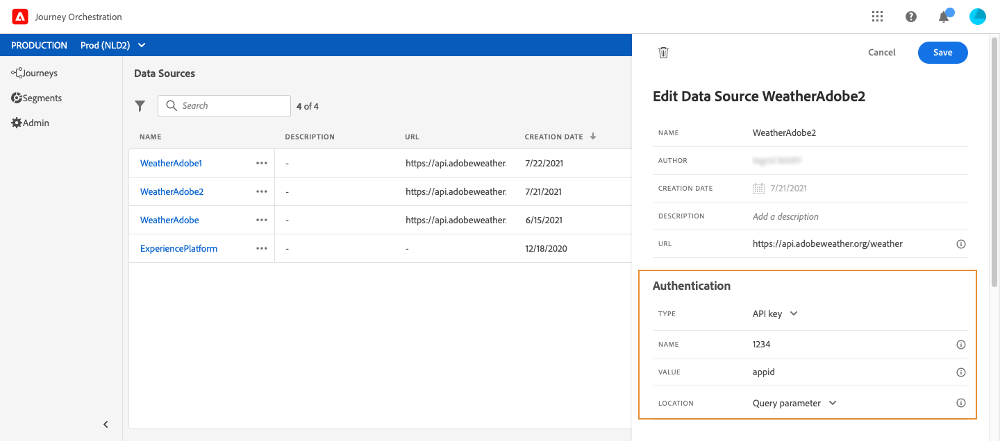

# Externe databronnen {#concept_t2s_kqt_52b}

Met externe databronnen kunt u een verbinding maken met externe systemen, bijvoorbeeld als u een hotelboekingssysteem gebruikt om te controleren of de persoon een kamer heeft besproken. In tegenstelling tot de ingebouwde databron van het Adobe Experience Platform kunt u zoveel externe databronnen maken als u wilt.

REST-API’s die gebruikmaken van POST of GET en JSON retourneren, worden ondersteund. API-sleutel, standaard en aangepaste verificatiemodi worden ondersteund.

Laten we bijvoorbeeld kijken naar een API-weerservice die ik wil gebruiken om de gedragingen van mijn journey aan te passen aan real-timeweerdata.

Hier volgen twee voorbeelden van de API-aanroep:

* _https://api.adobeweather.org/weather?city=London,uk&amp;appid=1234_
* _https://api.adobeweather.org/weather?lat=35&amp;lon=139&amp;appid=1234_

De aanroep bestaat uit een hoofd-URL (_https://api.adobeweather.org/weather_), twee parameterreeksen (‘city’ voor de stad en ‘lat/long’ voor de breedtegraad en de lengtegraad) en de API-sleutel (appid).

Hier volgen de belangrijkste stappen voor het maken en configureren van een nieuwe externe databron:

1. Klik in de lijst van databronnen op **[!UICONTROL Add]** om een nieuwe externe databron te maken.

   

   Hiermee opent u het configuratiedeelvenster voor de databron aan de rechterkant van het scherm.

   

1. Voer een naam in voor de databron.

   >[!NOTE]
   >
   >Gebruik geen spaties of speciale tekens. Gebruik niet meer dan 30 tekens.

1. Voeg een beschrijving aan de databron toe. Deze stap is optioneel.
1. Voeg de URL van de externe service toe. In ons voorbeeld: _https://api.adobeweather.org/weather_.

   >[!CAUTION]
   >
   >We raden u uit beveiligingsoverwegingen sterk aan om HTTPS te gebruiken. Bedenk ook dat we het gebruik van Adobe-adressen die niet openbaar beschikbaar zijn en het gebruik van IP-adressen niet toestaan.

   

1. Configureer de verificatie volgens de configuratie van de externe service: **[!UICONTROL No authentication]**, **[!UICONTROL Basic]**, **[!UICONTROL Custom]** of **[!UICONTROL API key]**. For more information on the custom authentication mode, see [this section](../datasource/external-data-sources.md#section_wjp_nl5_nhb). In ons voorbeeld kiezen we:


   * **[!UICONTROL Type]**: ‘API-sleutel’
   * **[!UICONTROL Value]**: ‘1234’ (dit is de waarde van onze API-sleutel)
   * **[!UICONTROL Name]**: ‘appid’ (dit is de parameternaam van de API-sleutel)
   * **[!UICONTROL Location]**: ‘Query-parameter’ (de API-sleutel bevindt zich in de URL)

   

1. Voeg een nieuwe veldengroep toe voor elke API-parameterreeks door te klikken op **[!UICONTROL Add a New Field Group]**. Gebruik geen spaties of speciale tekens in de naam van de veldengroep. In ons voorbeeld moeten we twee veldengroepen maken, één voor elke parameterreeks (city en long/lat).

Voor de parameterreeks ‘long/lat’ maken we een veldengroep met de volgende informatie:

* **[!UICONTROL Used in]**: geeft het aantal journey’s weer dat een veldengroep gebruikt. U kunt klikken op het pictogram **[!UICONTROL View journeys]** om de lijst weer te geven met journey’s die deze veldengroep gebruiken.
* **[!UICONTROL Method]**: selecteer de methode POST of GET. In ons geval selecteren we de methode GET.
* **[!UICONTROL Cache duration]**: in ons geval willen we dat het weer gedurende tien minuten in de cache wordt opgeslagen.
* **[!UICONTROL Response Payload]**: klik in het veld **[!UICONTROL Payload]** en plak een voorbeeld van de payload die door de aanroep is geretourneerd. Voor ons voorbeeld hebben we een payload gebruikt van een API-weerwebsite. Controleer of de veldtypen correct zijn. Telkens wanneer de API wordt aangeroepen, haalt het systeem alle velden op die in het payloadvoorbeeld zijn opgenomen. U kunt klikken op **[!UICONTROL Paste a new payload]** als u de huidige payload wilt wijzigen.
* **[!UICONTROL Dynamic Values]**: voer de verschillende parameters in, gescheiden door een komma, in het voorbeeld ‘long,lat’. Aangezien de parameterwaarden afhankelijk zijn van de uitvoeringscontext, worden ze tijdens de journey’s gedefinieerd. Zie [deze pagina](../expression/expressionadvanced.md).
* **[!UICONTROL Sent Payload]**: dit veld staat niet in ons voorbeeld. Deze optie is alleen beschikbaar als u de methode POST selecteert. Plak de payload die naar het externe systeem wordt verzonden.

Bij een GET-aanroep die parameter(s) vereist, voert u de parameter(s) in het veld **[!UICONTROL Parameters]** in en worden deze automatisch toegevoegd aan het eind van de aanroep. Bij een POST-aanroep doet u het volgende:

* geef een lijst op van de parameters die op het aanroeptijdstip moeten worden doorgegeven in het veld **[!UICONTROL Parameter]** (in het voorbeeld hieronder: ‘identifier’).
* geef ze ook volgens precies dezelfde syntaxis op in de hoofdtekst van de verzonden payload. Hiervoor moet u het volgende toevoegen: ‘param’: ‘naam van de parameter’ (in het onderstaande voorbeeld: ‘identifier’). Volg de onderstaande syntaxis:

   ```
   {"id":{"param":"identifier"}}
   ```


Klik op **[!UICONTROL Save]**.

De databron is nu geconfigureerd en klaar om te worden gebruikt in uw journey’s, bijvoorbeeld in uw voorwaarden of om een e-mail te personaliseren. Als de temperatuur boven 30 °C ligt, kunt u besluiten een bepaalde mededeling te sturen.

## Aangepaste verificatiemodus{#section_wjp_nl5_nhb}

>[!CONTEXTUALHELP]
>id="jo_authentication_payload"
>title="Aangepaste verificatie"
>abstract="De aangepaste verificatiemodus wordt gebruikt voor complexe verificatie om API-wrappingprotocollen aan te roepen zoals OAuth2. De uitvoering van de actie bestaat uit twee stappen. Eerst wordt een aanroep naar het eindpunt uitgevoerd om de toegangstoken te genereren. Vervolgens wordt de toegangstoken geïnjecteerd in de HTTP-aanvraag van de actie."

Deze verificatiemodus wordt gebruikt voor complexe verificatie, die vaak wordt gebruikt om API-wrappingprotocollen aan te roepen zoals OAuth2, voor het ophalen van een toegangstoken die moet worden geïnjecteerd in de echte HTTP-aanvraag voor de actie.

Wanneer u de aangepaste verificatie configureert, kunt u op de onderstaande knop klikken om te controleren of de payload van de aangepaste verificatie correct is geconfigureerd.


Als de test is geslaagd, wordt de knop groen.


Bij deze verificatie is de uitvoering van de actie een proces dat uit twee stappen bestaat:

1. Roep het eindpunt aan om de toegangstoken te genereren.
1. Roep de REST-API aan door de toegangstoken op de juiste manier te injecteren.

Deze verificatie bestaat uit twee delen.

De definitie van het eindpunt dat moet worden aangeroepen om de toegangstoken te genereren:

* endpoint: URL om het eindpunt te genereren
* methode van de HTTP-aanvraag bij het eindpunt (GET of POST)
* headers: sleutel-/waardeparen die als kopteksten in deze aanvraag moeten worden geïnjecteerd, indien vereist
* body: beschrijft de hoofdtekst van de aanroep als de methode POST is. We ondersteunen een beperkte hoofdtekststructuur die in bodyParams (sleutel-/waardeparen) wordt gedefinieerd. Het bodyType beschrijft de indeling en versleuteling van de hoofdtekst in de aanroep:
   * form: betekent dat het contenttype application/x-www-form-urlencoded (charset UTF-8) is en de sleutel-/waardeparen worden geserialiseerd zoals ze zijn: key1=value1&amp;key2=value2&amp;...
   * json: betekent dat het contenttype application/json is (charset UTF-8) en dat de sleutel-/waardeparen worden geserialiseerd als een json-object zoals het is: _{ “key1”: “value1”, “key2”: “value2”, ...}_

De definitie van de manier waarop de toegangstoken in de HTTP-aanvraag van de actie moet worden geïnjecteerd:

* authorizationType: bepaalt hoe de gegenereerde toegangstoken in de HTTP-aanroep voor de actie moet worden geïnjecteerd. De mogelijke waarden zijn:

   * bearer: geeft aan dat de toegangstoken moet worden geïnjecteerd in de Authorization-koptekst, bijvoorbeeld: _Authorization: Bearer &lt;toegangstoken>_
   * header: geeft aan dat de toegangstoken moet worden geïnjecteerd als een koptekst, de header-naam gedefinieerd door de eigenschap tokenTarget. Als de tokenTarget bijvoorbeeld myHeader is, wordt de toegangstoken geïnjecteerd als koptekst als: _myHeader: &lt;toegangstoken>_
   * queryParam: geeft aan dat de toegangstoken moet worden geïnjecteerd als een queryParam, de queryparam-naam gedefinieerd door de eigenschap tokenTarget. Als de tokenTarget bijvoorbeeld myQueryParam is, is de URL van de actieaanroep: _&lt;url>?myQueryParam=&lt;access token>_

* tokenInResponse: geeft aan hoe de toegangstoken uit de verificatieaanroep moet worden gehaald. Deze eigenschap kan zijn:
   * response: geeft aan dat de HTTP-reactie de toegangstoken is
   * een selectietool in een json (ervan uitgaande dat de reactie een json is, we ondersteunen geen andere indelingen zoals XML). De indeling van deze selector is _json://&lt;pad naar de toegangstoken-eigenschap>_. Als de reactie van de aanroep bijvoorbeeld _{ “access_token”: “theToken”, “timestamp”: 12323445656 }_ is, is de tokenInResponse: _json: //access_token_

De indeling van deze verificatie is:

```
{
    "type": "customAuthorization",
    "authorizationType": "<value in 'bearer', 'header' or 'queryParam'>",
    (optional, mandatory if authorizationType is 'header' or 'queryParam') "tokenTarget": "<name of the header or queryParam if the authorizationType is 'header' or 'queryParam'>",
    "endpoint": "<URL of the authentication endpoint>",
    "method": "<HTTP method to call the authentication endpoint, in 'GET' or 'POST'>",
    (optional) "headers": {
        "<header name>": "<header value>",
        ...
    },
    (optional, mandatory if method is 'POST') "body": {
        "bodyType": "<'form'or 'json'>,
        "bodyParams": {
            "param1": value1,
            ...

        }
    },
    "tokenInResponse": "<'response' or json selector in format 'json://<field path to access token>'"
}
```

U kunt de cachetermijn van de token wijzigen voor een databron met aangepaste verificatie. Hieronder ziet u een voorbeeld van een payload met aangepaste verificatie. De cachetermijn wordt gedefinieerd in de parameter cacheDuration. Hiermee wordt de retentieduur van de gegenereerde token in de cache opgegeven. De eenheid kan milliseconden, seconden, minuten, uren, dagen, maanden of jaren zijn.

```
"authentication": {
    "type":"customAuthorization",
    "authorizationType":"Bearer",
    "endpoint":"http://localhost:${port}/epsilon/oauth2/access_token",
    "method":"POST",
    "headers": {
        "Authorization":"Basic EncodeBase64(${epsilonClientId}:${epsilonClientSecret})"
        },
    "body": {
        "bodyType":"form",
        "bodyParams": {
             "scope":"cn mail givenname uid employeeNumber",
             "grant_type":"password",
             "username":"${epsilonUserName}",
             "password":"${epsilonUserPassword}"
             }
        },
    "tokenInResponse":"json://access_token",
    "cacheDuration":
             { "duration":5, "timeUnit":"seconds" }
    }
```
