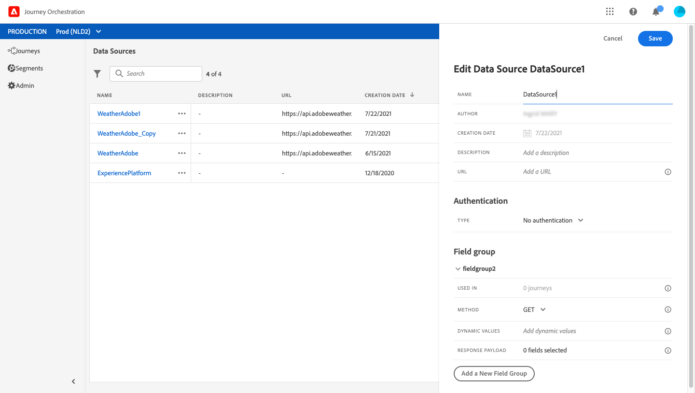

# Externe gegevensbronnen {#concept_t2s_kqt_52b}

Met externe gegevensbronnen kunt u een verbinding met systemen van derden definiëren, bijvoorbeeld als u een boekingssysteem voor hotels gebruikt om te controleren of de persoon een kamer heeft geregistreerd. In tegenstelling tot de ingebouwde gegevensbron van het Platform van de Ervaring, kunt u zo vele externe gegevensbronnen tot stand brengen aangezien u nodig hebt.

REST-API&#39;s die gebruikmaken van POST of GET en JSON retourneren, worden ondersteund. API-sleutel, standaard- en aangepaste verificatiemodi worden ondersteund.

Laten we het voorbeeld nemen van een weerdienst van API die ik wil gebruiken om het gedrag van mijn reis aan te passen aan weergegevens in real time.

Hier volgen twee voorbeelden van de API-aanroep:

* _https://api.adobeweather.org/weather?city=London,uk&amp;appid=1234_
* _https://api.adobeweather.org/weather?lat=35&amp;lon=139&amp;appid=1234_

De aanroep bestaat uit een hoofd-URL (_https://api.adobeweather.org/weather_), twee parametersets (&quot;city&quot; voor de stad en &quot;lat/long&quot; voor de breedte en lengte) en de API-sleutel (appid).

Hier volgen de belangrijkste stappen voor het maken en configureren van een nieuwe externe gegevensbron:

1. Van de lijst van gegevensbronnen, klik **[!UICONTROL Add]** om een nieuwe externe gegevensbron tot stand te brengen.

   

   Hiermee opent u het configuratievenster voor de gegevensbron aan de rechterkant van het scherm.

   

1. Voer een naam in voor de gegevensbron.

   >[!NOTE]
   >
   >Gebruik geen spaties of speciale tekens. Gebruik niet meer dan 30 tekens.

1. Voeg een beschrijving toe aan uw gegevensbron. Deze stap is optioneel.
1. Voeg de URL van de externe service toe. In ons voorbeeld: _https://api.adobeweather.org/weather_.

   >[!CAUTION]
   >
   >We raden u ten zeerste aan HTTPS te gebruiken om beveiligingsredenen. Merk ook op dat wij het gebruik van de adressen van Adobe niet toestaan die niet openbaar beschikbaar en het gebruik van IP adressen zijn.

   

1. Vorm de authentificatie afhankelijk van de externe de dienstconfiguratie: **[!UICONTROL No authentication]**, **[!UICONTROL Basic]**, **[!UICONTROL Custom]** of **[!UICONTROL API key]**. Voor meer informatie over de wijze van de douaneauthentificatie, zie [](../datasource/external-data-sources.md#section_wjp_nl5_nhb). In ons voorbeeld kiezen wij:


   * **[!UICONTROL Type]**: &quot;API-sleutel&quot;
   * **[!UICONTROL Value]**: &quot;1234&quot; (dit is de waarde van onze API-sleutel)
   * **[!UICONTROL Name]**: &quot;appid&quot; (dit is de naam van de API-sleutelparameter)
   * **[!UICONTROL Location]**: &quot;Query-parameter&quot; (de API-sleutel bevindt zich in de URL)
   

1. Voeg een nieuwe veldgroep voor elke API parameterreeks toe door te klikken **[!UICONTROL Add a New Field Group]**. Gebruik geen spaties of speciale tekens in de naam van de veldgroep. In ons voorbeeld moeten we twee veldgroepen maken, één voor elke parameterset (stad en lang/lang).

Voor de parameterset &quot;long/lat&quot; maken we een veldgroep met de volgende informatie:

* **[!UICONTROL Used in]**: geeft het aantal ritten weer dat een veldgroep gebruikt. U kunt op het **[!UICONTROL View journeys]** pictogram klikken om de lijst met reizen weer te geven met deze veldgroep.
* **[!UICONTROL Method]**: Selecteer de methode POST of GET. In ons geval, selecteren wij de GET methode.
* **[!UICONTROL Cache duration]**: in ons geval willen wij dat het weer tien minuten in de cache wordt opgeslagen .
* **[!UICONTROL Response Payload]**: Klik binnen het **[!UICONTROL Payload]** gebied en deeg een voorbeeld van de lading die door de vraag is teruggekeerd. Voor ons voorbeeld hebben we een payload gebruikt die op een API-website voor weersomstandigheden is gevonden. Controleer of de veldtypen correct zijn. Telkens wanneer de API wordt aangeroepen, haalt het systeem alle velden op die in het payload-voorbeeld zijn opgenomen. U kunt op de optie klikken **[!UICONTROL Paste a new payload]** als u de huidige lading wilt wijzigen.
* **[!UICONTROL Dynamic Values]**: Voer in ons voorbeeld de verschillende parameters in, gescheiden door een komma, &quot;long,lat&quot;. Aangezien de parameterwaarden afhankelijk zijn van de uitvoeringscontext, worden ze tijdens de reizen gedefinieerd. Zie [](../expression/expressionadvanced.md).
* **[!UICONTROL Sent Payload]**: dit veld staat niet in ons voorbeeld . Deze optie is alleen beschikbaar als u de methode POST selecteert. Plak de lading die naar het derdesysteem zal worden verzonden.

In het geval van een GET vraag die parameter(s) vereist, gaat u de parameter(s) op het **[!UICONTROL Parameters]** gebied in en zij worden automatisch toegevoegd aan het eind van de vraag. In het geval van een vraag van de POST, moet u:

* geef een lijst op van de parameters die bij de vraagtijd op het **[!UICONTROL Parameter]** gebied moeten worden overgegaan (in het voorbeeld hieronder: &quot;id&quot;).
* ze ook precies dezelfde syntaxis geven in de hoofdtekst van de verzonden lading. Hiervoor moet u het volgende toevoegen: &quot;param&quot;: &quot;naam van de parameter&quot; (in het onderstaande voorbeeld: &quot;id&quot;). Volg de onderstaande syntaxis:

   ```
   {"id":{"param":"identifier"}}
   ```


Klik op **[!UICONTROL Save]**.

De gegevensbron is nu geconfigureerd en klaar om te worden gebruikt in uw reizen, bijvoorbeeld in uw omstandigheden, of om een e-mail aan uw persoonlijke wensen aan te passen. Als de temperatuur boven 30°C ligt, kunt u besluiten een specifieke communicatie te sturen.

## Aangepaste verificatiemodus{#section_wjp_nl5_nhb}

>[!CONTEXTUALHELP]
>id="jo_authentication_payload"
>title="Aangepaste verificatie"
>abstract="De wijze van de douaneauthentificatie wordt gebruikt voor complexe authentificatie om API omsluitende protocollen zoals OAuth2 te roepen. De uitvoering van de handeling bestaat uit twee stappen. Eerst, wordt een vraag aan het eindpunt uitgevoerd om het toegangstoken te produceren. Vervolgens wordt het toegangstoken geïnjecteerd in de HTTP-aanvraag van de handeling."

Deze authentificatiemodus wordt gebruikt voor complexe authentificatie, vaak gebruikt om API omsluitende protocollen zoals OAuth2 te roepen, om een toegangstoken terug te winnen dat in het echte HTTP- verzoek voor de actie moet worden ingespoten.

Wanneer u de douaneauthentificatie vormt, kunt u op de hieronder knoop klikken om te controleren of wordt de lading van de douaneauthentificatie correct gevormd.


Als de test succesvol is, wordt de knoop groen.


Bij deze verificatie is de uitvoering van de handeling een proces dat uit twee stappen bestaat:

1. Roep het eindpunt aan om het toegangstoken te produceren.
1. Roep REST API door op de juiste manier het toegangstoken te injecteren.

Deze verificatie bestaat uit twee delen.

De definitie van het eindpunt dat moet worden geroepen om het toegangstoken te produceren:

* eindpunt: URL om het eindpunt te gebruiken te produceren
* methode van het HTTP- verzoek op het eindpunt (GET of POST)
* kopteksten: sleutel/waardeparen die als kopballen in deze vraag moeten worden ingespoten indien vereist
* body: beschrijft het lichaam van de vraag als de methode POST is. Wij steunen een beperkte lichaamsstructuur, die in bodyParams (sleutel/waardeparen) wordt bepaald. Het bodyType beschrijft het formaat en het coderen van het lichaam in de vraag:
   * &quot;formulier&quot;: betekent dat het inhoudstype application/x-www-form-urlencoded (charset UTF-8) zal zijn en de sleutel/waardeparen zullen worden geserialiseerd zoals is: key1=value1&amp;key2=value2&amp;..
   * &quot;json&quot;: betekent dat het inhoudstype application/json (charset UTF-8) is en dat de sleutelwaardeparen als een json-object met serienummering worden gecodeerd: _{ &quot;key1&quot;: &quot;value1&quot;, &quot;key2&quot;: &quot;value2&quot;, ..._

De definitie van de manier waarop het toegangstoken in het HTTP- verzoek van de actie moet worden ingespoten:

* authenticationType: bepaalt hoe het geproduceerde toegangstoken in de vraag van HTTP voor de actie moet worden geïnjecteerd. De mogelijke waarden zijn:

   * drager: Geeft aan dat het toegangstoken moet worden geïnjecteerd in de machtigingheader, zoals: _Autorisatie: Drager &lt;toegangstoken>_
   * header: Geeft aan dat het toegangstoken moet worden geïnjecteerd als een header, de headernaam gedefinieerd door de eigenschap tokenTarget. Bijvoorbeeld, als tokenTarget myHeader is, zal het toegangstoken als kopbal als worden geïnjecteerd: _myHeader: &lt;toegangstoken>_
   * queryParam: wijst erop dat het toegangstoken als queryParam moet worden ingespoten, de naam van de vraagparam die door het bezit tokenTarget wordt bepaald. Bijvoorbeeld, als tokenTarget myQueryParam is, zal URL van de actievraag zijn: _&lt;url>?myQueryParam=&lt;access token>_

* tokenInResponse: wijst erop hoe te om het toegangstoken uit de authentificatievraag te halen. Deze eigenschap kan zijn:
   * &quot;reactie&quot;: wijst erop dat de reactie van HTTP het toegangstoken is
   * een kiezer in een json (ervan uitgaande dat de reactie een json is, ondersteunen we geen andere indelingen, zoals XML). De indeling van deze kiezer is _json://&lt;path to the access token property>_. Bijvoorbeeld, als de reactie van de vraag is: _{ &quot;access_token&quot;: &quot;theToken&quot;, &quot;timestamp&quot;: 12323445656 }_, zal tokenInResponse zijn: _json: //access_token_

De indeling van deze verificatie is:

```
{
    "type": "customAuthorization",
    "authorizationType": "<value in 'bearer', 'header' or 'queryParam'>",
    (optional, mandatory if authorizationType is 'header' or 'queryParam') "tokenTarget": "<name of the header or queryParam if the authorizationType is 'header' or 'queryParam'>",
    "endpoint": "<URL of the authentication endpoint>",
    "method": "<HTTP method to call the authentication endpoint, in 'GET' or 'POST'>",
    (optional) "headers": {
        "<header name>": "<header value>",
        ...
    },
    (optional, mandatory if method is 'POST') "body": {
        "bodyType": "<'form'or 'json'>,
        "bodyParams": {
            "param1": value1,
            ...

        }
    },
    "tokenInResponse": "<'response' or json selector in format 'json://<field path to access token>'"
}
```
