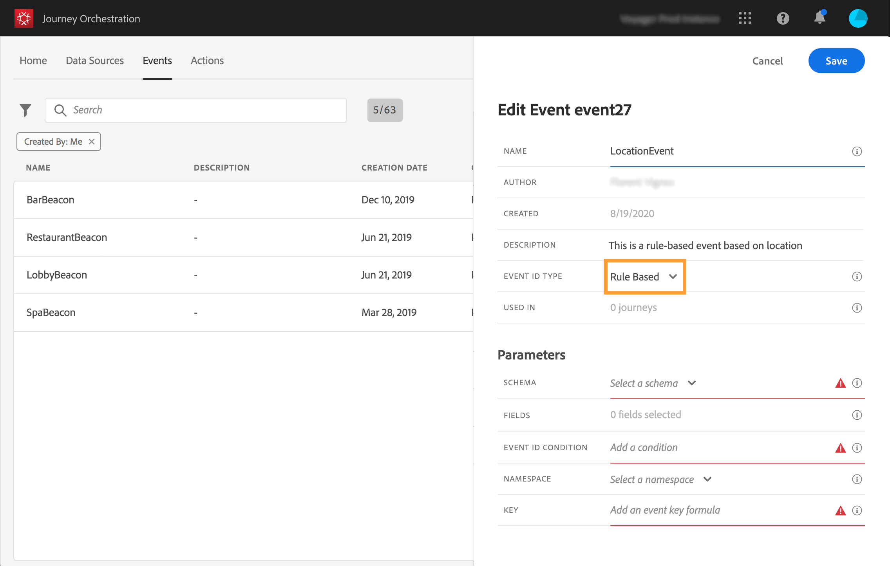

# Een nieuwe gebeurtenis maken {#section_tbk_5qt_pgb}

Dit zijn de belangrijkste stappen voor het configureren van een nieuwe gebeurtenis:

1. Klik in het bovenste menu op het tabblad **[!UICONTROL Events]**. De lijst met gebeurtenissen wordt weergegeven. Zie [deze pagina](../about/user-interface.md) voor meer informatie over de interface.

   

1. Klik op **[!UICONTROL Add]** om een nieuwe gebeurtenis te maken. Het deelvenster voor gebeurtenisconfiguratie wordt aan de rechterkant van het scherm geopend. Voer een naam in voor de gebeurtenis. U kunt ook een beschrijving toevoegen.

   

   >[!NOTE]
   >
   >Gebruik geen spaties of speciale tekens. Gebruik niet meer dan 30 tekens.

1. In de **[!UICONTROL Event ID type]** Selecteer het gebeurtenistype dat u wilt gebruiken.

   

   * **Op regels gebaseerde** gebeurtenissen: dit type gebeurtenis genereert geen eventID. In de **Voorwaarde van gebeurtenis-id** in het veld, definieert u eenvoudig een regel die door het systeem wordt gebruikt om de relevante gebeurtenissen te identificeren die uw reizen zullen activeren. Deze regel kan zijn gebaseerd op elk veld dat beschikbaar is in de gebeurtenispayload, bijvoorbeeld de locatie van het profiel of het aantal items dat is toegevoegd aan de winkelwagen van het profiel.

   * **Door het systeem gegenereerd** gebeurtenissen: voor dit type is een eventID vereist. Dit veld eventID wordt automatisch gegenereerd wanneer de gebeurtenis wordt gemaakt en toegevoegd aan de voorvertoning van de laadbewerking. Het systeem dat de gebeurtenis pusht, moet geen ID genereren, het moet overgaan naar degene die in de voorvertoning van de payload beschikbaar is. Zie [deze sectie](../event/previewing-the-payload.md).
   >[!NOTE]
   >
   >Meer informatie over gebeurtenistypen in [deze sectie](../event/about-events.md).
1. Het aantal journey’s dat deze gebeurtenis gebruikt, wordt in het veld **[!UICONTROL Used in]** weergegeven. U kunt klikken op het pictogram **[!UICONTROL View journeys]** om de lijst weer te geven met journey’s die deze gebeurtenis gebruiken.
1. Definieer het schema en de payloadvelden: hier selecteert u de gebeurtenisinformatie (gewoonlijk een payload genoemd) die [!DNL Journey Orchestration] verwacht te ontvangen. U kunt deze informatie vervolgens gebruiken tijdens uw journey. Zie [deze pagina](../event/defining-the-payload-fields.md).
   >[!NOTE]
   >
   >Wanneer u **[!UICONTROL System Generated]** type, slechts zijn de schema&#39;s die de eventID typemix hebben beschikbaar. Wanneer u **[!UICONTROL Rule Based]** type, zijn alle schema&#39;s van de Gebeurtenis van de Ervaring beschikbaar.

1. Voor op regel-gebaseerde gebeurtenissen, klik binnen **[!UICONTROL Event ID condition]** veld. Gebruikend de eenvoudige uitdrukkingsredacteur, bepaal de voorwaarde die door het systeem zal worden gebruikt om de gebeurtenissen te identificeren die uw reis zullen teweegbrengen.
   

   In ons voorbeeld schreven we een voorwaarde op basis van de stad van het profiel. Dit betekent dat wanneer het systeem een gebeurtenis ontvangt die overeenkomt met deze voorwaarde (**[!UICONTROL City]** veld en **[!UICONTROL Paris]** waarde), wordt deze doorgegeven aan Journey Orchestration.

   >[!NOTE]
   >
   >De geavanceerde expressie-editor is niet beschikbaar bij het definiëren van de **[!UICONTROL Event ID condition]**. In de eenvoudige expressie-editor zijn niet alle operatoren beschikbaar, maar zijn ze afhankelijk van het gegevenstype. Voor een tekenreekstype kunt u bijvoorbeeld &quot;contains&quot; of &quot;equal to&quot; gebruiken.

1. Voeg een naamruimte toe. Deze stap is optioneel, maar wordt aangeraden, omdat u door het toevoegen van een naamruimte gegevens kunt gebruiken die zijn opgeslagen in de real-timeklantprofielservice. U definieert zo het type sleutel van de gebeurtenis. Zie [deze pagina](../event/selecting-the-namespace.md).
1. Sleutel definiëren: kies een veld in uw payloadvelden of definieer een formule om de persoon te identificeren die aan de gebeurtenis is gekoppeld. Deze sleutel wordt automatisch ingesteld (maar kan nog steeds worden bewerkt) als u een naamruimte selecteert. [!DNL Journey Orchestration] kiest namelijk de sleutel die moet overeenkomen met de naamruimte (als u bijvoorbeeld een naamruimte voor e-mail selecteert, wordt de e-mailsleutel geselecteerd). Zie [deze pagina](../event/defining-the-event-key.md).
1. Voor door het systeem gegenereerde gebeurtenissen kunt u een voorwaarde toevoegen. Deze stap is optioneel. Hiermee stelt u het systeem in staat alleen gebeurtenissen te verwerken die aan de voorwaarde voldoen. De voorwaarde kan alleen worden gebaseerd op informatie in de gebeurtenis. Zie [deze pagina](../event/adding-a-condition.md).
1. Klik op **[!UICONTROL Save]**.

   

   De gebeurtenis is nu geconfigureerd en klaar om in een journey worden gezet. Er zijn aanvullende configuratiestappen nodig om gebeurtenissen te ontvangen. Zie [deze pagina](../event/additional-steps-to-send-events-to-journey-orchestration.md).
