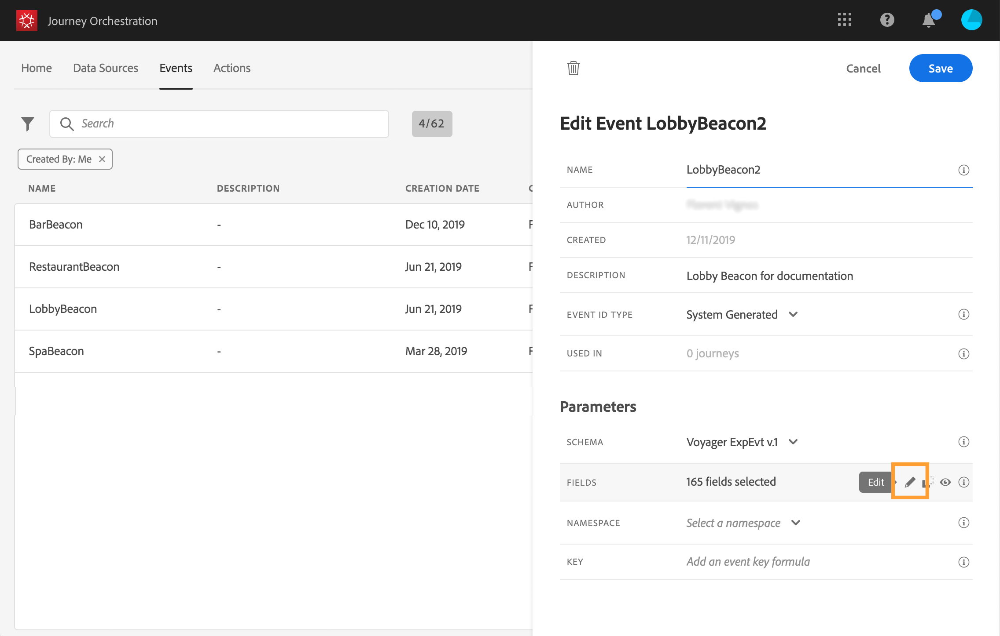

# De laadvelden definiëren {#concept_yrw_3qt_52b}

De ladingsdefinitie staat u toe om de informatie te kiezen het systeem van de gebeurtenis in uw reis verwacht te ontvangen en de sleutel om te identificeren welke persoon aan de gebeurtenis wordt geassocieerd. De payload is gebaseerd op de XDM-velddefinitie van Experience Cloud. Raadpleeg deze [pagina](https://www.adobe.io/apis/cloudplatform/dataservices/xdm.html)voor meer informatie over XDM.

1. Selecteer een XDM-schema in de lijst en klik op het **[!UICONTROL Payload]**veld of op het**[!UICONTROL Edit]** pictogram.

   

   Alle velden die in het schema zijn gedefinieerd, worden weergegeven. De lijst met velden verschilt per schema. U kunt naar een specifiek veld zoeken of de filters gebruiken om alle knooppunten en velden of alleen de geselecteerde velden weer te geven. Volgens de schemadefinitie zijn sommige velden mogelijk verplicht en vooraf geselecteerd. U kunt de selectie niet opheffen.

   >[!NOTE]
   >
   >Controleer of u de mix &quot;orkest&quot; aan het XDM-schema hebt toegevoegd. Dit zal ervoor zorgen dat uw schema alle vereiste informatie bevat om met de Orchestratie van de Reis te werken.

   

1. Selecteer de velden die u van de gebeurtenis wilt ontvangen. Dit zijn de gebieden die de bedrijfsgebruiker in de reis zal hefboomwerking hebben. Zij moeten ook de sleutel omvatten die zal worden gebruikt om de persoon te identificeren verbonden aan de gebeurtenis (zie ).

   

   >[!NOTE]
   >
   >Het **[!UICONTROL eventID]**veld wordt automatisch toegevoegd aan de lijst met geselecteerde velden, zodat Journey Orchestration de gebeurtenis kan identificeren. Het systeem dat de gebeurtenis duwt zou geen identiteitskaart moeten produceren, zou het moeten gebruiken beschikbaar in de voorproef van de lading. Zie.

1. Klik **[!UICONTROL Save]**of druk op**[!UICONTROL Enter]**.

   

   Het aantal geselecteerde velden wordt weergegeven in het **[!UICONTROL Payload]**veld.

   
