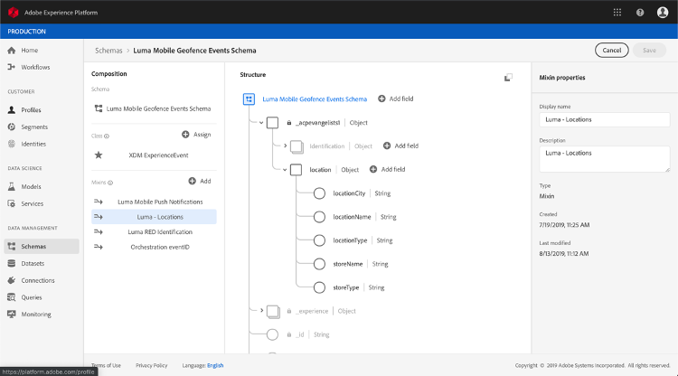

# Informatie over ExperienceEvent-schema&#39;s voor gebeurtenissen [!DNL Journey Orchestration]

[!DNL Journey Orchestration] Gebeurtenissen zijn XDM Experience Events die via Streaming Ingestie naar de Adobe Experience Platform worden verzonden.

Als dusdanig, is een belangrijke voorwaarde voor vestiging gebeurtenissen voor [!DNL Journey Orchestration] dat u met het Model van de Gegevens van de Ervaring van Adobe Experience Platform (of XDM) vertrouwd bent en hoe te om de schema&#39;s van de Gebeurtenis van de Ervaring XDM samen te stellen, evenals hoe te om XDM-Geformatteerde gegevens aan Adobe Experience Platform te stromen.

## Schemavereisten voor gebeurtenissen [!DNL Journey Orchestration]

De eerste stap in vestiging een gebeurtenis voor [!DNL Journey Orchestration] is ervoor te zorgen dat u een schema XDM hebt dat wordt bepaald om de gebeurtenis te vertegenwoordigen, en een dataset die wordt gecreeerd om instanties van de gebeurtenis op Adobe Experience Platform te registreren. Het hebben van een dataset voor uw gebeurtenissen is niet strikt noodzakelijk, maar het verzenden van de gebeurtenissen naar een specifieke dataset zal u toestaan om gebruikers&#39; gebeurtenisgeschiedenis voor toekomstige verwijzing en analyse te handhaven, zodat is het altijd een goed idee. Als u nog geen geschikt schema en dataset voor uw gebeurtenis hebt, kunnen beide taken in de Adobe Experience Platform-webinterface worden uitgevoerd.

Om het even welk schema XDM dat voor [!DNL Journey Orchestration] gebeurtenissen zal worden gebruikt zou aan de volgende vereisten moeten voldoen:

* Het schema moet van de klasse XDM ExperienceEvent zijn.

   

* Voor door het systeem gegenereerde gebeurtenissen moet het schema de Orchestration eventID-mix bevatten. [!DNL Journey Orchestration] gebruikt dit veld om gebeurtenissen te identificeren die tijdens reizen worden gebruikt.

   

* Declareer een identiteitsveld voor het identificeren van het onderwerp van de gebeurtenis. Als er geen identiteit is opgegeven, kan een identiteitskaart worden gebruikt. Dit wordt niet aanbevolen.

   

* Als u deze gegevens voor raadpleging later in een Reis beschikbaar zou willen zijn, merk het schema en de dataset voor profiel.

   

   

* U kunt gegevensvelden vrij gebruiken om andere contextgegevens vast te leggen die u met de gebeurtenis wilt opnemen, zoals informatie over de gebruiker, het apparaat waaruit de gebeurtenis is gegenereerd, de locatie of andere betekenisvolle omstandigheden die met de gebeurtenis verband houden.

   

   
