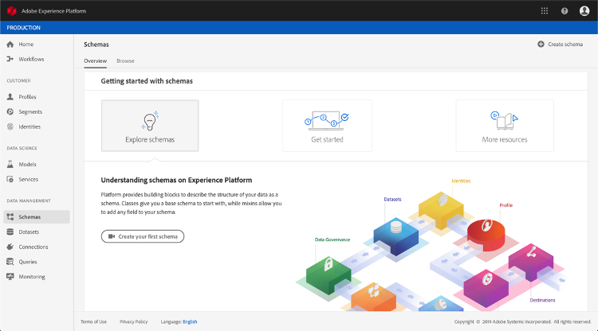
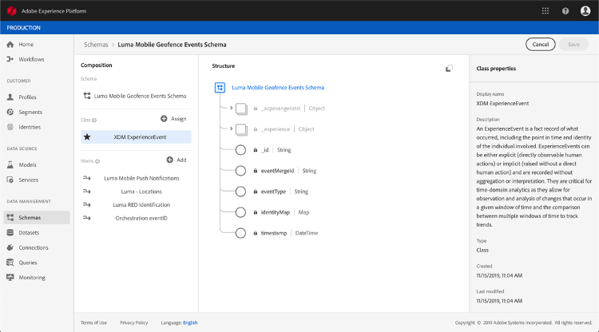

# Over ExperienceEvent-schema&#39;s voor Journey Orchestration Events

Journey Orchestration events are XDM Experience Events die via Streaming Ingestie naar het Adobe Experience Platform worden verzonden.

Daarom is een belangrijke voorwaarde voor het opzetten van gebeurtenissen voor Journey Orchestration dat u met het Model van de Gegevens van de Ervaring van het Platform (of XDM) vertrouwd bent en hoe te om de schema&#39;s van de Gebeurtenis van de Ervaring XDM samen te stellen, evenals hoe te om XDM-Geformatteerde gegevens aan het Platform te stromen.

## Schemavereisten voor Journey Orchestration Events

De eerste stap in vestiging een gebeurtenis voor de Orchestratie van de Reis moet ervoor zorgen dat u een schema XDM hebt dat wordt bepaald om de gebeurtenis te vertegenwoordigen, en een dataset die wordt gecreeerd om instanties van de gebeurtenis op het Platform te registreren. Het hebben van een dataset voor uw gebeurtenissen is niet strikt noodzakelijk, maar het verzenden van de gebeurtenissen naar een specifieke dataset zal u toestaan om gebruikers&#39; gebeurtenisgeschiedenis voor toekomstige verwijzing en analyse te handhaven, zodat is het altijd een goed idee. Als u nog geen geschikt schema en een geschikte dataset voor uw gebeurtenis hebt, kunnen beide taken in de het Webinterface van het Platform worden gedaan.

Om het even welk schema XDM dat voor de gebeurtenissen van de Orchestratie van de Reis zal worden gebruikt zou aan de volgende vereisten moeten voldoen:

* Het schema moet van de klasse XDM ExperienceEvent zijn.

* Het schema moet de Orchestration eventID-mix bevatten. Reisorchestratie gebruikt dit veld om gebeurtenissen te identificeren die tijdens reizen worden gebruikt.

* Declareer een identiteitsveld voor het identificeren van het onderwerp van de gebeurtenis. Als er geen identiteit is opgegeven, kan een identiteitskaart worden gebruikt. Dit wordt niet aanbevolen.

* Als u deze gegevens voor raadpleging later in een Reis beschikbaar zou willen zijn, merk het schema en de dataset voor profiel.

* U kunt gegevensvelden vrij gebruiken om andere contextgegevens vast te leggen die u met de gebeurtenis wilt opnemen, zoals informatie over de gebruiker, het apparaat waaruit de gebeurtenis is gegenereerd, de locatie of andere betekenisvolle omstandigheden die met de gebeurtenis verband houden.

