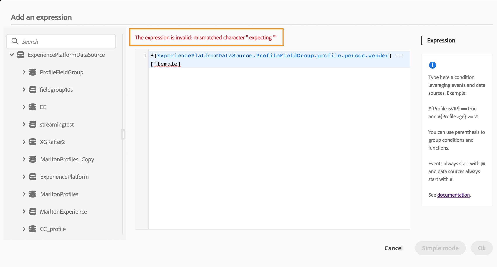

# De geavanceerde expressie-editor {#concept_uyj_trt_52b}

Gebruik de geavanceerde uitdrukkingsredacteur om geavanceerde uitdrukkingen in diverse schermen van de interface te bouwen. U kunt bijvoorbeeld expressies maken bij het configureren en gebruiken van reizen en bij het definiëren van een gegevensbronvoorwaarde.
De editor is ook altijd beschikbaar wanneer u actieparameters moet definiëren waarvoor specifieke datamanipulaties nodig zijn. U kunt data gebruiken die afkomstig zijn van gebeurtenissen of aanvullende informatie die is opgehaald uit de databron. In een journey is de weergegeven lijst met gebeurtenisvelden contextafhankelijk en deze varieert op basis van de gebeurtenissen die tijdens de journey worden toegevoegd.

De geavanceerde expressie-editor biedt een reeks ingebouwde functies en operatoren waarmee u waarden kunt manipuleren en een expressie kunt definiëren die precies bij uw wensen past. Met de geavanceerde expressie-editor kunt u ook de waarden van de externe databronbronparameter definiëren en toewijzingsvelden en verzamelingen zoals ervaringsgebeurtenissen bewerken.

_De interface van de geavanceerde expressie-editor_

De geavanceerde expressie-editor kan worden gebruikt om:

* [Geavanceerde voorwaarden](../building-journeys/condition-activity.md#about_condition) te maken voor databronnen en gebeurtenisinformatie
* Aangepaste [wachtactiviteiten](../building-journeys/wait-activity.md#custom) te definiëren
* De toewijzing van actieparameters te definiëren

Indien mogelijk kunt u tussen de twee modi schakelen met de knop **[!UICONTROL Advanced mode]**/**[!UICONTROL Simple mode]**. De eenvoudige modus wordt [hier](../building-journeys/condition-activity.md#about_condition) beschreven.

>[!NOTE]
>
>De voorwaarden kunnen in de eenvoudige of geavanceerde expressie-editor worden gedefinieerd. Ze retourneren altijd een booleaans type.
>
>Actieparameters kunnen worden gedefinieerd door velden te selecteren of via de geavanceerde expressie-editor. Ze retourneren een specifiek datatype op basis van hun expressie.

## De geavanceerde expressie-editor openen {#section_fdz_4nj_cjb}

U kunt de geavanceerde expressie-editor op verschillende manieren openen:

* Wanneer u een databronvoorwaarde maakt, kunt u de geavanceerde editor openen door te klikken op **[!UICONTROL Advanced mode]**.

   

* Wanneer u een aangepaste timer maakt, wordt de geavanceerde editor direct weergegeven.
* Wanneer u een actieparameter toewijst, klikt u op **[!UICONTROL Advanced mode]**.

## De interface verkennen{#section_otq_tnj_cjb}

In dit scherm kunt u uw expressie handmatig schrijven.

Links in het scherm worden de beschikbare velden en functies weergegeven:

* **[!UICONTROL Events]**: kies een van de velden die worden ontvangen van de binnenkomende gebeurtenis. De weergegeven lijst met gebeurtenisvelden is contextafhankelijk en varieert al naar gelang de gebeurtenissen die tijdens de journey worden toegevoegd. [Meer informatie](../event/about-events.md)
* **[!UICONTROL Segments]**: als u een **[!UICONTROL Segment qualification]** kiest u het segment dat u in uw expressie wilt gebruiken. [Meer informatie](../segment/using-a-segment.md)
* **[!UICONTROL Data Sources]**: kies uit de lijst met velden die beschikbaar zijn in de veldengroepen van uw databronnen. [Meer informatie](../datasource/about-data-sources.md)
* **[!UICONTROL Journey properties]**: in dit deel worden de technische gebieden die verband houden met de reis voor een bepaald profiel gegroepeerd . [Meer informatie](../expression/journey-properties.md)
* **[!UICONTROL Functions]**: kies uit de lijst met ingebouwde functies die complexe filtering mogelijk maken. Functies zijn ingedeeld in categorieën. [Meer informatie](../expression/functions.md)

Een mechanisme voor automatisch aanvullen geeft contextafhankelijke suggesties weer.

Een mechanisme voor de syntaxisvalidatie controleert de integriteit van uw code. Fouten worden over de editor heen weergegeven.

**Parameters vereist tijdens het samenstellen van voorwaarden met de geavanceerde expressie-editor**

Als u een veld selecteert uit een externe gegevensbron waarvoor een parameter moet worden aangeroepen (zie [deze pagina](../datasource/external-data-sources.md). In een databron met betrekking tot weersomstandigheden is ‘city’ bijvoorbeeld een veelgebruikte parameter. Dit betekent dat u moet selecteren waar u deze parameter ‘city’ wilt ophalen. Functies kunnen ook op parameters worden toegepast om opmaakwijzigingen of samenvoegingen uit te voeren.

Als u bij complexere gebruiksscenario’s de parameters van de databron wilt opnemen in de hoofdexpressie, kunt u de waarden ervan definiëren met het trefwoord ‘params’. Zie [deze pagina](../expression/field-references.md).
