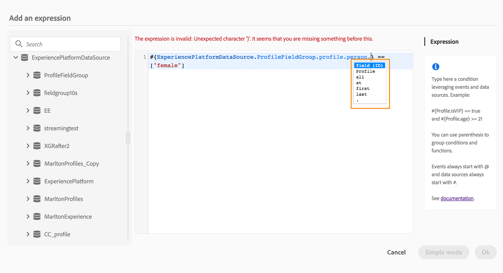

# Over de geavanceerde expressie-editor {#concept_uyj_trt_52b}

De geavanceerde uitdrukkingsredacteur staat u toe om geavanceerde uitdrukkingen in diverse schermen van de interface te bouwen, bijvoorbeeld, wanneer het bepalen van een gegevensbronvoorwaarde.
Het is ook beschikbaar telkens als u actieparameters moet bepalen die specifieke gegevensmanipulaties vereisen. U kunt gegevens die afkomstig zijn van gebeurtenissen of aanvullende informatie die is opgehaald uit de gegevensbron, gebruiken. Op een reis is de weergegeven lijst met gebeurtenisvelden contextueel en varieert afhankelijk van de gebeurtenis(sen) die tijdens de reis zijn toegevoegd.

De geavanceerde uitdrukkingsredacteur biedt een reeks ingebouwde functies en exploitanten aan om u waarden te laten manipuleren en een uitdrukking te bepalen die specifiek uw behoeften past. Met de geavanceerde expressie-editor kunt u ook de waarden van de externe gegevensbronparameter definiëren, kaartvelden en verzamelingen bewerken, zoals ervaringsgebeurtenissen.

_De geavanceerde interface van de uitdrukkingsredacteur_

De geavanceerde uitdrukkingsredacteur kan worden gebruikt om:

* creëren [geavanceerde voorwaarden](../building-journeys/condition-activity.md#about_condition) op gegevensbronnen en gebeurtenisinformatie
* aangepaste [wachtactiviteiten definiëren](../building-journeys/wait-activity.md#custom)
* handeling parameters toewijzen

Indien mogelijk kunt u tussen de twee modi schakelen met de **[!UICONTROL Advanced mode]** knop / **[!UICONTROL Simple mode]** . De eenvoudige modus wordt [hier](../building-journeys/condition-activity.md#about_condition)beschreven.

>[!NOTE]
>
>De voorwaarden kunnen in de eenvoudige of geavanceerde uitdrukkingsredacteur worden bepaald. Ze retourneren altijd een booleaans type.
>
>Handelingsparameters kunnen worden gedefinieerd door velden te selecteren of via de geavanceerde expressie-editor. Ze retourneren een specifiek gegevenstype op basis van hun expressie.

## De geavanceerde expressie-editor openen {#section_fdz_4nj_cjb}

U kunt de geavanceerde expressieeditor op verschillende manieren openen:

* Wanneer u een gegevensbronvoorwaarde creeert, kunt u tot de geavanceerde redacteur toegang hebben door op te klikken **[!UICONTROL Advanced mode]**.

   

* Wanneer u een douanetijdopnemer creeert, zal de geavanceerde redacteur direct worden getoond.
* Wanneer u actieparameter toewijst, klik op **[!UICONTROL Advanced mode]**.

## De interface detecteren{#section_otq_tnj_cjb}

In dit scherm kunt u uw expressie handmatig schrijven.

Links op het scherm worden beschikbare velden en functies weergegeven:

* **[!UICONTROL Events]**: Kies een van de velden die worden ontvangen van de binnenkomende gebeurtenis. De weergegeven lijst met gebeurtenisvelden is contextueel en varieert afhankelijk van de gebeurtenis(sen) die tijdens de reis zijn toegevoegd.
* **[!UICONTROL Data Sources]**: kiest u uit de lijst met velden die beschikbaar zijn in de veldgroepen van uw gegevensbronnen.
* **[!UICONTROL Functions]**: kiest u uit de lijst met ingebouwde functies die complexe filtering mogelijk maken. Functies zijn ingedeeld in categorieën.

Een mechanisme voor automatisch aanvullen geeft contextuele suggesties weer.

Een mechanisme van de syntaxisbevestiging controleert de integriteit van uw code. Fouten worden boven op de editor weergegeven.

**Behoefte aan parameters wanneer het bouwen van voorwaarden met de geavanceerde uitdrukkingsredacteur**

Als u een veld selecteert uit een externe gegevensbron waarvoor een parameter moet worden aangeroepen (zie . In een gegevensbron met betrekking tot weersomstandigheden is een veelgebruikte parameter bijvoorbeeld &quot;stad&quot;. Dit betekent dat u moet selecteren waar u deze parameter city wilt ophalen. Functies kunnen ook op parameters worden toegepast om opmaakwijzigingen of aaneenschakelingen uit te voeren.

Als u de parameters van de gegevensbron wilt opnemen in de hoofdexpressie, kunt u voor complexere gebruiksgevallen de waarden definiëren met het trefwoord &quot;params&quot;. Zie [deze pagina](../expression/field-references.md).
