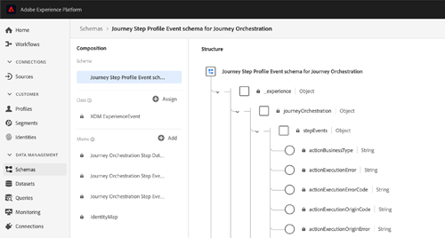

# Opmerkingen bij de release {#release-notes}

Deze pagina bevat een overzicht van alle nieuwe functies en verbeteringen voor Journey Orchestration.
U kunt ook de [Documentatie-updates](../release-notes/documentation-updates.md)raadplegen.

## Release Q2 - juni 2020 {#q2-release---june-2020}

<table>
<thead>
<tr>
<th><strong>Verbeterde integratie van Adobe Experience Platform</strong> </th>
</tr>
</thead>
<tbody>
<tr>
<td>

De volgende verbeteringen zijn doorgevoerd in de platformintegratie:

<ul>
<li>
Een nieuwe activiteit staat het luisteren van het segmentententangen/de uitgang van het Platform toe om mensen te maken binnen of zich voorwaarts in een reis bewegen. <a href="../building-journeys/event-activities.md#segment-qualification">Meer informatie</a>

</li>
<li>
De segmenten van het platform kunnen nu worden gecreeerd en worden uitgegeven zonder de interface van de Orchestratie van de Reis, dankzij een nieuw lusje van <strong>Segmenten</strong> te verlaten. Effectieve beschikbaarheid: 15 juni 2020. <a href="../segment/about-segments.md">Meer informatie</a>

</li>
<li>
In de eenvoudige uitdrukkingsredacteur, zijn de segmenten van het Platform nu direct vermeld in de navigatieboom om gemakkelijke opstelling van voorwaarden zoals "toe te staan behoort deze persoon tot segment A?". <a href="../segment/using-a-segment.md">Meer informatie</a>

</li>
<li>
Reisorchestratie geeft nu automatisch aan het Adobe-gegevensplatform de stappen door individuele personen tijdens reizen door. Dit geldt ook voor mogelijke fouten. Deze informatie kan worden gebruikt voor analyse- of segmentatiedoeleinden. <a href="../building-journeys/sharing-overview.md">Meer informatie</a>

</li>
<li>
Reisorchestratie kan nu worden verbonden met productie en niet-productie Platform Sandbox. Effectieve beschikbaarheid: 15 juni 2020. <a href="../about/access-management.md#sandboxes">Meer informatie</a>

</li>
</td>
</tr>
</tbody>
</table>

<table>
<thead>
<tr>
<th><strong>Verbeteringen in de reisontwerper en testmodus</strong> </th>
</tr>
</thead>
<tbody>
<tr>
<td>

De volgende verbeteringen zijn aangebracht aan de reisontwerper en de testmodus:

<ul>
<li>
U kunt nu plakactiviteiten kopiëren van de ene reis naar de andere en 1 of N reisactiviteiten selecteren. <a href="../building-journeys/using-the-journey-designer.md#copy-paste">Meer informatie</a>

</li>
<li>
Nadat u een gebeurtenis hebt afgevuurd om een testprofiel een reis te laten maken, kunt u nu de voortgang van de reis zien dankzij een gekleurde visuele stroom. In het geval van een fout tijdens de rit worden ook details van fouten weergegeven. <a href="../building-journeys/testing-the-journey.md#firing_events">Meer informatie</a>

</li>
<li>De <strong>voltooide</strong> reisstaat is hernoemd <strong>Gesloten (geen ingang)</strong> om beter te weerspiegelen wat deze staat betekent.</li>
</ul>
</td>
</tr>
</tbody>
</table>

**Overige verbeteringen**

Om te voorkomen dat er te veel API-aanroepen naar systemen van derden worden verzonden, introduceren we een nieuwe openbare API voor het instellen van ‘plafondregels&#39;. De begrenzingsregels staan de definitie van een maximumaantal vraag aan een API eindpunt per milliseconden toe. [Meer informatie](../api/capping.md)

Het beheer van de toegang staat nu meer granulariteit in het beheer van de gebruikerstoegang toe. Effectieve beschikbaarheid: 15 juni 2020. [Meer informatie](../about/access-management.md#create-product-profile)

Reisorchestratie is nu beschikbaar in APAC (Australisch datacenter). Effectieve beschikbaarheid: 15 juni 2020

De interface Journey Orchestration is beschikbaar in het Japans.

## Release Q1 - maart 2020 {#q1-release---march-2020}

**Wat is nieuw?**

<table>
<thead>
<tr>
<th><strong>Verbeteringen in de testmodus</strong> </th>
</tr>
</thead>
<tbody>
<tr>
<td>

De testmodus is als volgt verbeterd:

<ul>
<li>Wanneer een reis verscheidene gebeurtenissen gebruikt, kunt u elk van hen nu individueel van een drop-down lijst, in het de configuratiescherm <strong>van de</strong> Gebeurtenis van de testwijze teweegbrengen. <a href="../building-journeys/testing-the-journey.md#firing_events">Meer informatie</a>
</li>
<li>
Wanneer één of meerdere <strong>Wacht</strong> activiteiten in een reis worden gebruikt, kunt u de tijd nu bepalen dat elk van deze activiteiten op testwijze zal duren. De standaardtijd is 10 seconden. U kunt dit veranderen gebruikend de <strong>Wacht tijd in testparameter</strong> , in de bodem linkerhoek. <a href="../building-journeys/testing-the-journey.md">Meer informatie</a>

</li>
<li>In de <strong>testlogboeken</strong>, in het geval van een fout wanneer het roepen van een derdesysteem (gegevensbron of actie), worden de foutencode en foutenreactie nu getoond. <a href="../building-journeys/testing-the-journey.md#viewing_logs">Meer informatie</a>
</li>
</ul>
</td>
</tr>
</tbody>
</table>

<table>
<thead>
<tr>
<th><strong>Gecentraliseerd tijdzonebeheer</strong> </th>
</tr>
</thead>
<tbody>
<tr> 
<td>

Het tijdzonebeheer wordt nu gecentraliseerd in het deelvenster met reiseigenschappen. Er zijn twee parameters toegevoegd aan de reiseigenschappen:

<ul>
<li>In de vervolgkeuzelijst <strong>Tijdzone</strong> kunt u een specifieke tijdzone selecteren. Standaard wordt de tijdzone van de browser gebruikt. </li>
<li>Met het selectievakje Tijdzone <strong>van</strong> profiel kunt u de tijdzone van het profiel van het ervaringsplatform gebruiken van de persoon die de reis betreedt, indien beschikbaar. Als dat niet het geval is, wordt de tijdzone gebruikt die in de vervolgkeuzelijst is gedefinieerd. Deze functie is niet compatibel met ritten die gebeurtenissen gebruiken die geen naamruimte hebben.</li>
</ul>

Raadpleeg de secties <a href="../building-journeys/changing-properties.md#timezone">Eigenschappen</a> wijzigen en <a href="../building-journeys/timezone-management.md">Tijdzonebeheer</a> voor meer informatie.

</td>
</tr>
</tbody>
</table>

<table>
<thead>
<tr>
<th><strong>Verbeteringen voor ontwerpers van reizen</strong> </th>
</tr>
</thead>
<tbody>
<tr> 
<td>

Het <strong>reispalet</strong>aan de linkerkant van de reisontwerper is verbeterd:

<ul>
<li>Met een nieuw pictogram naast de <strong>zoekbalk</strong> kunt u niet-beschikbare elementen in het palet verbergen of weergeven, bijvoorbeeld gebeurtenissen die een andere naamruimte gebruiken dan de gebeurtenissen die tijdens de reis worden gebruikt. Niet-beschikbare items worden standaard verborgen.</li>
<li>Wanneer u het veld <strong>Zoeken</strong> gebruikt, wordt nu het aantal resultaten voor elke categorie canvasactiviteiten weergegeven.</li>
<li>De navigatie tussen de verschillende activiteitencategorieën is verbeterd.</li>
</ul>

In de reisontwerper, kunt u nu controleren u tot de recentste versie van de reis toegang hebt. Deze informatie wordt weergegeven naast het versienummer.

Op het <strong>reiscanvas</strong>, wanneer twee activiteiten worden losgemaakt, wordt een waarschuwingsbericht nu getoond.

Raadpleeg de <a href="../building-journeys/using-the-journey-designer.md">gedetailleerde documentatie</a>voor meer informatie.

</td>
</tr>
</tbody>
</table>

<table>
<thead>
<tr>
<th><strong>Contextafhankelijke Help</strong> </th>
</tr>
</thead>
<tbody>
<tr>
<td>

Er is nu een contextafhankelijke Help beschikbaar in de verschillende lijstschermen van de Journey Orchestration (reizen, gebeurtenissen, handelingen en gegevensbronnen). Op deze manier kunt u een korte beschrijving weergeven van de huidige functionaliteit en toegang krijgen tot verwante artikelen en video's.

Klik op het  pictogram in de rechterbovenhoek van het scherm om de contextafhankelijke Help weer te geven. 

</td>
</tr>
</tbody>
</table>

**Overige verbeteringen**

* Naast de VS is nu ook de Journey Orchestration (Reisorchestratie) beschikbaar in **EMEA**. De aanvraag en documentatie zijn in het Frans en Duits beschikbaar.

* De Experience League is nu geïntegreerd in het product. Dit vereenvoudigt de toegang tot gerelateerde inhoud en helpt u optimaal te profiteren van Experience Cloud. De directe toegang tot de documentatie van het Orchestration van de Reis is beschikbaar bij de bodem van de Hulp tabel. Klik bovendien op Help > Feedback om problemen te melden of uw ideeën te delen met Adobe.

* De sneltoets **C** , waarmee u een nieuw item kunt maken, is nu beschikbaar in alle lijstschermen: reizen, gegevensbronnen, acties en gebeurtenissen. [Meer informatie](../about/user-interface.md#section_ksq_zr1_ffb)

* U kunt gestopt reizen nu **verwijderen** . Rapporten over deze verwijderde reizen zijn niet beschikbaar.

* Wanneer u door **gegevensplatformvelden** bladert (XDM-indeling), wordt naast de veldnaam ook de weergavenaam weergegeven. Deze informatie wordt teruggewonnen van de schemadefinitie in het Model van de Gegevens van de Ervaring. Indien beschikbaar wordt de alternatieve weergavenaam weergegeven. Met deze gebruiksvriendelijke beschrijving, vooral handig in het geval van eVar-velden, kunt u uw velden gemakkelijker identificeren. [Meer informatie](../about/user-interface.md#friendly-names-display)

## GA-release - december 2019 {#ga-release---december-2019}

Reisorchestratie is nu GA.

Stel in real-time implementatiefuncties samen voor het orkestgebruik, waarbij gebruik wordt gemaakt van contextuele gegevens die zijn opgeslagen in gebeurtenissen of gegevensbronnen.

De Orchestratie van de reis staat in real time orchestratie toe die door contextafhankelijke gegevens van gebeurtenissen, informatie van het Platform van de Ervaring van Adobe, of gegevens van de diensten van derdeAPI wordt aangedreven. De toepassing bepaalt in multistep stromen die reizen de volgende beste acties specifiek voor de consument, op hun profiel en gedrag worden genoemd. Dit omvat zowel de optimale timing als het type actie, zoals het verzenden van een pushmelding aan de consument via de mogelijkheden voor transactiemeldingen in Adobe Campagne Standard (hiervoor is Adobe Campagne Standard vereist) of het melden van een systeem van derden. Deze beslissingen worden genomen op basis van regels en Sensei-scores.

[Meer](../action/working-with-adobe-campaign.md) weten over Journey Orchestration?

Aanvullende bronnen:

* [Zelfstudies](https://docs.adobe.com/content/help/en/platform-learn/tutorials/journey-orchestration/introduction.html)
* [Gemeenschap](https://www.adobe.com/go/journeyorchestrationcommunity)
