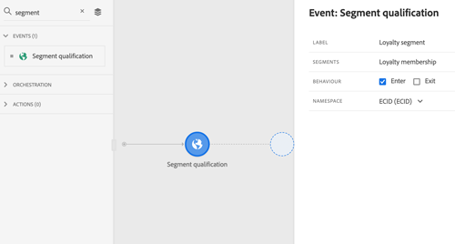
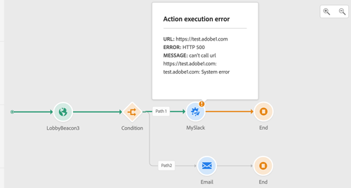

# Release-opmerkingen{#release-notes}

Deze pagina bevat een overzicht van alle nieuwe functies en verbeteringen voor Journey Orchestration.
U kunt ook de nieuwste [Documentatie-updates](../release-notes/documentation-updates.md) raadplegen.

## Release {#february-2021-release} februari 2021

<table>
<thead>
<tr>
<th><strong>Profielactiviteit bijwerken</strong> </th>
</tr>
</thead>
<tbody>
<tr>
<td>

Met deze nieuwe actieactiviteit kunt u een bestaand Adobe Experience Platform-profiel bijwerken met informatie die afkomstig is van de gebeurtenis, een gegevensbron of een specifieke waarde gebruiken.

Raadpleeg de <a href="../building-journeys/update-profiles.md">gedetailleerde documentatie</a> voor meer informatie.

</td>
</tr>
</tbody>
</table>

### Overige verbeteringen

* Bij het configureren van een gebeurtenis worden nu standaard alleen velden geselecteerd die verplicht zijn voor de XDM-validatie. Deze velden kunnen niet worden uitgeschakeld.
* In het reispalet is een nieuw filter toegevoegd. Hiermee kunt u alleen de laatste vijf gebruikte gebeurtenissen en handelingen weergeven, naast de gebeurtenissen en handelingen die buiten de box vallen. Dit geldt specifiek voor elke gebruiker. Standaard worden alle items weergegeven. [Meer informatie](../building-journeys/using-the-journey-designer.md#palette)
* Bij het starten van een nieuwe rit worden elementen die niet op het canvas kunnen worden neergezet als de eerste stap, nu verborgen. Dit heeft betrekking op alle handelingen, de activiteit van de aandoening, de wachttijd en de reactie.
* In het linkerdeel van de geavanceerde uitdrukkingsredacteur, worden de functies nu opnieuw gegroepeerd onder een **sectie Functions** aan het eind van de lijst.

## Release van januari 2021 {#january-2021-release}

Wanneer u een schema selecteert in de gebeurtenisconfiguratie, worden alleen velden geselecteerd die verplicht zijn om de gebeurtenis correct door Journey Orchestration te ontvangen. [Meer informatie](../event/defining-the-payload-fields.md)

De eigenschappen van de reis zijn nu beschikbaar in de eenvoudige uitdrukkingsredacteur. [Meer informatie](../expression/journey-properties.md)

Er zijn twee nieuwe kenmerken voor de reiseigenschappen toegevoegd (sandboxName en organisationId). [Meer informatie](../expression/journey-properties.md)

Om zich aan Adobe Campaign Standard SLAs te richten, wordt een het maximum van 13 vraag per seconde nu automatisch bepaald voor de acties van Adobe Campaign Standard zodra de integratie van Adobe Campaign Standard opstelling is. [Meer informatie](../action/working-with-adobe-campaign.md)

De time-outduur van de gebeurtenis wordt nu duidelijker opgegeven in het time-outpad. [Meer informatie](../building-journeys/event-activities.md#listening-to-events-during-a-specific-time)

De [getListItem](../functions/functiongetlistitem.md) en [split](../functions/functionsplit.md) functies zijn toegevoegd aan de lijst van functies beschikbaar in de geavanceerde uitdrukkingsredacteur. Dit zal meer mogelijkheden in uw koordberekeningen gebruiksgevallen aanbieden.

## Release {#november-release} van november 2020

<table>
<thead>
<tr>
<th><strong>Van de ene journey naar de andere gaan</strong> </th>
</tr>
</thead>
<tbody>
<tr>
<td>

Met een nieuwe actie kunt u personen van de ene reis naar de andere verplaatsen. Met de <strong>Jump</strong>-activiteit kunt u:

<ul>
<li>vereenvoudigen het ontwerp van zeer complexe reizen door deze in verschillende te splitsen </li>
<li>ritten bouwen op basis van gemeenschappelijke en herbruikbare reispatronen</li>
</ul>

Raadpleeg voor meer informatie de <a href="../building-journeys/jump.md">gedetailleerde documentatie</a> en <a href="https://experienceleague.adobe.com/docs/journey-orchestration-learn/tutorials/building-a-journey/jumping-to-another-journey.html">zelfstudievideo</a>.

</td>
</tr>
</tbody>
</table>

<table>
<thead>
<tr>
<th><strong>Eigenschappen voor reizen gebruiken in de expressieeditor</strong> </th>
</tr>
</thead>
<tbody>
<tr>
<td>

In de geavanceerde uitdrukkingsredacteur, hebben wij een nieuwe categorie in de lijst van gebieden en functies toegevoegd. Dit is de informatie die door het systeem wordt opgehaald uit rechtstreekse reizen, zoals de reis-id of de specifieke fouten die zijn aangetroffen. Dit geeft u meer mogelijkheden bij het bouwen van uw reizen. U kunt bijvoorbeeld systemen van derden waarschuwen in het geval van fouten die in een voorwaarde of handeling worden aangetroffen.

Raadpleeg de <a href="../expression/journey-properties.md">gedetailleerde documentatie</a> voor meer informatie.

</td>
</tr>
</tbody>
</table>

<table>
<thead>
<tr>
<th><strong>Gebeurtenissen op basis van regels (bèta)</strong> </th>
</tr>
</thead>
<tbody>
<tr>
<td>

Er is nu een nieuwe methode beschikbaar om gebeurtenissen gemakkelijker in te stellen, zonder een eventID te gebruiken: Op regel-gebaseerde gebeurtenissen evalueren of zou de gebeurtenis volgens een voorwaarde moeten worden teweeggebracht. U kunt nog steeds de bestaande methode gebruiken, die nu "door het systeem gegenereerd" wordt genoemd. Deze functie, die door een beperkte groep klanten via het Alpha-programma is getest, is nu beschikbaar in Bèta aan alle klanten.

</td>
</tr>
</tbody>
</table>

### Overige verbeteringen

Er zijn beperkingen toegevoegd bij het maken van nieuwe versies van een reis. Deze beperkingen voorkomen te drastische veranderingen in de reis om enige consistentie tussen versies te behouden. [Meer informatie](../about/limitations.md#journey-versions-limitations)

De **Segmentkwalificatie** activiteit kan niet meer worden gebruikt in een reis die Campaign Standard berichtactiviteiten omvat. Deze beperking beschermt de integriteit van Adobe Campaign Standard-instanties. Het gebruik van de Kwalificatie van het Segment kan zelfs tot dagelijkse pieken van bericht leiden die Campaign Standard Transactioneel Overseinen zou overbelasten. [Meer informatie](../about/limitations.md#segment-qualification)

## Release {#october-release} oktober 2020

<table>
<thead>
<tr>
<th><strong>Time-out gebeurtenis</strong> </th>
</tr>
</thead>
<tbody>
<tr>
<td>

U kunt nu een time-out voor een gebeurtenis configureren om een reis alleen tijdens een bepaalde tijd naar een gebeurtenis te laten luisteren. U hoeft geen wachtactiviteiten meer parallel aan het gebeurtenispad toe te voegen om dit te bereiken.

Raadpleeg de <a href="../building-journeys/event-activities.md#listening-to-events-during-a-specific-time">gedetailleerde documentatie</a> voor meer informatie.

</td>
</tr>
</tbody>
</table>

### Overige verbeteringen

* Wanneer u een nieuwe versie van een reis publiceert, beëindigt de vorige versie automatisch en schakelt naar de Gesloten status. [Meer informatie](../building-journeys/journey-versions.md)

## Release {#september-release} september 2020

### GA-updates{#september-ga-update}

<table>
<thead>
<tr>
<th><strong>Verbeteringen in voorwaardenactiviteit</strong> </th>
</tr>
</thead>
<tbody>
<tr>
<td>

Wanneer u voorwaarden toevoegt aan uw reis, kunt u nu een etiket bepalen. Als u tijdens een reis verschillende omstandigheden gebruikt, kunt u deze gemakkelijker identificeren.

Raadpleeg de <a href="../building-journeys/condition-activity.md#about_condition">gedetailleerde documentatie</a> voor meer informatie.

</td>
</tr>
</tbody>
</table>

### Alfa-updates{#september-alpha-update}

<table>
<thead>
<tr>
<th><strong>Verbeteringen voor segmentactiviteit lezen</strong> </th>
</tr>
</thead>
<tbody>
<tr>
<td>

De volgende verbeteringen zijn aangebracht in de <strong>Read segment</strong> activiteit:

<ul>
<li>
Op segmenten gebaseerde reizen tonen nu, boven het canvas, een herinnering aan het planningstype van de reis. U kunt op deze herinnering klikken om tot het menu van de planningsconfiguratie toegang te hebben.

</li>
<li>
De granulariteit van de logboeken van de testwijze is verbeterd om de de vooruitgangsstatus van de segmentuitvoer te tonen.

</li>
</ul>
</td>
</tr>
</tbody>
</table>

## Release van augustus 2020 {#august-release}

### GA-updates{#august-ga-update}

De payload van segmentkwalificatiegebeurtenissen bevat nu de volgende contextinformatie, die u in voorwaarden en acties kunt gebruiken: het gedrag (openen, sluiten), het tijdstempel van kwalificatie en de segment-ID. [Meer informatie](../building-journeys/segment-qualification-events.md)

### Alfa-updates{#august-alpha-update}

<table>
<thead>
<tr>
<th><strong>Segmenttriggeractiviteit</strong> </th>
</tr>
</thead>
<tbody>
<tr>
<td>

De segmenttriggeractiviteit bevat de volgende verbeteringen:

<ul>
<li>
De naam van de activiteit is veranderd in ‘Segment lezen’. 

</li>
<li>
De configuratie van de journeyplanner is verwijderd uit de eigenschappen van de activiteit. De activiteit is nu direct toegankelijk vanuit de eigenschappen van de journey in een specifieke sectie die wordt weergegeven als een activiteit voor Segment lezen op het canvas is neergezet. 

</li>
<li>
U kunt de journey nu testen op een uniform profiel en de voortgang van de journey volgen met behulp van de visuele stroom.

</li>
</ul>
</td>
</tr>
</tbody>
</table>

<table>
<thead>
<tr>
<th><strong>Gebeurtenissen op basis van regels</strong> </th>
</tr>
</thead>
<tbody>
<tr>
<td>

De volgende verbeteringen zijn doorgevoerd in op regels gebaseerde gebeurtenissen:

<ul>
<li>
U kunt nu alle Adobe Analytics-gedragsgebeurtenisgegevens die u al vastlegt en naar het platform streamt, gebruiken om journey’s te starten en ervaringen voor uw klanten te automatiseren. <a href="../event/about-analytics.md">Meer informatie</a>

</li>
<li>
Wanneer u een op regels gebaseerde gebeurtenis activeert in de testmodus, kunt u de voorwaarde van de gebeurtenis-ID nu rechtstreeks weergeven. Ook is er een tooltip toegevoegd naast elk veld dat deel uitmaakt van de regelevaluatie. <a href="../building-journeys/testing-the-journey.md#test-rule-based">Meer informatie</a>

</li>
<li>
Het scherm voor de definitie van op regels gebaseerde gebeurtenissen is gereorganiseerd voor een betere ervaring. <a href="../event/about-creating.md">Meer informatie</a>

</li>
</ul>
</td>
</tr>
</tbody>
</table>

## Alfa-release - juli 2020 {#alpha-release---july-2020}

Het Alfa-programma biedt functies die momenteel bij een beperkt aantal klanten worden getest. Hierdoor kunnen we ons product verbeteren op basis van de ontvangen feedback. Deze functies zijn niet beschikbaar voor alle Journey Orchestration-klanten.

<table>
<thead>
<tr>
<th><strong>Verbeterde gebruikersinterface</strong> </th>
</tr>
</thead>
<tbody>
<tr>
<td>

De navigatie binnen de menu’s van Journey Orchestration is verbeterd en biedt nu een consistente interface met Adobe Experience Platform:

<ul>
<li>
Menu’s zijn van de bovenkant verplaatst naar de linkerkant van de interface. 

</li>
<li>
Groepering van beheerdersfuncties in één dashboard.

</li>
</ul>
</td>
</tr>
</tbody>
</table>

<table>
<thead>
<tr>
<th><strong>Segmenttriggeractiviteit</strong> </th>
</tr>
</thead>
<tbody>
<tr>
<td>

Met de segmenttriggeractiviteit kunt u alle personen die tot een Adobe Experience Platform-segment behoren, een journey laten starten. Het starten van een journey kan één keer, of op regelmatige basis plaatsvinden. 

</td>
</tr>
</tbody>
</table>

<table>
<thead>
<tr>
<th><strong>Gebeurtenissen op basis van regels</strong> </th>
</tr>
</thead>
<tbody>
<tr>
<td>

We hebben de manier vereenvoudigd waarop u Experience-gebeurtenissen instelt. We introduceren een nieuwe methode waarvoor geen eventID nodig is. Wanneer u de gebeurtenis instelt in Journey Orchestration, kunt u nu een op regels gebaseerde gebeurtenis definiëren. <a href="../event/about-events.md">Meer informatie</a>

</td>
</tr>
</tbody>
</table>

## Q2-release - juni 2020 {#q2-release---june-2020}

<table>
<thead>
<tr>
<th><strong>Verbeterde Adobe Experience Platform-integratie</strong> </th>
</tr>
</thead>
<tbody>
<tr>
<td>

De volgende Adobe Experience Platform-integratieverbeteringen zijn doorgevoerd:

<ul>
<li>
Met een nieuwe activiteit kan worden geluisterd naar het openen en sluiten van Adobe Experience Platform-segmenten waarmee mensen aan een journey beginnen of ermee doorgaan. <a href="../building-journeys/segment-qualification-events.md">Meer informatie</a>

</li>
<li>
U kunt nu Adobe Experience Platform-segmenten maken en bewerken zonder de Journey Orchestration-interface te verlaten dankzij het nieuwe tabblad <strong>Segments. </strong> <a href="../segment/about-segments.md">Meer informatie</a>

</li>
<li>
In de eenvoudige expressie-editor worden Adobe Experience Platform-segmenten nu direct vermeld in de navigatiestructuur voor het gemakkelijk instellen van voorwaarden zoals ‘hoort deze persoon bij segment A?’. <a href="../segment/using-a-segment.md">Meer informatie</a>

</li>
<li>
Journey Orchestration geeft nu automatisch de stappen die tijdens journey’s worden uitgevoerd, door aan het Adobe Experience Platform. Dit geldt ook voor mogelijke fouten. Deze informatie kan worden gebruikt voor rapportage en probleemoplossing door query’s uit te voeren op journeystapgebeurtenissen voor een bepaalde journey of voor alle journey’s. <a href="../building-journeys/sharing-overview.md">Meer informatie</a>

</li>
<li>
Journey Orchestration kan nu worden verbonden met productie- en niet-productie Adobe Experience Platform-sandboxen. Sandboxen zijn bètafuncties. <a href="../about/access-management.md#sandboxes">Meer informatie</a>

</li>
</ul>
</td>
</tr>
</tbody>
</table>

<table>
<thead>
<tr>
<th><strong>Verbeteringen in de journeyontwerper en testmodus</strong> </th>
</tr>
</thead>
<tbody>
<tr>
<td>

De volgende verbeteringen zijn aangebracht aan de journeyontwerper en de testmodus:

<ul>
<li>
U kunt activiteiten nu kopiëren en plakken van de ene journey naar de andere en 1 of N journeyactiviteiten selecteren. <a href="../building-journeys/using-the-journey-designer.md#copy-paste">Meer informatie</a>

</li>
<li>
Nadat u een gebeurtenis hebt geactiveerd om een testprofiel een journey te laten starten, kunt u nu de voortgang in de journey zien dankzij een gekleurde visuele stroom. In het geval van een fout tijdens de journey worden ook foutdetails weergegeven. <a href="../building-journeys/testing-the-journey.md#firing_events">Meer informatie</a>

</li>
<li>De <strong>voltooide</strong> journeystatus is hernoemd als <strong>Gesloten (geen toegang)</strong> om beter weer te geven wat deze status betekent.</li>
</ul>
</td>
</tr>
</tbody>
</table>

**Overige verbeteringen**

Om te voorkomen dat er te veel API-aanroepen naar externe systemen worden verzonden, is er een nieuwe openbare API voor het instellen van beperkingsregels. Met beperkingsregels kan een maximum aantal aanroepen per milliseconde aan een API-eindpunt worden gedefinieerd. [Meer informatie](../api/capping.md)

Met de toegangscontrole is nu meer granulariteit in het beheer van gebruikerstoegang mogelijk. Beschikbaar: 30 juni 2020. [Meer informatie](../about/access-management.md#create-product-profile)

Journey Orchestration is nu verkrijgbaar in APAC (Australisch datacenter). Beschikbaar: 30 juni 2020

De Journey Orchestration-interface is beschikbaar in het Japans.

## Q1-release - maart 2020 {#q1-release---march-2020}

<table>
<thead>
<tr>
<th><strong>Verbeteringen in de testmodus</strong> </th>
</tr>
</thead>
<tbody>
<tr>
<td>

De testmodus is als volgt verbeterd:

<ul>
<li>Wanneer een journey verscheidene gebeurtenissen gebruikt, kunt u elk van deze nu afzonderlijk activeren vanuit een vervolgkeuzelijst in het scherm <strong>Event configuration</strong> van de testmodus. <a href="../building-journeys/testing-the-journey.md#firing_events">Meer informatie</a>
</li>
<li>
Wanneer een of meer <strong>Wacht</strong>-activiteiten in een journey worden gebruikt, kunt u nu in de testmodus de tijdsduur bepalen voor elk van deze activiteiten. De standaardtijd is 10 seconden. U kunt dit veranderen met de parameter <strong>Wait time in test</strong> linksonder. <a href="../building-journeys/testing-the-journey.md">Meer informatie</a>

</li>
<li>In de <strong>testlogboeken</strong> worden bij een fout tijdens het aanroepen van een extern systeem (databron of actie) nu de foutcode en de reactie op de fout weergegeven. <a href="../building-journeys/testing-the-journey.md#viewing_logs">Meer informatie</a>
</li>
</ul>
</td>
</tr>
</tbody>
</table>

<table>
<thead>
<tr>
<th><strong>Gecentraliseerd tijdzonebeheer</strong> </th>
</tr>
</thead>
<tbody>
<tr> 
<td>

Tijdzonebeheer wordt nu centraal geregeld in het deelvenster voor journey-eigenschappen. Er zijn twee parameters toegevoegd aan de journey-eigenschappen:

<ul>
<li>In de vervolgkeuzelijst <strong>Timezone</strong> kunt u een specifieke tijdzone selecteren. Standaard wordt de tijdzone van de browser gebruikt. </li>
<li>Met het selectievakje <strong>Profile Timezone</strong> kunt u de Adobe Experience Platform-profieltijdzone gebruiken van de persoon die aan de journey begint, mits beschikbaar. Als dat niet het geval is, wordt de tijdzone gebruikt die in de vervolgkeuzelijst is gedefinieerd. Deze functie is niet compatibel met journey’s die gebeurtenissen gebruiken die geen naamruimte hebben.</li>
</ul>

Raadpleeg de secties <a href="../building-journeys/changing-properties.md#timezone">Eigenschappen wijzigen</a> en <a href="../building-journeys/timezone-management.md">Tijdzonebeheer</a> voor meer informatie.

</td>
</tr>
</tbody>
</table>

<table>
<thead>
<tr>
<th><strong>Verbeteringen voor journeyontwerp</strong> </th>
</tr>
</thead>
<tbody>
<tr> 
<td>

Het journey<strong>palet</strong> aan de linkerkant van de journeyontwerper is verbeterd:

<ul>
<li>Met een nieuw pictogram naast de <strong>zoekbalk</strong> kunt u niet-beschikbare elementen in het palet verbergen of weergeven, bijvoorbeeld gebeurtenissen die een andere naamruimte gebruiken dan de gebeurtenissen die tijdens de journey worden gebruikt. Niet-beschikbare items zijn standaard verborgen.</li>
<li>Wanneer u het veld <strong>Search</strong> gebruikt, wordt nu het aantal resultaten voor elke categorie canvasactiviteiten weergegeven.</li>
<li>De navigatie tussen de verschillende activiteitencategorieën is verbeterd.</li>
</ul>

In de journeyontwerper kunt u nu controleren of u de meest recente versie van de journey gebruikt. Deze informatie wordt weergegeven naast het versienummer.

Op het journey<strong>canvas</strong> wordt nu een waarschuwingsbericht weergegeven als twee activiteiten worden losgekoppeld.

Raadpleeg de <a href="../building-journeys/using-the-journey-designer.md">gedetailleerde documentatie</a> voor meer informatie.

</td>
</tr>
</tbody>
</table>

<table>
<thead>
<tr>
<th><strong>Contextafhankelijke Help</strong> </th>
</tr>
</thead>
<tbody>
<tr>
<td>

Er is nu contextafhankelijke Help beschikbaar in de verschillende Journey Orchestration-lijstschermen (journey’s, gebeurtenissen, acties en databronnen). Hiermee kunt u een korte beschrijving weergeven van de huidige functionaliteit en toegang krijgen tot verwante artikelen en video’s.

Klik op het pictogram  in de rechterbovenhoek van het scherm om de contextafhankelijke Help weer te geven. 

</td>
</tr>
</tbody>
</table>

**Overige verbeteringen**

* Naast de VS is Journey Orchestration nu ook verkrijgbaar in **EMEA**. De applicatie en documentatie zijn in het Frans en Duits beschikbaar.

* Experience League is nu geïntegreerd in het product. Dit vereenvoudigt de toegang tot verwante content en helpt u Experience Cloud optimaal te benutten. Onderaan het tabblad Help hebt u rechtstreeks toegang tot de Journey Orchestration-documentatie. U kunt bovendien op Help > Feedback klikken om problemen te melden of uw ideeën te delen met Adobe.

* De sneltoets **C**, waarmee u een nieuw item kunt maken, is nu beschikbaar in alle lijstschermen: journey’s, databronnen, acties en gebeurtenissen. [Meer informatie](../about/user-interface.md#section_ksq_zr1_ffb)

* U kunt gestopte journey’s nu **verwijderen**. Er zijn geen rapporten beschikbaar over deze verwijderde journey’s.

* Wanneer u door **Adobe Experience Platform-velden** (XDM-indeling) bladert, ziet u nu behalve de veldnaam ook de weergavenaam. Deze informatie wordt opgehaald uit de schemadefinitie in het Gegevenservaringmodel. Indien beschikbaar ziet u de alternatieve weergavenaam. Met deze gebruiksvriendelijke beschrijving, vooral handig bij eVar-velden, kunt u uw velden gemakkelijker identificeren. [Meer informatie](../about/user-interface.md#friendly-names-display)

## GA-release - december 2019 {#ga-release---december-2019}

Journey Orchestration is nu GA.

Stel real-timegebruiksscenario’s voor orkestratie samen aan de hand van contextuele data die zijn opgeslagen in gebeurtenissen of databronnen.

Met Journey Orchestration is real-timeorkestratie mogelijk aan de hand van contextuele data van gebeurtenissen, informatie van het Adobe Experience Platform of data van externe API-services. De applicatie bepaalt in stromen van meerdere stappen die journey’s worden genoemd, de volgende beste acties specifiek voor een bepaalde consument op basis van profiel en gedragingen. Dit omvat zowel de optimale timing als het type actie, zoals het verzenden van een pushbericht aan de consument via de Adobe Campaign Standard-mogelijkheden voor transactionele berichten (Adobe Campaign Standard vereist) of de melding van een extern systeem. Deze beslissingen worden genomen op basis van regels en Sensei-scores.

[Meer informatie](../action/working-with-adobe-campaign.md) over Journey Orchestration.

Aanvullende bronnen:

* [Tutorials](https://docs.adobe.com/content/help/nl-NL/journey-orchestration-learn/tutorials/understanding-journey-orchestration.html)
* [Community](https://www.adobe.com/go/journeyorchestrationcommunity)
