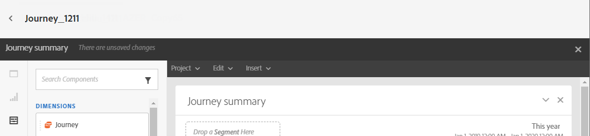
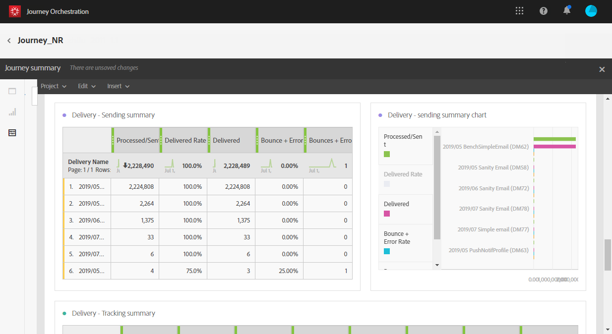

# Journeyrapporten {#concept_rfj_wpt_52b}

>[!NOTE]
>
>De leveringsgegevens en de component Segmenten worden alleen gevuld als u Adobe Campaign Standard hebt.

In dit gedeelte wordt uitgelegd hoe u rapporten kunt openen en gebruiken om de doeltreffendheid van uw reizen te meten.

## Rapportage-interface {#reporting-interface}

Op de bovenste werkbalk kunt u bijvoorbeeld uw rapport wijzigen, opslaan of afdrukken.

Gebruik de tab **[!UICONTROL Project]** om:

* **[!UICONTROL Open]**: Hiermee opent u een eerder gemaakt rapport of sjabloon.
* **[!UICONTROL Save As]**: dupliceert sjablonen om deze te kunnen wijzigen.
* **[!UICONTROL Refresh project]**: werkt uw rapport bij dat op nieuwe gegevens en veranderingen in filters wordt gebaseerd.
* **[!UICONTROL Download CSV]**: exporteert uw rapporten naar een CSV-bestand.
* **[!UICONTROL Print]**: drukt uw rapport af.

Met de tab **[!UICONTROL Edit]** kunt u:

* **[!UICONTROL Undo]**: Hiermee annuleert u de laatste handeling op het dashboard.
* **[!UICONTROL Redo]**: Hiermee annuleert u de laatste  **[!UICONTROL Undo]** handeling op het dashboard.
* **[!UICONTROL Clear all]**: verwijdert elk deelvenster op het dashboard.

Met de tabel **[!UICONTROL Insert]** kunt u uw rapporten aanpassen door grafieken en tabellen toe te voegen aan het dashboard:

* **[!UICONTROL New Blank Panel]**: voegt een nieuw leeg deelvenster toe aan het dashboard.
* **[!UICONTROL New Freeform]**: voegt een nieuwe vrije-vormlijst aan uw dashboard toe.
* **[!UICONTROL New Line]**: voegt een nieuwe lijngrafiek aan uw dashboard toe.
* **[!UICONTROL New Bar]**: voegt een nieuwe staafgrafiek toe aan het dashboard.

Met de linkertabbladen kunt u uw rapport samenstellen en de gegevens naar wens filteren.

Op deze tabbladen hebt u toegang tot de volgende items:

* **[!UICONTROL Panels]**: Voeg een leeg paneel of een vrije vorm aan uw rapport toe beginnen uw gegevens te filtreren. Raadpleeg voor meer informatie de sectie [Deelvensters toevoegen](../reporting/creating-your-journey-reports.md#adding-panels)
* **[!UICONTROL Visualizations]**: sleep en laat vallen een selectie van visualiseringspunten om uw rapport een grafische dimensie te geven. Raadpleeg voor meer informatie de sectie [Visualisaties toevoegen](../reporting/creating-your-journey-reports.md#adding-visualizations).
* **[!UICONTROL Components]**: Pas uw rapporten aan met verschillende afmetingen, metriek, segmenten en tijdsperioden. Raadpleeg voor meer informatie de sectie [Componenten toevoegen](../reporting/creating-your-journey-reports.md#adding-components).

## Samenvattingssjabloon reis {#ootb-template}

De rapporten zijn verdeeld in twee categorieën: een out-of-the-box malplaatje en douanerapporten.
De uit-van-de-doos malplaatje, **[!UICONTROL Journey summary]**, geeft u een duidelijke mening van de belangrijkste het volgen gegevens.

Elke tabel wordt aangegeven met een overzichtsnummer en een overzicht van de diagrammen. U kunt wijzigen hoe de details worden weergegeven in de respectievelijke visualisatie-instellingen.

De volgende KPIs is beschikbaar bij de bovenkant van uw rapport:

* **[!UICONTROL Journey - Entered]**: het totale aantal personen dat het inreisevenement van de reis heeft bereikt.
* **[!UICONTROL Journey - Completion rate]**: het totale aantal personen dat het einde van de reis heeft bereikt (of in het geval van een persoon die niet aan een voorwaarde voldoet) in vergelijking met het totale aantal personen dat de reis heeft betreden.
* **[!UICONTROL Journey - Current]**: totaal aantal personen dat momenteel op reis is.
* **[!UICONTROL Journey - Failed rate]**: het totale aantal ritten dat niet met succes werd uitgevoerd in vergelijking met het aantal ritten.
* **[!UICONTROL Delivery - Messages sent]**: totaal aantal verzonden berichten.
* **[!UICONTROL Delivery rate]**: totaal aantal berichten dat is afgeleverd in vergelijking met verzonden berichten.
* **[!UICONTROL Delivery - Bounce rate]**: totaal aantal berichten dat is teruggestuurd in vergelijking met verzonden berichten.
* **[!UICONTROL Delivery - Unsubscribed rate]**: het totale aantal opnemingen door de ontvanger in vergelijking met de geleverde berichten.
* **[!UICONTROL Delivery - Open rate]**: totaal aantal geopende berichten in verhouding tot het aantal geleverde berichten.
* **[!UICONTROL Delivery - Click rate]**: het totale aantal klikken in een levering in verhouding tot het aantal geleverde berichten.

Met de reisvisualisatie kunt u het pad van uw doelprofielen stap voor stap bekijken. Dit is alleen beschikbaar wanneer het gaat om één reis. Deze wordt automatisch gegenereerd en kan niet worden gewijzigd.

De tabel **[!UICONTROL Journey summary]** bevat de gegevens die beschikbaar zijn voor uw reis, zoals:

* **[!UICONTROL Entered]**: het totale aantal personen dat het inreisevenement van de reis heeft bereikt.
* **[!UICONTROL Completion rate]**: het totale aantal personen dat de eindstroommebesturing van de reis heeft bereikt, in vergelijking met het totale aantal personen dat de reis heeft betreden.
* **[!UICONTROL Current]**: totaal aantal personen dat momenteel op reis is.
* **[!UICONTROL Failed]**: het totale aantal ritten dat niet met succes is uitgevoerd.
* **[!UICONTROL Failed rate]**: het totale aantal ritten dat niet met succes werd uitgevoerd in vergelijking met het aantal ritten.

In de tabel **[!UICONTROL Top events]** worden de meest geslaagde gebeurtenissen weergegeven en de **[!UICONTROL Top action]**, de meest succesvolle acties tijdens uw reizen.

De tabel **[!UICONTROL Delivery - Sending summary]** bevat de gegevens die beschikbaar zijn voor de levering van uw reis, zoals:

* **[!UICONTROL Processed/sent]**: totaal aantal verzonden berichten.
* **[!UICONTROL Delivered rate]**: totaal aantal berichten dat is afgeleverd in vergelijking met verzonden berichten.
* **[!UICONTROL Delivered]**: aantal berichten dat met succes is verzonden, in verhouding tot het totale aantal verzonden berichten.
* **[!UICONTROL Bounce + error rate]**: totaal aantal berichten dat is teruggestuurd in vergelijking met verzonden berichten.
* **[!UICONTROL Bounces + errors]**: totaal van fouten die tijdens levering en automatische terugkeerverwerking met betrekking tot het totale aantal verzonden berichten zijn gecumuleerd.

De tabel **[!UICONTROL Delivery - Tracking summary]** bevat de gegevens die beschikbaar zijn om het succes van de ritten te controleren, zoals:

* **[!UICONTROL Open Rate]**: percentage geopende berichten.
* **[!UICONTROL Open]**: aantal keren dat een bericht in een levering werd geopend.
* **[!UICONTROL Click trough rate]**: het totale aantal klikken in een levering in verhouding tot het aantal geleverde berichten.
* **[!UICONTROL Click]**: het aantal keren dat er op de inhoud is geklikt in een levering.
* **[!UICONTROL Unsubscribe rate]**: percentage van abonnementen door ontvanger in vergelijking met de geleverde berichten.
* **[!UICONTROL Unsubscribed]**: het totale aantal opnemingen door de ontvanger in vergelijking met de geleverde berichten.
