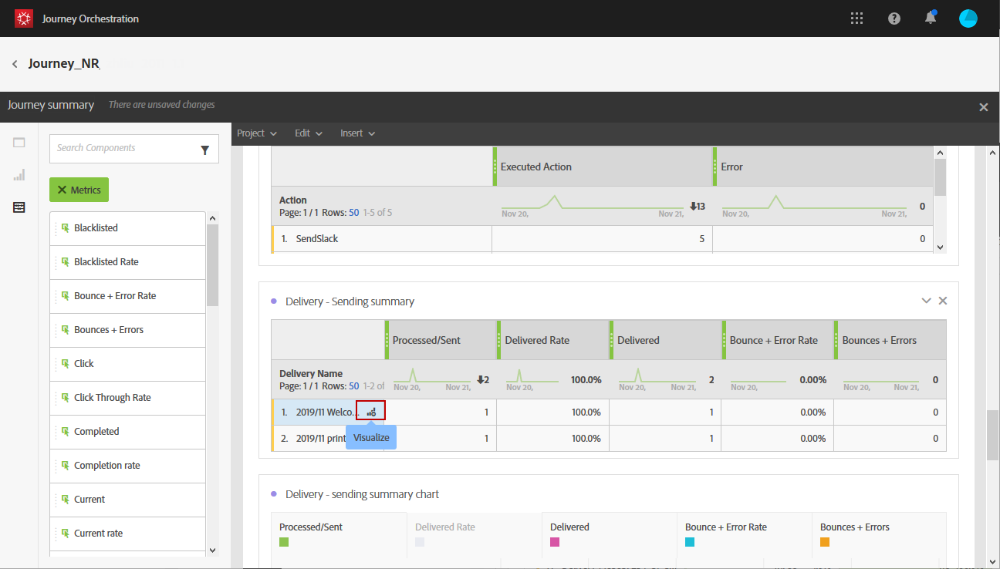

# Journeyrapporten maken {#concept_rfj_wpt_52b}

## Uw rapporten openen en maken {#accessing-reports}

>[!NOTE]
>
>Na het schrappen van een reis, zullen alle bijbehorende rapporten niet meer beschikbaar zijn.

In deze sectie wordt uitgelegd hoe u rapporten kunt maken of gebruiken die zich buiten de box bevinden. Combineer deelvensters, onderdelen en visualisaties om het succes van uw reizen beter te kunnen volgen.

U kunt als volgt de reisrapporten openen en het succes van uw leveringen volgen:

1. Klik in het bovenste menu op het tabblad **[!UICONTROL Home]**.

1. Selecteer de reis u wilt melden.

   U kunt uw rapporten ook openen door op **Rapport** te klikken terwijl u de muis boven een reis in de lijst met reizen houdt.

   

1. Klik op het **[!UICONTROL Report]** pictogram rechtsboven in het scherm.

   

1. Het **[!UICONTROL Journey summary]** rapport Buiten de doos verschijnt op het scherm. Klik op de **[!UICONTROL Close]** knop voor aangepaste rapporten.

   

1. Klik op het pictogram **[!UICONTROL Create new project]** om een volledig nieuw rapport te maken.

   

1. Sleep vanuit het **[!UICONTROL Panels]** tabblad zoveel deelvensters of vrije-vormtabellen als u wilt. For more information, refer to this [section](#adding-panels).

   

1. Vervolgens kunt u uw gegevens filteren door de afmetingen en metriek van de **[!UICONTROL Components]** tab naar de vrije-vormtabel te slepen. For more information, refer to this [section](#adding-components).

   

1. Voor een duidelijkere weergave van uw gegevens kunt u afbeeldingen toevoegen via het **[!UICONTROL Visualizations]** tabblad. For more information, refer to this [section](#adding-visualizations).

## Deelvensters toevoegen{#adding-panels}

### Een leeg deelvenster toevoegen {#adding-a-blank-panel}

Om uw rapport te beginnen, kunt u een reeks panelen aan een uit-van-de-doos of douanerapport toevoegen. Elk deelvenster bevat verschillende gegevenssets en bestaat uit vrije-vormtabellen en visualisaties.

In dit deelvenster kunt u uw rapporten naar wens samenstellen. U kunt zoveel deelvensters toevoegen als u wilt in uw rapporten om uw gegevens met verschillende tijdsperiodes te filteren.

1. Klik op het **[!UICONTROL Panels]** pictogram. U kunt ook een deelvenster toevoegen door op het deelvenster te klikken **[!UICONTROL Insert tab]** en het te selecteren **[!UICONTROL New Blank Panel]**.

   

1. Sleep het object naar het **[!UICONTROL Blank Panel]** dashboard.

   

U kunt nu een vrije-vormlijst aan uw paneel toevoegen beginnen richtend gegevens.

### Een vrije-vormtabel toevoegen {#adding-a-freeform-table}

Met tabellen met vrije vorm kunt u een tabel maken voor het analyseren van uw gegevens met behulp van de verschillende maatstaven en dimensies die beschikbaar zijn in de **[!UICONTROL Component]** tabel.

Elke lijst en visualisatie is resizable en kan worden bewogen om uw rapport beter aan te passen.

1. Klik op het **[!UICONTROL Panels]** pictogram.

   

1. Sleep het **[!UICONTROL Freeform]** item naar het dashboard.

   U kunt ook een tabel toevoegen door op het **[!UICONTROL Insert]** tabblad te klikken en vervolgens te selecteren **[!UICONTROL New Freeform]** of door te klikken **[!UICONTROL Add a freeform table]** in een leeg deelvenster.

   

1. Sleep items van het **[!UICONTROL Components]** tabblad naar de kolommen en rijen om uw tabel samen te stellen.

   

1. Klik op het **[!UICONTROL Settings]** pictogram om de weergave van de gegevens in de kolommen te wijzigen.

   

   Het **[!UICONTROL Column settings]** bestaat uit:

   * **[!UICONTROL Number]**: Hiermee kunt u samenvattingsnummers in de kolom tonen of verbergen.
   * **[!UICONTROL Percent]**: Hiermee kunt u percentages in de kolom tonen of verbergen.
   * **[!UICONTROL Interpret zero as no value]**: Hiermee kunt u tonen of verbergen wanneer de waarde gelijk is aan nul.
   * **[!UICONTROL Background]**: Hiermee kunt u de horizontale voortgangsbalk in cellen weergeven of verbergen.
   * **[!UICONTROL Include retries]**: Hiermee kunt u opnieuw proberen opnemen in het resultaat. Dit is alleen beschikbaar voor **[!UICONTROL Sent]** en **[!UICONTROL Bounces + Errors]**.

1. Selecteer een of meerdere rijen en klik op het **[!UICONTROL Visualize]** pictogram. Er wordt een visualisatie toegevoegd die de geselecteerde rijen weerspiegelt.

   

U kunt nu zo veel componenten toevoegen als u nodig hebt en ook visualisaties toevoegen om grafische representaties van uw gegevens te geven.

## Componenten toevoegen{#adding-components}

Componenten helpen u bij het aanpassen van rapporten met verschillende afmetingen, meetwaarden en tijdsperioden.

1. Klik op het **[!UICONTROL Components]** tabblad om de lijst met componenten te openen.

   

1. Elke categorie die op het **[!UICONTROL Components]** tabblad wordt weergegeven, geeft de vijf meest gebruikte items weer en klikt op de naam van een categorie om de volledige lijst met componenten te openen.

   De tabel met componenten bestaat uit drie categorieën:

   * **[!UICONTROL Dimensions]**: Krijg details van het leveringslogboek, zoals browser of domein van de ontvanger, of het succes van een levering.
   * **[!UICONTROL Metrics]**: Meer informatie over de status van een bericht. Bijvoorbeeld, als een bericht werd geleverd en de gebruiker het opende.
   * **[!UICONTROL Time]**: Stel een tijdsperiode in voor uw tabel.

1. Sleep componenten in een deelvenster om de gegevens te filteren.

U kunt zoveel componenten slepen en neerzetten als u nodig hebt en deze met elkaar vergelijken.

## Visualisaties toevoegen{#adding-visualizations}

Op het **[!UICONTROL Visualizations]** tabblad kunt u visualisatie-items, zoals gebied, donut en grafiek, slepen en neerzetten. Visualisaties geven u grafische voorstellingen van uw gegevens.

1. Sleep op het **[!UICONTROL Visualizations]** tabblad een visualisatie-item in een deelvenster.

   

1. Nadat u een visualisatie aan het deelvenster hebt toegevoegd, worden in uw rapporten automatisch de gegevens in uw vrije-vormtabel gedetecteerd. Selecteer de instellingen voor uw visualisatie.
1. Als u meer dan één vrije lijst hebt, kies de beschikbare gegevensbron om in uw grafiek in het **[!UICONTROL Data Source Settings]** venster toe te voegen. Dit venster is ook beschikbaar als u op de gekleurde stip naast de titel voor visualisatie klikt.

   

1. Klik op de knop **[!UICONTROL Visualization]** Instellingen om het grafiektype of de weergave ervan rechtstreeks te wijzigen, zoals:

   * **[!UICONTROL Percentages]**: Hiermee geeft u de waarden weer als een percentage.
   * **[!UICONTROL Anchor Y Axis at Zero]**: Hiermee wordt de y-as naar nul geforceerd, zelfs als de waarden boven nul liggen.
   * **[!UICONTROL Legend visible]**: Hiermee kunt u de legenda verbergen.
   * **[!UICONTROL Normalization]**: Hiermee past u waarden aan.
   * **[!UICONTROL Display Dual Axis]**: Hiermee voegt u een andere as aan de grafiek toe.
   * **[!UICONTROL Limit Max Items]**: Hiermee beperkt u het aantal weergegeven grafieken.
   * **[!UICONTROL Threshold]**: Hiermee kunt u een drempelwaarde instellen voor uw grafiek. Het wordt weergegeven als een zwarte stippellijn.

   

Dankzij deze visualisatie hebt u een duidelijker beeld van uw gegevens in uw rapporten.