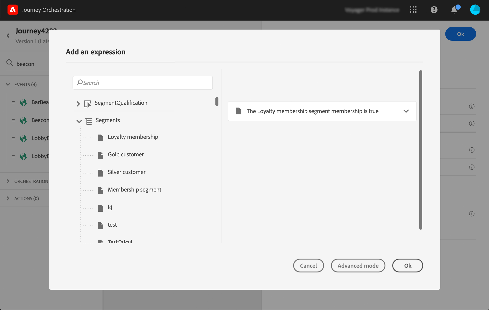

# Segmenten gebruiken in voorwaarden {#using-a-segment}

Deze sectie verklaart hoe te om een segment in een reisvoorwaarde te gebruiken. Leren hoe u een **[!UICONTROL Segment qualification]** deze gebeurtenis tijdens uw reis [sectie](../building-journeys/segment-qualification-events.md).

Voer de volgende stappen uit om een segment te gebruiken in een reisvoorwaarde:

1. Een reis openen en een **[!UICONTROL Condition]** en kiest u de **Voorwaarde gegevensbron**.
   

1. Klikken **[!UICONTROL Add a path]** voor elk extra pad dat nodig is. Klik voor elk pad op de knop **[!UICONTROL Expression]** veld.

   

1. Links vouwen **[!UICONTROL Segments]** knooppunt. Sleep het segment dat u voor de voorwaarde wilt gebruiken en zet het neer. De standaardwaarde voor het segment is true.

   

   >[!NOTE]
   >
   >Alleen personen met de **Gerealiseerd** en **Bestaande** de deelnamestatistieken van segmenten worden beschouwd als leden van het segment . Raadpleeg voor meer informatie over het evalueren van een segment de [Documentatie voor segmentatieservice](https://experienceleague.adobe.com/docs/experience-platform/segmentation/tutorials/evaluate-a-segment.html?lang=en#interpret-segment-results).

Raadpleeg voor meer informatie over de reisvoorwaarden en hoe u de redacteur van eenvoudige expressies kunt gebruiken [Condition-activiteit](../building-journeys/condition-activity.md#about_condition).
