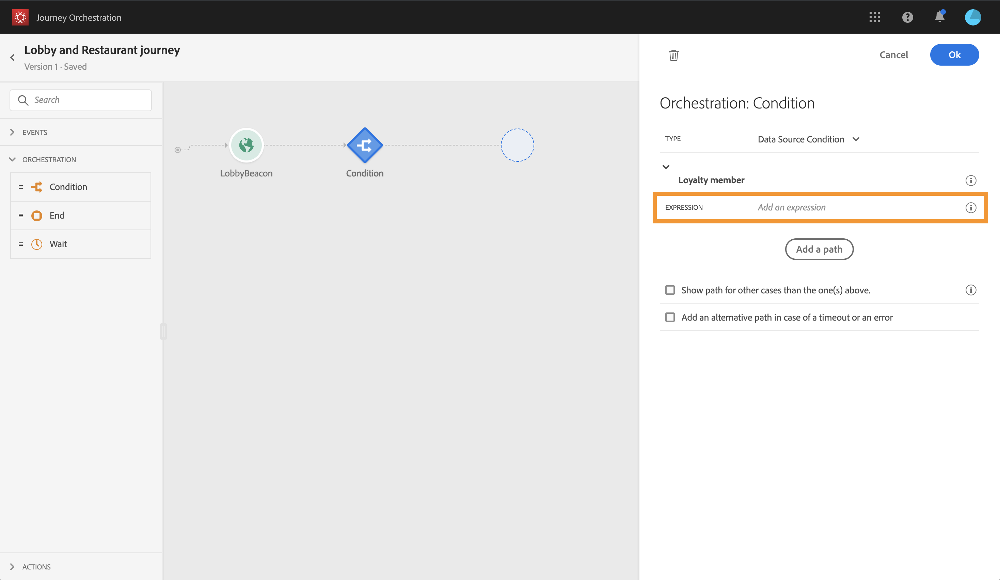
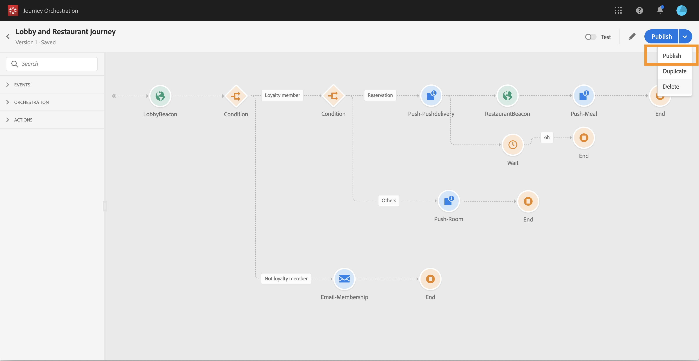

# Journey samenstellen {#concept_owm_kdy_w2b}

De **bedrijfsgebruiker** kan nu de journey bouwen. Onze journey bevat de volgende activiteiten:

* twee **[!UICONTROL Event]**-activiteiten: ‘LobbyBeacon’ en ‘RestaurantBeacon’
* twee **[!UICONTROL Condition]**-activiteiten
* drie **[!UICONTROL Push]**-activiteiten en één **[!UICONTROL Email]**-activiteit (met Adobe Campaign Standard)
* een **[!UICONTROL Wait]**-activiteit
* vier **[!UICONTROL End]**-activiteiten

>[!NOTE]
>
>De **[!UICONTROL Push]**- en **[!UICONTROL Email]**-activiteiten zijn alleen beschikbaar in het palet als u Adobe Campaign Standard hebt.

Raadpleeg [deze pagina](../building-journeys/journey.md) voor meer informatie over het maken van een reis.

## Eerste stappen{#section_ntb_ws1_ffb}

1. Klik in het bovenste menu op de tabbladen **[!UICONTROL Home]** en **[!UICONTROL Create]** om een nieuwe journey te maken.

   

1. Bewerk de eigenschappen van de journey in het configuratievenster dat aan de rechterkant wordt weergegeven. Voeg een naam toe en stel de duur in op een maand, van de eerste tot en met de 31e december.

   

1. Begin het ontwerp van uw journey door de gebeurtenis ‘LobbyBeacon’ van het palet naar het canvas te slepen. U kunt ook dubbelklikken op de gebeurtenis in het palet om deze aan het canvas toe te voegen.

   

1. Laten we nu een voorwaarde toevoegen om te controleren of de persoon in de afgelopen 24 uur niet is benaderd en om te controleren of deze een loyaliteitslid is. Sleep een voorwaardeactiviteit en zet deze neer in uw journey.

   

1. Kies het type **[!UICONTROL Data Source Condition]** en klik in het veld **[!UICONTROL Expression]**. U kunt ook een voorwaardelabel definiëren die wordt weergegeven op de pijl, in het canvas. In ons voorbeeld vervangen we ‘Voorwaarde 1’ door ‘Loyaliteitslid’.

   

1. Klik op **[!UICONTROL Advanced mode]** en definieer de volgende voorwaarde op basis van de velden ‘timestamp’ en ‘directMarketing.sends.value’ die afkomstig zijn uit de Adobe Experience Platform-databron. De syntaxis van de expressie is:

   ```
   count(#{ExperiencePlatformDataSource.MarltonExperience.experienceevent.all(
       currentDataPackField.directMarketing.sends.value > 0 and
       currentDataPackField.timestamp > nowWithDelta(-1, "days")).timestamp}) == 0
   and
       #{ExperiencePlatformDataSource.MarltonProfiles.Profile._customer.marlton.loyaltyMember}
   ```

   

1. Klik op de knop **[!UICONTROL Add a path]** en maak een tweede pad voor klanten die de afgelopen 24 uur niet zijn benaderd en die geen loyaliteitslid zijn. Geef het pad de naam ‘Geen loyaliteitslid’. De syntaxis van de expressie is:

   ```
   count(#{ExperiencePlatformDataSource.MarltonExperience.experienceevent.all(
       currentDataPackField.directMarketing.sends.value > 0 and
       currentDataPackField.timestamp > nowWithDelta(-1, "days").timestamp}) == 0
   and not
       #{ExperiencePlatformDataSource.MarltonProfiles.Profile._customer.marlton.loyaltyMember}
   ```

   >[!NOTE]
   >
   >In het tweede deel van de expressie is ‘Profiel’ optioneel.

1. We moeten een naamruimte selecteren. Een naamruimte wordt vooraf geselecteerd op basis van schema-eigenschappen. U kunt de voorinstelling behouden. Zie [deze pagina](../event/selecting-the-namespace.md) voor meer informatie over naamruimten.

In ons gebruiksscenario willen we alleen reageren op deze twee voorwaarden, dus we schakelen het selectievakje **[!UICONTROL Show path for other cases than the one(s) above]** niet in.

Na uw voorwaarde worden twee paden gemaakt:

* _Klanten die de afgelopen 24 uur niet zijn benaderd en die loyaliteitsleden zijn._
* _Klanten die de afgelopen 24 uur niet zijn benaderd en die geen loyaliteitsleden zijn._


## Eerste pad: de klant is een loyaliteitslid {#section_otb_ws1_ffb}

1. In het eerste pad voegen we een voorwaarde toe om te controleren of de klant een reservering heeft. Sleep een voorwaardeactiviteit en zet deze neer in uw journey.

   

1. Kies het type **[!UICONTROL Data Source Condition]** en definieer de voorwaarde op basis van de informatie over de reserveringsstatus die u hebt opgehaald uit het reserveringssysteem:

   ```
   #{MarltonReservation.MarltonFieldGroup.reservation} == true
   ```

   

1. Wanneer u een gebied van een externe gegevensbron selecteert, toont het juiste deel van het scherm de lijst van parameters die werden bepaald toen het vormen van de externe gegevensbron (zie [deze pagina](../usecase/configuring-the-data-sources.md)). Klik op de parameternaam en definieer de waarde van de sleutel van het reserveringssysteem, de Experience Cloud-ID, in ons voorbeeld:

   ```
   @{LobbyBeacon.endUserIDs._experience.mcid.id}
   ```

   

1. Aangezien we ook willen reageren op klanten die geen reservering hebben, moeten we het selectievakje **[!UICONTROL Show path for other cases than the one(s) above]** inschakelen.

   

   Er worden twee paden gemaakt:

   * _Klanten die een kamer hebben geboekt_
   * _Klanten die geen kamer hebben geboekt._

   

1. Zet in het eerste pad (kamer geboekt) een **[!UICONTROL Push]**-activiteit neer, selecteer uw mobiele app en uw welkomstsjabloon.

   

1. Definieer de velden **[!UICONTROL Target]** die het systeem nodig heeft om de push te verzenden.

   * **[!UICONTROL Push platform]**: selecteer het platform: **[!UICONTROL Apple Push Notification Server]** (Apple) of **[!UICONTROL Firebase Cloud Messaging]** (Android).
   * **[!UICONTROL Registration token]**: voeg de volgende uitdrukking toe (op basis van de geconfigureerde gebeurtenis) met de geavanceerde modus:

      ```
      @{LobbyBeacon._experience.campaign.message.profileSnapshot.pushNotificationTokens.first().token}
      ```

1. Definieer de velden voor het personaliseren van pushmeldingen. In ons voorbeeld: voornaam en achternaam.

1. Voeg een gebeurtenis ‘RestaurantBeacon’ toe.

   

1. Voeg een nieuwe **[!UICONTROL Push]**-activiteit toe, selecteer de sjabloon ‘Meal discount’ (Maaltijdkorting) en definieer de velden **[!UICONTROL Address]** en **[!UICONTROL Personalization]**. Voeg een **[!UICONTROL End]**-activiteit toe.

   

1. We willen alleen een pushmelding voor een maaltijdkorting verzenden als de persoon het restaurant binnen 6 uur na de welkomstpushmelding betreedt. Daarvoor moeten we een wachtactiviteit gebruiken. Plaats de cursor op de welkomstpushactiviteit en klik op het plusteken (+). Voeg in het nieuwe pad een wachtactiviteit toe en definieer een duur van 6 uur. De eerste in aanmerking komende activiteit wordt gekozen. Als de restaurantgebeurtenis minder dan 6 uur na de welkomstpush wordt ontvangen, wordt de pushactiviteit verzonden. Als er binnen de volgende 6 uur geen restaurantgebeurtenis wordt ontvangen, wordt de wachtactiviteit gekozen. Plaats een **[!UICONTROL End]**-activiteit na de wachtactiviteit.

   

1. In het tweede pad dat volgt op de reserveringsvoorwaarde (geen kamer geboekt), voegt u een **[!UICONTROL Push]**-activiteit toe en selecteert u de sjabloon ‘Room rates’ (Kamerprijzen). Voeg een **[!UICONTROL End]**-activiteit toe.

   

## Tweede pad: de klant is geen loyaliteitslid{#section_ptb_ws1_ffb}

1. In het tweede pad dat volgt op de eerste voorwaarde (de klant is geen loyaliteitslid), voegt u een **[!UICONTROL Email]**-activiteit toe en selecteert u de sjabloon ‘Loyalty membership’ (Loyaliteitslidmaatschap).

   

1. Selecteer in het veld **[!UICONTROL Address]** het e-mailadres in de databron.

   

1. Definieer de personalisatievelden voor voornaam en achternaam van de databron.

   

1. Voeg een **[!UICONTROL End]**-activiteit toe.

Klik op de **[!UICONTROL Test]**-schakeloptie en test uw journey. Als er een fout optreedt, deactiveert u de testmodus, wijzigt u de journey en test u deze opnieuw. Raadpleeg [deze pagina](../building-journeys/testing-the-journey.md) voor meer informatie over de testmodus.


Wanneer de test is geslaagd is, kunt u uw journey vanuit het vervolgkeuzemenu rechtsboven publiceren.


