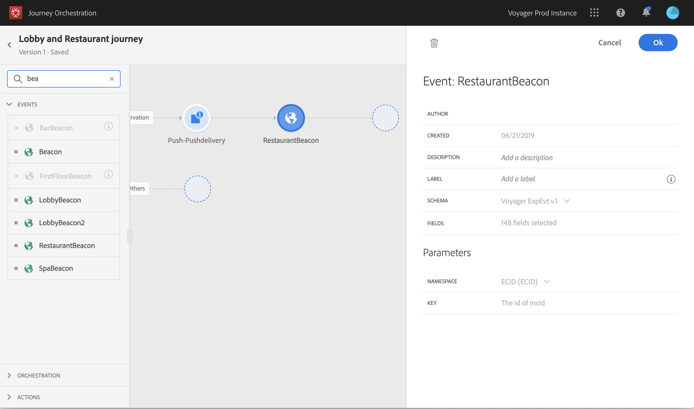

# De reis maken {#concept_owm_kdy_w2b}

De **bedrijfsgebruiker** kan nu de reis bouwen. Onze reis zal de volgende activiteiten omvatten:

* twee **[!UICONTROL Event]** activiteiten : &quot;LobbyBeacon&quot; en &quot;RestaurantBeacon&quot;
* twee **[!UICONTROL Condition]** activiteiten
* drie **[!UICONTROL Push]** activiteiten en één **[!UICONTROL Email]** activiteit (met Adobe Campaign Standard)
* een **[!UICONTROL Wait]** activiteit
* vier **[!UICONTROL End]** activiteiten

>[!NOTE]
>
>De **[!UICONTROL Push]** en **[!UICONTROL Email]** activiteiten zijn alleen beschikbaar in het palet als u Adobe Campaign Standard hebt.

Raadpleeg [](../building-journeys/journey.md)voor meer informatie over het maken van een reis.

## Eerste stappen{#section_ntb_ws1_ffb}

1. Klik in het bovenste menu op het **[!UICONTROL Home]** tabblad en **[!UICONTROL Create]** maak een nieuwe rit.

   

1. Bewerk de eigenschappen van de rit in het configuratievenster dat aan de rechterkant wordt weergegeven. Voeg een naam toe en stel de naam in op een maand, van de eerste tot en met de 31e december.

   

1. Begin uw reis te ontwerpen door de gebeurtenis &quot;LobbyBeacon&quot; van het palet naar het canvas te slepen. U kunt ook dubbelklikken op de gebeurtenis in het palet om deze aan het canvas toe te voegen.

   

1. Laten we nu een voorwaarde toevoegen om te controleren of de persoon in de afgelopen 24 uur niet is benaderd en om te controleren of hij een loyaliteitslid is. Sleep een voorwaardenactiviteit naar uw reis.

   

1. Kies het **[!UICONTROL Data Source Condition]** type en klik in het **[!UICONTROL Expression]** veld. U kunt ook een voorwaardelabel definiëren dat wordt weergegeven op de pijl, in het canvas. In ons voorbeeld vervangen we &#39;Voorwaarde 1&#39; door &#39;Loyalty member&#39;.

   

1. Klik op de velden &quot;timestamp&quot; **[!UICONTROL Advanced mode]** en &quot;directMarketing.send.value&quot; die uit de gegevensbron van het Adobe Experience Platform afkomstig zijn en definieer de volgende voorwaarde. De syntaxis van de expressie is:

   ```
   count(#{ExperiencePlatformDataSource.MarltonExperience.experienceevent.all(
       currentDataPackField.directMarketing.sends.value > 0 and
       currentDataPackField.timestamp > nowWithDelta(-1, "days")).timestamp}) == 0
   and
       #{ExperiencePlatformDataSource.MarltonProfiles.Profile._customer.marlton.loyaltyMember}
   ```

   

1. Klik op de **[!UICONTROL Add a path]** knop en maak een tweede pad voor klanten die de afgelopen 24 uur geen contact hebben gehad en die geen loyaliteitslid zijn. Geef het pad de naam &quot;Geen loyaliteitslid&quot;. De syntaxis van de expressie is:

   ```
   count(#{ExperiencePlatformDataSource.MarltonExperience.experienceevent.all(
       currentDataPackField.directMarketing.sends.value > 0 and
       currentDataPackField.timestamp > nowWithDelta(-1, "days").timestamp}) == 0
   and not
       #{ExperiencePlatformDataSource.MarltonProfiles.Profile._customer.marlton.loyaltyMember}
   ```

   >[!NOTE]
   >
   >In het tweede deel van de expressie is &quot;Profiel&quot; optioneel.

1. We moeten een naamruimte selecteren. Een naamruimte wordt vooraf geselecteerd op basis van schema-eigenschappen. U kunt de voorinstelling behouden. Zie voor meer informatie over naamruimten [](../event/selecting-the-namespace.md).

In ons gebruik willen we alleen reageren op deze twee voorwaarden, dus we controleren het selectievakje niet **[!UICONTROL Show path for other cases than the one(s) above]**.

Na uw voorwaarde worden twee paden gemaakt:

* _Klanten die de afgelopen 24 uur geen contact hebben gehad en loyaliteitsleden zijn._
* _Klanten die de afgelopen 24 uur geen contact hebben gehad en geen loyaliteitsleden zijn._


## Eerste pad: de klant is een loyaliteitslid {#section_otb_ws1_ffb}

1. In de eerste weg, laten wij een voorwaarde toevoegen om te controleren of heeft hij een reserve. Sleep een voorwaardenactiviteit naar uw reis.

   

1. Kies het **[!UICONTROL Data Source Condition]** type en definieer de voorwaarde op basis van de informatie over de reserveringsstatus die u hebt opgehaald uit het reserveringssysteem:

   ```
   #{MarltonReservation.MarltonFieldGroup.reservation} == true
   ```

   

1. Wanneer u een gebied van een externe gegevensbron selecteert, toont het juiste deel van het scherm de lijst van parameters die toen het vormen van de externe gegevensbron (zie [](../usecase/configuring-the-data-sources.md)) werden bepaald. Klik op de parameternaam en definieer de waarde van de sleutel van het reserveringssysteem, de Experience Cloud-id, in ons voorbeeld:

   ```
   @{LobbyBeacon.endUserIDs._experience.mcid.id}
   ```

   

1. Aangezien wij ook aan klanten willen reageren die geen reserve hebben, moeten wij de doos controleren **[!UICONTROL Show path for other cases than the one(s) above]**.

   

   Er worden twee paden gemaakt:

   * _Klanten die een ruimte hebben geboekt_
   * _Klanten die geen ruimte hebben geboekt._

   

1. Zet in het eerste pad (ruimte geboekt) een **[!UICONTROL Push]** activiteit neer, selecteer uw mobiele app en uw welkomstsjabloon.

   

1. Definieer de **[!UICONTROL Target]** velden die het systeem nodig heeft om de push te verzenden.

   * **[!UICONTROL Push platform]**: Selecteer het platform: **[!UICONTROL Apple Push Notification Server]** (Apple) of **[!UICONTROL Firebase Cloud Messaging]** (Android).
   * **[!UICONTROL Registration token]**: Voeg de volgende uitdrukking (die op de gevormde gebeurtenis wordt gebaseerd) toe gebruikend de geavanceerde wijze:

      ```
      @{LobbyBeacon._experience.campaign.message.profileSnapshot.pushNotificationTokens.first().token}
      ```

1. Definieer de velden voor het aanpassen van pushmeldingen. In ons voorbeeld: voornaam en achternaam.

1. Voeg een &quot;RestaurantBeacon&quot;-gebeurtenis toe.

   

1. Voeg een nieuwe **[!UICONTROL Push]** activiteit toe, selecteer het malplaatje &quot;van de Korting van de Overeenkomst&quot;en bepaal de **[!UICONTROL Address]** en **[!UICONTROL Personalization]** gebieden. Voeg een **[!UICONTROL End]** activiteit toe.

   

1. We willen alleen een pushmelding voor maaltijdkortingen verzenden als de persoon het restaurant binnen 6 uur na de welkomstpushmelding binnenkomt. Om dit te doen, moeten we een wachtende activiteit gebruiken. Plaats de cursor op de welkomstpushactiviteit en klik op het plusteken (+). Voeg in het nieuwe pad een wachtbewerking toe en definieer een duur van 6 uur. De eerste in aanmerking komende activiteit wordt gekozen. Als de restaurantgebeurtenis minder dan 6 uur na de welkomstpush wordt ontvangen, wordt de pushactiviteit verzonden. Als er binnen de komende 6 uur geen restaurantgebeurtenis wordt ontvangen, wordt de wachttijd gekozen. Plaats een **[!UICONTROL End]** activiteit na de wachttijdactiviteit.

   

1. In het tweede pad dat volgt op de reserveringsvoorwaarde (geen ruimte geboekt), voegt u een **[!UICONTROL Push]** activiteit toe en selecteert u de sjabloon &quot;Ruimtetarieven&quot;. Voeg een **[!UICONTROL End]** activiteit toe.

   

## Tweede pad: de klant is geen loyaliteitslid{#section_ptb_ws1_ffb}

1. In de tweede weg die de eerste voorwaarde volgt (de klant is geen loyaliteitslid), voeg een **[!UICONTROL Email]** activiteit toe en selecteer uw malplaatje van het &quot;lidmaatschap van de Loyalty&quot;.

   

1. Selecteer in het **[!UICONTROL Address]** veld het e-mailadres in de gegevensbron.

   

1. Definieer de velden voor voornaam en achternaam aanpassen aan de gegevensbron.

   

1. Voeg een **[!UICONTROL End]** activiteit toe.

Klik op de **[!UICONTROL Test]** knevel en test uw reis. Als er een fout optreedt, deactiveert u de testmodus, wijzigt u de reis en test u deze opnieuw. Raadpleeg voor meer informatie over de testmodus [](../building-journeys/testing-the-journey.md).


Wanneer de test overtuigend is, kunt u uw reis van het hoogste juiste drop-down menu publiceren.


