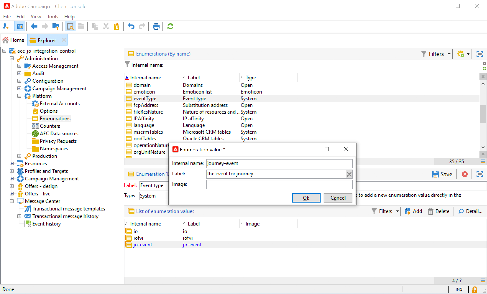

# Een bericht verzenden met Campaign v7/v8 {#campaign-classic-use-case}


>[!CAUTION]
>
>**zoekend Adobe Journey Optimizer**? Klik [ hier ](https://experienceleague.adobe.com/nl/docs/journey-optimizer/using/ajo-home){target="_blank"} voor de documentatie van Journey Optimizer.
>
>
>_Deze documentatie verwijst naar erfenismaterialen van Journey Orchestration die door Journey Optimizer zijn vervangen. Neem contact op met uw accountteam als u vragen hebt over uw toegang tot Journey Orchestration of Journey Optimizer._


In dit geval worden alle stappen beschreven die nodig zijn om een e-mail te verzenden via de integratie met Adobe Campaign Classic v7 en Adobe Campaign v8.

We maken eerst een transactionele e-mailsjabloon in Campagne. In Journey Orchestration maken we dan het evenement, de actie en ontwerpen we de reis.

Raadpleeg de volgende pagina&#39;s voor meer informatie over de integratie van campagnes:

* [Campagne maken](../action/acc-action.md)
* [ Gebruikend de actie in een reis ](../building-journeys/using-adobe-campaign-classic.md).

**Adobe Campaign**

Voor deze integratie moet uw Campagne-instantie zijn ingericht. De eigenschap van het Overseinen van de Transactie moet worden gevormd.

1. Meld u aan bij de besturingsinstantie Campagne.

1. Onder **Beleid** > **Platform** > **Opsommingen**, selecteer het **type van Gebeurtenis** (eventType) opsomming. Maak een nieuw gebeurtenistype (&quot;reis-gebeurtenis&quot;, in ons voorbeeld). U moet de interne naam van het gebeurtenistype gebruiken wanneer u het JSON-bestand later schrijft.

   

1. Maak de verbinding met de instantie los en maak opnieuw verbinding zodat het maken effectief is.

1. Onder **Centrum van het Bericht** > **Transactionele berichtmalplaatjes**, creeer een nieuw e-mailmalplaatje dat op het eerder gecreeerde gebeurtenistype wordt gebaseerd.

   

1. Ontwerp uw sjabloon. In dit voorbeeld gebruiken we personalisatie op de voornaam en het ordernummer van het profiel. De voornaam staat in de Adobe Experience Platform-gegevensbron en het ordernummer is een veld uit onze Journey Orchestration-gebeurtenis. Gebruik de juiste veldnamen in Campagne.

   

1. Publiceer uw transactiesjabloon.

   

1. Nu moet u de JSON-payload schrijven die overeenkomt met de sjabloon.

```
{
     "channel": "email",
     "eventType": "journey-event",
     "email": "Email address",
     "ctx": {
          "firstName": "First name", "purchaseOrderNumber": "Purchase order number"
     }
}
```

* Voor het kanaal moet u &quot;email&quot; typen.
* Voor eventType gebruikt u de interne naam van het gebeurtenistype dat u eerder hebt gemaakt.
* Het e-mailadres is een variabele, dus u kunt elk label typen.
* Onder ctx, zijn de verpersoonlijkingsgebieden ook variabelen.

**Journey Orchestration**

1. Eerst moet u een gebeurtenis maken. Zorg ervoor dat u het veld &quot;purchaseOrderNumber&quot; opneemt.

   

1. Vervolgens moet u in Journey Orchestration een actie maken die overeenkomt met uw campagnemjabloon. In het **type van Actie** drop-down, uitgezochte **Adobe Campaign Classic**.

   

1. Klik het **gebied van de Lading** en kleef JSON eerder gecreeerd.

   

1. Voor het e-mailadres en de twee verpersoonlijkingsgebieden, veranderings **Constante** aan **Variabele**.

   

1. Maak nu een nieuwe reis en begin met de gebeurtenis die eerder is gemaakt.

   

1. Voeg de handeling toe en wijs elk veld toe aan het juiste veld in Journey Orchestration.

   

1. Voeg een **Eind** activiteit toe en test uw reis.

   

1. U kunt nu uw reis publiceren.
