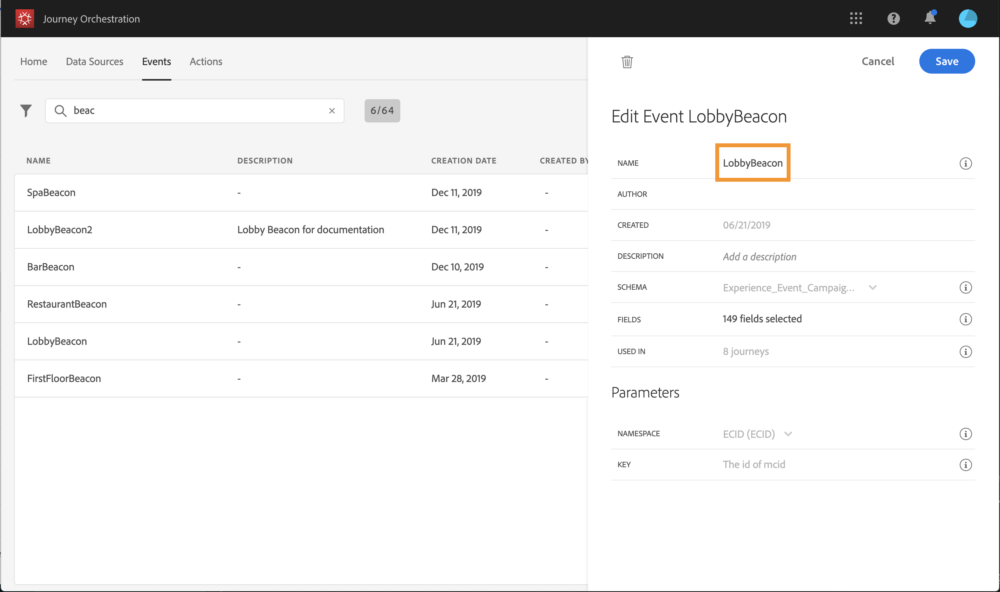

# Gebeurtenissen configureren {#concept_sbp_5cy_w2b}

In ons scenario moeten we telkens een evenement ontvangen wanneer een persoon het hotel Marlton en het restaurant binnenkomt. De **technische gebruiker** moet de twee gebeurtenissen vormen wij het systeem willen om aan in onze reis te luisteren.

Raadpleeg voor meer informatie over gebeurtenisconfiguratie .

1. Klik in het bovenste menu op het **[!UICONTROL Events]** tabblad en klik **[!UICONTROL Add]** om een nieuwe gebeurtenis te maken.

   

1. U voert de naam in zonder spaties of speciale tekens: &quot;LobbyBeacon&quot;.

   

<!--li>Select the **[!UICONTROL Mobile - Streaming Ingestion APIs]** event type. Events are sent from the customers' mobile phone through the Mobile SDK.. Het systeem dat de gebeurtenis duwt zou geen identiteitskaart moeten produceren, zou het moeten gebruiken beschikbaar in de voorproef van de lading. In ons gebruiksgeval, wordt dit ID gebruikt om de bakenplaats te identificeren. Elke keer dat een persoon in de buurt van het lobby-baken loopt, wordt een gebeurtenis verzonden die deze specifieke gebeurtenis-id bevat. Hetzelfde beginsel geldt voor de restaurantbakenevenementen. Dit staat het systeem toe om te weten welk baken de gebeurtenis teweegbracht die verzendt.

   

   >[!NOTE]
   >
   >De lijst met velden verschilt per schema. Volgens de schemadefinitie zijn sommige velden mogelijk verplicht en vooraf geselecteerd.

1. We moeten een naamruimte selecteren. Een naamruimte wordt vooraf geselecteerd op basis van schema-eigenschappen. U kunt de voorinstelling behouden. Zie voor meer informatie over naamruimten .

   

1. Een sleutel wordt vooraf geselecteerd gebaseerd op schemaeigenschappen en namespace geselecteerd. Je kunt het houden.

   

1. Klik op **[!UICONTROL Save]**.

1. Klik op het **[!UICONTROL View Payload]** pictogram om een voorvertoning weer te geven van de lading die door het systeem wordt verwacht en deze te delen met de persoon die verantwoordelijk is voor het verzenden van de gebeurtenis.  Deze nuttige lading zal in postback van de Mobiele het beleidsconsole van de Diensten moeten worden gevormd.

   

Maak op dezelfde manier de gebeurtenis &quot;RestaurantBeacon&quot;. Uw twee baken-gebeurtenissen worden gecreëerd en kunnen nu worden gebruikt op onze reis. U moet nu de mobiele toepassing vormen zodat het de verwachte nuttige lading naar het Streaming Ingestie APIs eindpunt kan verzenden. Zie .
