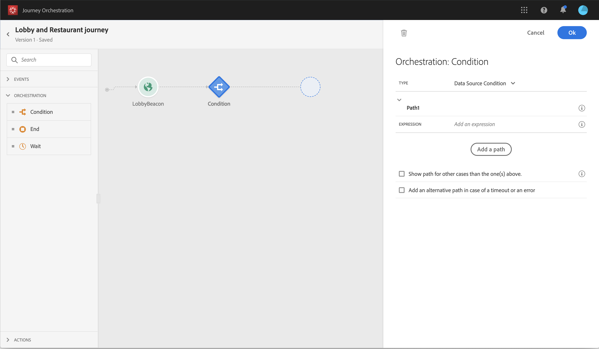

# Journey-AI gebruiken {#concept_dsh_1ry_wfb}

Met deze gebruiksaanwijzing kunt u de vermoeidheidsscores benutten om te voorkomen dat uw klanten op reis te veel vragen.

>[!NOTE]
>
>De functie voor voorspellende vermoeidheidsscore is alleen beschikbaar voor klanten die de [Adobe Experience Platform Data Connector](https://docs.adobe.com/content/help/en/campaign-standard/using/developing/mapping-campaign-and-aep-data/aep-about-data-connector.html)gebruiken.

## De gebeurtenis configureren {#section_ptb_ws1_ffb}

Voer de in [](../event/about-events.md)beschreven stappen uit.

## De databron configureren {#section_o3n_4yy_wfb}

Voer de volgende stappen uit om de gebieden van de vermoeidheidsscore in de ingebouwde gegevensbron te selecteren:

1. Klik in het bovenste menu op het **[!UICONTROL Data Sources]** tabblad en selecteer de Adobe Experience Platform-gegevensbron voor de build-in.

   

1. Controleer of de velden die nodig zijn voor het gebruik van hoofdletters en kleine letters zijn geselecteerd.
1. Klik op **[!UICONTROL Add a New Field Group]**, selecteer het **[!UICONTROL Profiles]** model en voeg de velden **[!UICONTROL fatigueLevel]** en **[!UICONTROL fatigueScore]** velden toe (onder _TagAI > e-mailscore > vermoeidheid_).

   

1. Klik op **[!UICONTROL Save]**.

## De journey samenstellen {#section_uzm_pyy_wfb}

Volg de stappen in deze sectie om de reis te maken, te valideren en te publiceren [](../building-journeys/journey.md).

In ons gebruiksgeval gebruiken we het **[!UICONTROL fatigueLevel]** veld. U kunt het **[!UICONTROL fatigueScore]** veld ook gebruiken.

Voer de volgende stappen uit om het vermoeidheidsniveau tijdens uw reis te benutten:

1. Voeg een gebeurtenis en een voorwaarde in uw reis toe.

   

1. Kies het **[!UICONTROL Data Source Condition]** type en klik in het **[!UICONTROL Expression]** veld.

   

1. Zoek met de eenvoudige expressie-editor naar het **[!UICONTROL fatigueLevel]** veld (_ExperiencePlatformDataSource > JourneyAIScores > Profile > tripAI > emailScore > vermoeidheid_), zet het neer aan de rechterkant en maak de volgende voorwaarde: &quot;fatigueLevel is gelijk aan &quot;Low&quot;. Klik op **[!UICONTROL Ok]**.

   

   De geavanceerde expressie is:

   ```
   #{ExperiencePlatformDataSource.JourneyAIScores.Profile.journeyAI.emailScore.fatigue.fatigueLevel} == "low"
   ```

1. In de voorwaarde, creeer twee andere wegen voor middelgrote en hoge vermoeiingsniveaus.

   

1. U kunt nu verschillende acties toevoegen voor elk vermoeidheidsniveau.

   
