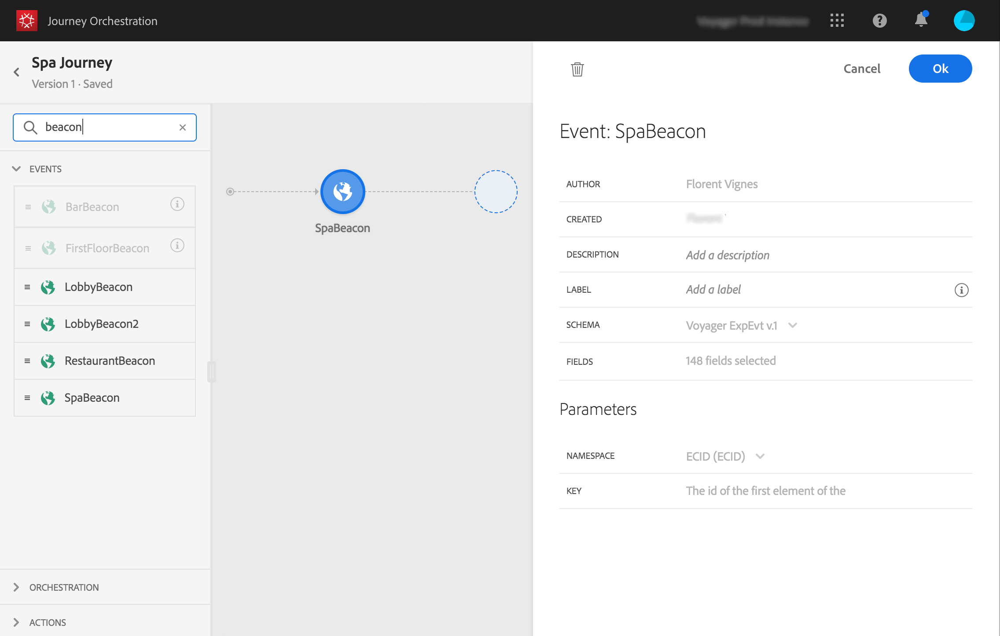

# De journey samenstellen{#concept_eyw_mcy_w2b}

De **bedrijfsgebruiker** kan nu de journey bouwen. Onze reis zal slechts één weg met de volgende activiteiten omvatten:

* het &quot;SpaBeacon&quot; **[!UICONTROL Event]**: wanneer een persoon in de buurt van het spa - baken loopt , zal het systeem een evenement ontvangen en zal de reis voor die persoon beginnen .
* een **[!UICONTROL Condition]** activiteit om na te gaan of de persoon een vrouw is
* een **[!UICONTROL Email]** activiteit (met Adobe Campaign Standard)
* an **[!UICONTROL End]** activity

>[!NOTE]
>
>De **[!UICONTROL Push]**- en **[!UICONTROL Email]**-activiteiten zijn alleen beschikbaar in het palet als u Adobe Campaign Standard hebt.

For additional information on how to build a journey, refer to [this page](../building-journeys/journey.md).

1. Klik in het bovenste menu op de tabbladen **[!UICONTROL Home]** en **[!UICONTROL Create]** om een nieuwe journey te maken.

   

1. Bewerk de eigenschappen van de journey in het configuratievenster dat aan de rechterkant wordt weergegeven. We noemen het &#39;Spa-reis&#39; en stellen het in op een maand, van 1 tot en met 31 december.

   

1. Begin uw reis te ontwerpen door de &quot;SpaBeacon&quot;-gebeurtenis van het palet naar het canvas te slepen. U kunt ook dubbelklikken op de gebeurtenis in het palet om deze aan het canvas toe te voegen.

   

1. Laten we nu een voorwaarde toevoegen om te controleren of de persoon een vrouw is. Sleep een voorwaardeactiviteit en zet deze neer in uw journey.

   

1. Kies het type **[!UICONTROL Data Source Condition]** en klik in het veld **[!UICONTROL Expression]**. U kunt ook een voorwaardelabel definiëren die wordt weergegeven op de pijl, in het canvas.

   

1. Zoek met de eenvoudige expressie-editor naar het genderveld (_persoon > geslacht_) en zet dit naar rechts om de volgende voorwaarde te maken: &quot;geslacht is gelijk aan &quot;vrouw&quot;.

   

1. Zet een **[!UICONTROL Email]** activiteit neer en selecteer uw transactiemalplaatje van de &quot;korting van de Buur&quot;transactie. Deze sjabloon is ontworpen met Adobe Campaign. Refer to this [page](https://docs.adobe.com/content/help/nl-NL/campaign-standard/using/communication-channels/transactional-messaging/about-transactional-messaging.html).

   

1. Click inside the **[!UICONTROL Email]** field and select the email address from the data source.

   

1. Definieer op dezelfde manier de velden voor voornaam en achternaam aanpassen van de gegevensbron.

   

1. Zet een **[!UICONTROL End]** activiteit neer.

   

1. Klik op de **[!UICONTROL Test]** knevel en test uw reis gebruikend testprofielen. Als er een fout optreedt, deactiveert u de testmodus, wijzigt u de journey en test u deze opnieuw. For more information on the test mode, refer to [this page](../building-journeys/testing-the-journey.md).

   

1. Wanneer de test is geslaagd is, kunt u uw journey vanuit het vervolgkeuzemenu rechtsboven publiceren.

   

De volgende keer dat een vrouw in de buurt van het baken loopt, ontvangt ze meteen een persoonlijke e-mail met de titel &quot;Spa-korting&quot;.
